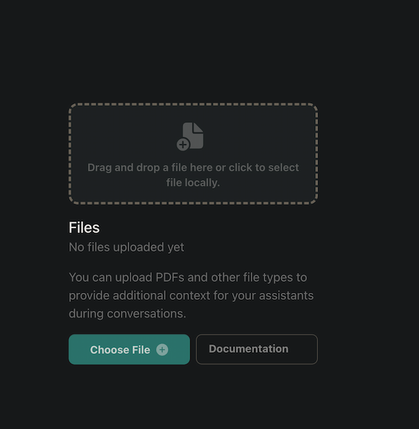

## **What is Vapi's Knowledge Base?**

A Knowledge Base is a collection of custom files that contain information on specific topics or domains. By integrating a Knowledge Base into your voice AI assistant, you can enable it to provide more accurate and informative responses to user queries. This is currently available in Vapi via the API, and will be on the dashboard soon.

### **Why Use a Knowledge Base?**

Using a Knowledge Base with your voice AI assistant offers several benefits:

- **Improved accuracy**: By integrating custom files into your assistant, you can ensure that it provides accurate and up-to-date information to users.
- **Enhanced capabilities**: A Knowledge Base enables your assistant to answer complex queries and provide detailed responses to user inquiries.
- **Customization**: With a Knowledge Base, you can tailor your assistant's responses to specific domains or topics, making it more effective and informative.

## **How to Create a Knowledge Base**

To create a Knowledge Base, follow these steps:

### **Step 1: Upload Your Files**

Navigate to Platform > Files and upload your custom files in Markdown, PDF, plain text, or Microsoft Word (.doc and .docx) format to Vapi's Knowledge Base.

<Frame caption="Adding files to your Knowledge Base">
  
</Frame>

Alternatively you can upload your files via the API.

```bash
curl --location 'https://api.vapi.ai/file' \
--header 'Authorization: Bearer <YOUR_API_KEY>' \
--form 'file=@"<PATH_TO_YOUR_FILE>"'
```

### **Step 2: Create a Knowledge Base**

Use the ID of the uploaded file to create a Knowledge Base. Currently we support [trieve](https://trieve.ai) as a provider.

```bash
curl --location 'https://api.vapi.ai/knowledge-base' \
--header 'Content-Type: text/plain' \
--header 'Authorization: Bearer <YOUR_API_KEY>' \
--data '{
    "name": "knowledge-base-test",
    "provider": "trieve",
    "vectorStoreSearchPlan": {
        "scoreThreshold": 0.1,
        "searchType": "hybrid"
    },
    "vectorStoreCreatePlan": {
        "fileIds": ["<FILE_ID>"]
    }
}'
```

### **Step 3: Create an Assistant**

Create a new assistant in Vapi and, on the right sidebar menu. Add the Knowledge Base to your assistant via the PATCH endpoint. Also make sure you customize your assistant's system prompt to utilize the Knowledge Base for responding to user queries.

```bash
curl --location --request PATCH 'https://api.vapi.ai/assistant/<ASSISTANT_ID>' \
--header 'Content-Type: text/plain' \
--header 'Authorization: Bearer <YOUR_API_KEY>' \
--data '{
  "model": {
    "knowledgeBaseId": "<KNOWLEDGE_BASE_ID>",
    "temperature": 0.2,
    "provider": "openai",
    "model": "gpt-4o",
    "messages": [
      {
        "content": "You are a smart assistant who responds to user queries using the information you know, or information supplied by outside context.",
        "role": "system"
      }
    ]
  }
}'
```

## **Best Practices for Creating Effective Knowledge Bases**

- **Organize Your files**: Organize your files by topic or category to ensure that your assistant can quickly retrieve relevant information.
- **Use Clear and concise language**: Use clear and concise language in your files to ensure that your assistant can accurately understand and respond to user queries.
- **Keep your files up-to-date**: Regularly update your files to ensure that your assistant provides the most accurate and up-to-date information.

<Tip>
  For more information on creating effective Knowledge Bases, check out our
  tutorial on [Best Practices for Knowledge Base
  Creation](https://youtu.be/i5mvqC5sZxU).
</Tip>

By following these guidelines, you can create a comprehensive Knowledge Base that enhances the capabilities of your voice AI assistant and provides valuable information to users.
