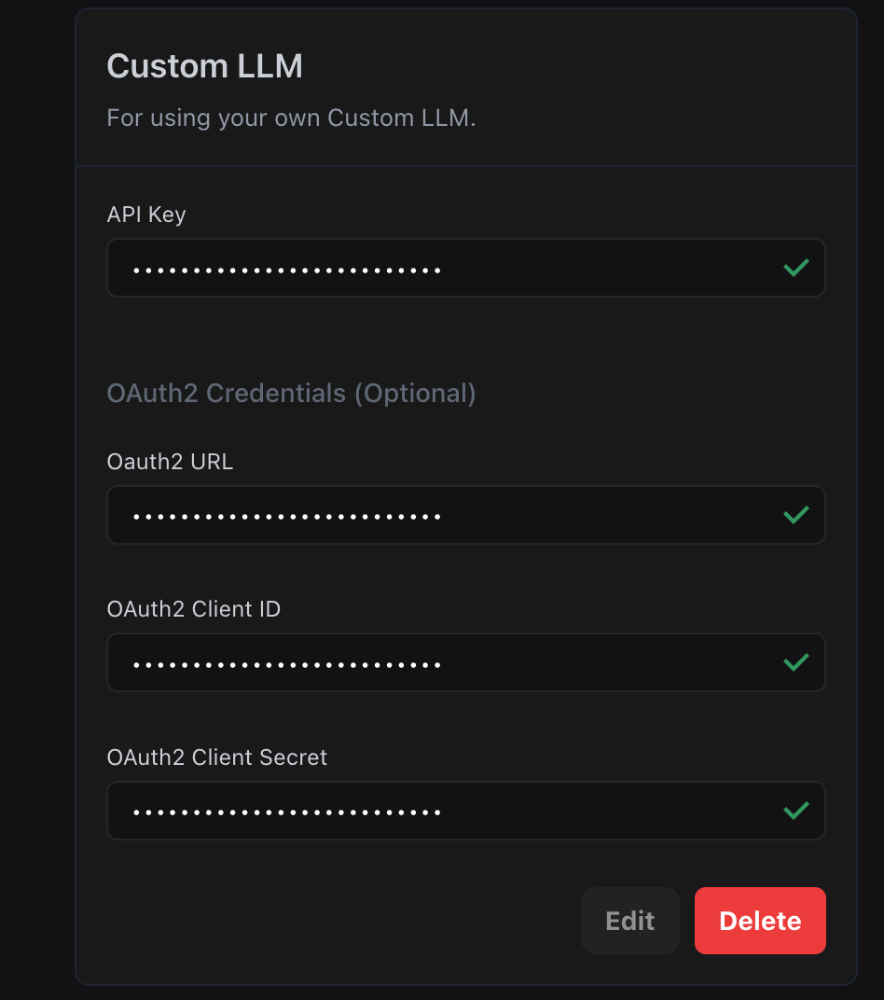

This guide provides a comprehensive walkthrough on integrating Vapi with OpenAI's gpt-4.1-mini model using a custom LLM configuration. We'll leverage Ngrok to expose a local development environment for testing and demonstrate the communication flow between Vapi and your LLM.
## Prerequisites

- **Vapi Account**: Access to the Vapi Dashboard for configuration.
- **OpenAI API Key**: With access to the gpt-4.1-mini model.
- **Python Environment**: Set up with the OpenAI library (`pip install openai`).
- **Ngrok**: For exposing your local server to the internet.
- **Code Reference**: Familiarize yourself with the `/openai-sse/chat/completions` endpoint function in the provided Github repository: [Server-Side Example Python Flask](https://github.com/VapiAI/server-side-example-python-flask/blob/main/app/api/custom_llm.py).

## Step 1: Setting Up Your Local Development Environment

**1. Create a Python Script (app.py):**

```python
from flask import Flask, request, jsonify
import openai

app = Flask(__name__)
openai.api_key = "YOUR_OPENAI_API_KEY"  # Replace with your actual API key

@app.route("/chat/completions", methods=["POST"])
def chat_completions():
    data = request.get_json()
    # Extract relevant information from data (e.g., prompt, conversation history)
    # ...
    
    response = openai.ChatCompletion.create(
        model="gpt-4.1-mini",
        messages=[
            {"role": "system", "content": "You are a helpful assistant."},
            # ... (Add messages from conversation history and current prompt)
        ]
    )
    # Format response according to Vapi's structure
    # ...
    return jsonify(formatted_response)

if __name__ == "__main__":
    app.run(debug=True, port=5000)  # You can adjust the port if needed
```
**2. Run the Script:**
Execute the Python script using python app.py in your terminal. This will start the Flask server on the specified port (5000 in this example).

**3. Expose with Ngrok:**
Open a new terminal window and run ngrok http 5000 (replace 5000 with your chosen port) to create a public URL that tunnels to your local server.

## Step 2: Configuring Vapi with Custom LLM
**1. Access Vapi Dashboard:**
Log in to your Vapi account and navigate to the "Model" section.

**2. Select Custom LLM:**
Choose the "Custom LLM" option to set up the integration.

**3. Enter Ngrok URL:**
Paste the public URL generated by ngrok (e.g., https://your-unique-id.ngrok.io) into the endpoint field. This will be the URL Vapi uses to communicate with your local server.

**4. Test the Connection:**
Send a test message through the Vapi interface to ensure it reaches your local server and receives a response from the OpenAI API. Verify that the response is displayed correctly in Vapi.

## Authentication (Optional)

For production deployments, you can secure your custom LLM endpoint using authentication. This ensures only authorized requests from Vapi can access your LLM server.



### Configuration Options

Vapi supports two authentication methods for custom LLMs:

1. **API Key**: Simple authentication where Vapi includes a static API key in request headers. Your server validates this key to authorize requests.

2. **OAuth2 Credentials**: More secure authentication using OAuth2 client credentials flow with automatic token refresh.

### API Key Authentication

When using API Key authentication:
- Vapi sends your API key in the Authorization header to your custom LLM endpoint
- Your server validates the API key before processing the request
- Simple to implement and suitable for basic security requirements

### OAuth2 Authentication

When configuring OAuth2 in the Vapi dashboard:

1. **OAuth2 URL**: Enter your OAuth2 token endpoint (e.g., `https://your-server.com/oauth/token`)
2. **OAuth2 Client ID**: Your OAuth2 client identifier
3. **OAuth2 Client Secret**: Your OAuth2 client secret

### How OAuth2 Works

1. Vapi requests an access token from your OAuth2 endpoint using client credentials
2. Your server validates the credentials and returns an access token
3. Vapi includes the token in the Authorization header for LLM requests
4. Your server validates the token before processing requests
5. Tokens automatically refresh when they expire

## Step 3: Understanding the Communication Flow
**1. Vapi Sends POST Request:**
When a user interacts with your Vapi application, Vapi sends a POST request containing conversation context and metadata to the configured endpoint (your ngrok URL).

**2. Local Server Processes Request:**
Your Python script receives the POST request and the chat_completions function is invoked.

**3. Extract and Prepare Data:**
The script parses the JSON data, extracts relevant information (prompt, conversation history), and builds the prompt for the OpenAI API call.

**4. Call to OpenAI API:**
The constructed prompt is sent to the gpt-4.1-mini model using the openai.ChatCompletion.create method.

**5. Receive and Format Response:**
The response from OpenAI, containing the generated text, is received and formatted according to Vapi's expected structure.

**6. Send Response to Vapi:**
The formatted response is sent back to Vapi as a JSON object.

**7. Vapi Displays Response:**
Vapi receives the response and displays the generated text within the conversation interface to the user.

By following these detailed steps and understanding the communication flow, you can successfully connect Vapi to OpenAI's gpt-4.1-mini model and create powerful conversational experiences within your Vapi applications. The provided code example and reference serve as a starting point for you to build and customize your integration based on your specific needs.

**Video Tutorial:**
  <iframe
    src="https://www.youtube.com/embed/-1xWhYmOT0A?si=8qB6FLzcmmrmduT-"
    title="Loom video player"
    frameborder="0"
    allow="accelerometer; autoplay; clipboard-write; encrypted-media; gyroscope; picture-in-picture; web-share"
    referrerpolicy="strict-origin-when-cross-origin"
    width="100%"
    height="400px"
    allowfullscreen
  />