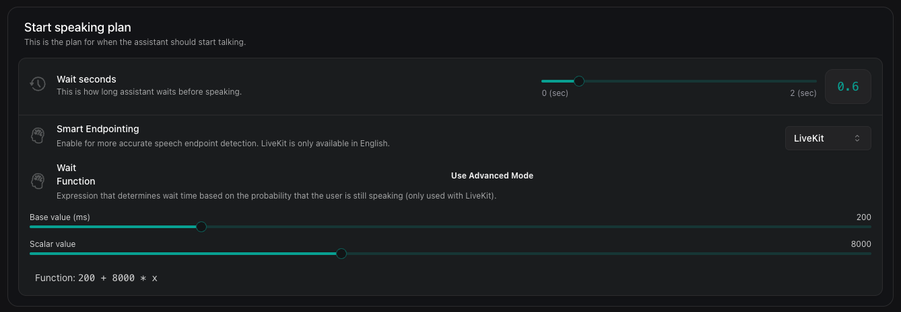

## Overview

Speech configuration lets you control exactly when your assistant starts and stops speaking during a conversation. By tuning these settings, you can make your assistant feel more natural, avoid interrupting the customer, and reduce awkward pauses.

<Note>
  Speech speed can be controlled, but only PlayHT currently supports this
  feature with the `speed` field. Other providers do not currently support
  speed.
</Note>

The two main components are:

- **Speaking Plan**: Controls when the assistant begins speaking after the customer finishes or pauses.
- **Stop Speaking Plan**: Controls when the assistant stops speaking if the customer starts talking.

Fine-tuning these plans helps you adapt the assistant's responsiveness to your use case—whether you want fast, snappy replies or a more patient, human-like conversation flow.

<Note>Currently, these configurations can only be set via API.</Note>

The rest of this page explains each setting and provides practical examples for different scenarios.

## Start Speaking Plan

This plan defines the parameters for when the assistant begins speaking after the customer pauses or finishes.

- **Wait Time Before Speaking**: You can set how long the assistant waits before speaking after the customer finishes. The default is 0.4 seconds, but you can increase it if the assistant is speaking too soon, or decrease it if there's too much delay.
  **Example:** For tech support calls, set `waitSeconds` for the assistant to more than 1.0 seconds to give customers time to complete their thoughts, even if they have some pauses in between.

- **Smart Endpointing Plan**: This feature uses advanced processing to detect when the customer has truly finished speaking, especially if they pause mid-thought.

  In general, turn-taking includes the following tasks:

  - **End-of-turn prediction** - predicting when the current speaker is likely to finish their turn.
  - **Backchannel prediction** - detecting moments where a listener may provide short verbal acknowledgments like "uh-huh", "yeah", etc. to show engagement, without intending to take over the speaking turn. This is better handled by the assistant's stopSpeakingPlan.

  We offer different providers that can be audio-based, text-based, or audio-text based:

  **Audio-based providers:**

  - **Krisp**: Audio-based model that analyzes prosodic and acoustic features such as changes in intonation, pitch, and rhythm to detect when users finish speaking. Since it's audio-based, it always notifies when the user is done speaking, even for brief acknowledgments. Vapi offers configurable acknowledgement words and a well-configured stop speaking plan to handle this properly.

    Configure Krisp with a threshold between 0 and 1 (default 0.5), where 1 means the user definitely stopped speaking and 0 means they're still speaking. Use lower values for snappier conversations and higher values for more conservative detection.

    When interacting with an AI agent, users may genuinely want to interrupt to ask a question or shift the conversation, or they might simply be using backchannel cues like "right" or "okay" to signal they're actively listening. The core challenge lies in distinguishing meaningful interruptions from casual acknowledgments. Since the audio-based model signals end-of-turn after each word, configure the stop speaking plan with the right number of words to interrupt, interruption settings, and acknowledgement phrases to handle backchanneling properly.

  **Audio-text based providers:**

  - **Deepgram Flux**: Deepgram's latest transcriber model with built-in conversational speech recognition. Flux combines high-quality speech-to-text with native turn detection, while delivering ultra-low latency and Nova-3 level accuracy.

  - **Assembly**: Transcriber that also reports end-of-turn detection. To use Assembly, choose it as your transcriber without setting a separate smart endpointing plan. As transcripts arrive, we consider the `end_of_turn` flag that Assembly sends to mark the end-of-turn, stream to the LLM, and generate a response.

  **Text-based providers:**

  - **Off**: Disabled by default. When smart endpointing is set to "Off", the system will automatically use the transcriber's end-of-turn detection if available. If no transcriber EOT detection is available, the system defaults to LiveKit if the language is set to English or to Vapi's standard endpointing mode.
  - **LiveKit**: Recommended for English conversations as it provides the most sophisticated solution for detecting natural speech patterns and pauses. LiveKit can be fine-tuned using the `waitFunction` parameter to adjust response timing based on the probability that the user is still speaking.
  - **Vapi**: Recommended for non-English conversations or as an alternative when LiveKit isn't suitable

  

  **LiveKit Smart Endpointing Configuration:**
  When using LiveKit, you can customize the `waitFunction` parameter which determines how long the bot will wait to start speaking based on the likelihood that the user has finished speaking:

  ```
  waitFunction: "200 + 8000 * x"
  ```

  This function maps probabilities (0-1) to milliseconds of wait time. A probability of 0 means high confidence the caller has stopped speaking, while 1 means high confidence they're still speaking. The default function (`200 + 8000 * x`) creates a wait time between 200ms (when x=0) and 8200ms (when x=1). You can customize this with your own mathematical expression, such as `4000 * (1 - cos(pi * x))` for a different response curve.

  **Example:** In insurance claims, smart endpointing helps avoid interruptions while customers think through complex responses. For instance, when the assistant asks "do you want a loan," the system can intelligently wait for the complete response rather than interrupting after the initial "yes" or "no." For responses requiring number sequences like "What's your account number?", the system can detect natural pauses between digits without prematurely ending the customer's turn to speak.

- **Transcription-Based Detection**: Customize how the assistant determines that the customer has stopped speaking based on what they're saying. This offers more control over the timing. **Example:** When a customer says, "My account number is 123456789, I want to transfer $500."
  - The system detects the number "123456789" and waits for 0.5 seconds (`WaitSeconds`) to ensure the customer isn't still speaking.
  - If the customer were to finish with an additional line, "I want to transfer $500.", the system uses `onPunctuationSeconds` to confirm the end of the speech and then proceed with the request processing.
  - In a scenario where the customer has been silent for a long and has already finished speaking but the transcriber is not confident to punctuate the transcription, `onNoPunctuationSeconds` is used for 1.5 seconds.

## Stop Speaking Plan

The Stop Speaking Plan defines when the assistant stops talking after detecting customer speech.

- **Words to Stop Speaking**: Define how many words the customer needs to say before the assistant stops talking. If you want immediate reaction, set this to 0. Increase it to avoid interruptions by brief acknowledgments like "okay" or "right". **Example:** While setting an appointment with a clinic, set `numWords` to 2-3 words to allow customers to finish brief clarifications without triggering interruptions.

- **Voice Activity Detection**: Adjust how long the customer needs to be speaking before the assistant stops. The default is 0.2 seconds, but you can tweak this to balance responsiveness and avoid false triggers.
  **Example:** For a banking call center, setting a higher `voiceSeconds` value ensures accuracy by reducing false positives. This avoids interruptions caused by background sounds, even if it slightly delays the detection of speech onset. This tradeoff is essential to ensure the assistant processes only correct and intended information.

- **Pause Before Resuming**: Control how long the assistant waits before starting to talk again after being interrupted. The default is 1 second, but you can adjust it depending on how quickly the assistant should resume.
  **Example:** For quick queries (e.g., "What's the total order value in my cart?"), set `backoffSeconds` to 1 second.

Here's a code snippet for Stop Speaking Plan -

```json
 "stopSpeakingPlan": {
    "numWords": 0,
    "voiceSeconds": 0.2,
    "backoffSeconds": 1
  }
```

## Considerations for Configuration

- **Customer Style**: Think about whether the customer pauses mid-thought or provides continuous speech. Adjust wait times and enable smart endpointing as needed.

- **Background Noise**: If there's a lot of background noise, you may need to tweak the settings to avoid false triggers. Default for phone calls is 'office' and default for web calls is 'off'.

```json
  "backgroundSound": "off",
```

- **Conversation Flow**: Aim for a balance where the assistant is responsive but not intrusive. Test different settings to find the best fit for your needs.
