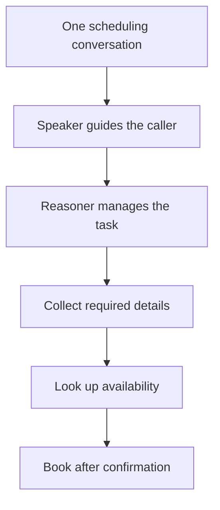
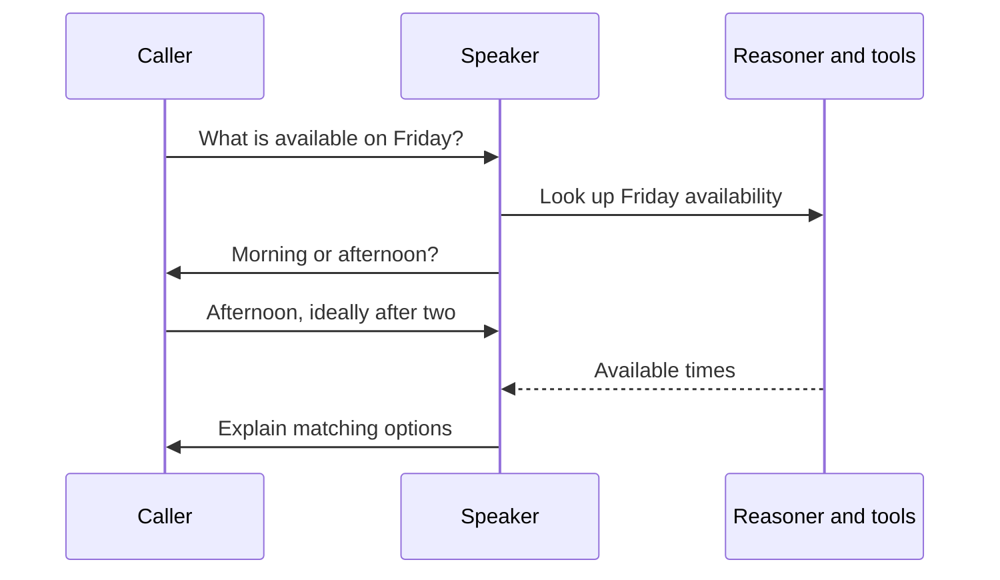

With GPT-Live, the conversation can continue while work happens in the background. A caller can add a preference during a lookup, ask a question halfway through scheduling, or ask the assistant to slow down.

The design task is to make those moments feel connected. Decide what the assistant is trying to accomplish, how it should guide the caller, and which decisions need help from your services.

This guide uses scheduling as an example. The same approach applies to support, intake, and other conversations that combine questions with actions.

**Jump to:** [Architecture](#speaker-and-reasoner-roles) · [Prompt example](#example-split-a-scheduling-prompt) · [Context](#what-context-does-the-reasoner-receive) · [Squads](#start-with-one-assistant) · [Conversation flow](#questions-and-changes-of-topic) · [Voice design](#speaking-style) · [Testing](#testing-conversations)

## Speaker and reasoner roles

The **speaker** carries the spoken interaction: listening, responding, asking questions, and deciding when to delegate. The **reasoner** takes a delegated task, follows its instructions, and calls tools. A tool connects the assistant to information or actions in your service.

Both models belong to the same assistant. The caller stays in one conversation while the reasoner works behind it.

| Give the speaker | Give the reasoner |
| --- | --- |
| The assistant's role and the caller's goal | The procedure for completing each task |
| Tone, language, and pacing | Required information and confirmation rules |
| When to clarify or delegate | Which tools to use and in what order |
| How to explain results to the caller | How to interpret tool results and failures |

For example, the speaker needs to know that it can help find an appointment. The reasoner needs to know which service returns availability, what information that service requires, and when booking is allowed.

This separation lets you keep the speaker's instructions focused. Put detailed business procedures in the reasoner prompt. Your services remain responsible for enforcing permissions and validating actions.

### Where should an instruction go?

Use `model.speaker.instructions` for **how to conduct the conversation and when to ask for help**. Use `model.reasoner.instructions` for **how to decide and act once asked**.

| Instruction | Where it belongs | Why |
| --- | --- | --- |
| “Ask one question at a time and speak briefly.” | Speaker | Controls the interaction the caller hears. |
| “Delegate availability checks and booking requests.” | Speaker | Tells it when to involve the reasoner. |
| “Use `lookupAvailability` with an explicit date and time zone.” | Reasoner | Defines how to use a tool correctly. |
| “Call `bookAppointment` only after the caller confirms a specific slot.” | Reasoner | Defines the condition for taking an action. |
| “Never tell the caller a booking succeeded before the tool confirms it.” | Both, tailored to each role | The reasoner must verify success; the speaker must describe it accurately. |

The prompts are separate. Instructions written only in the speaker prompt aren't automatically included in the reasoner prompt. Put rules that affect both conversation and actions in both prompts, using wording appropriate to each role. Keep detailed tool procedures in the reasoner prompt rather than copying the entire prompt into both fields.

### Example: split a scheduling prompt

Suppose the assistant can look up availability and book appointments. The example below assumes you have attached tools named `lookupAvailability` and `bookAppointment`. Replace those names and requirements with your actual tools. The [configuration walkthrough](/gpt-live/configuration#create-an-assistant) provides a lookup-only example if you haven't connected booking yet.

```text title="model.speaker.instructions"
You help callers find and book appointments. Speak warmly and briefly.
Ask one question at a time. Use details the caller has already supplied.

Collect an explicit date and time zone, then delegate availability checks.
Read back the returned options. Ask the caller to confirm one specific
slot before delegating a booking request.

While a lookup runs, you may ask about preferences that don't change
its inputs. If the caller changes the date or time zone, acknowledge
the correction and delegate the updated request. Don't present an old
lookup result as an answer to the new request.

Only say an appointment is booked after the reasoner returns a confirmed
booking. If information is missing or a tool fails, explain the issue
and ask for the next detail needed.
```

```text title="model.reasoner.instructions"
Help the speaker complete the caller's scheduling request using the
conversation transcript and the available tools.

For availability, require an explicit date and time zone before calling
lookupAvailability. If either is missing or ambiguous, return a concise
clarification for the speaker to ask. Don't invent missing arguments.

For booking, require the caller's explicit confirmation of a specific
slot returned by lookupAvailability. Call bookAppointment only when
those conditions and the tool's required arguments are satisfied.

Use the latest request in the supplied transcript. Before taking a new
action, check prior tool results so you don't repeat a completed booking.
Don't retry an uncertain booking outcome without checking its status.

Return the relevant date, time zone, slots, or confirmed booking details
for the speaker to explain. If a tool fails, report the failure and the
next useful step. Don't invent availability or claim success without a
successful tool result.
```

The speaker asks the caller for clarification; the reasoner returns what needs clarification. The reasoner doesn't speak to the caller directly. Your service should also enforce booking requirements: prompt instructions don't replace validation in the tool handler.

### What context does the reasoner receive?

**At each delegation, the reasoner receives the available spoken conversation transcript so far**, including caller and assistant turns. It also receives its own instructions, available tool definitions, and retained history from prior reasoner work and tool results within that call. It doesn't rely on a short summary or a few selected lines supplied by the speaker.

The speaker and reasoner still have different context:

| Context | Speaker | Reasoner |
| --- | --- | --- |
| Live audio | Listens and speaks continuously | Receives text, not the audio stream |
| Spoken conversation | Part of the live conversation | Receives the transcript available when delegation starts |
| Instructions | Speaker prompt and personality guidance | Reasoner prompt; the speaker prompt isn't automatically copied |
| Tool work | Receives results returned by the reasoner | Has tool definitions and retained reasoner/tool history |
| HTTP `append-context` | Receives the injected speaker context | Doesn't receive it directly in its history |

The transcript is a snapshot of what Vapi has received at that point. Speech that arrives while the reasoner is already working doesn't automatically refresh that delegation's transcript. A subsequent delegation receives the updated transcript. Completed work and tool results can inform later reasoning, but the reasoner isn't continuously listening alongside the speaker.

For example, if the caller says “Actually, Thursday” while a Friday lookup is running, the speaker can hear and acknowledge the correction. The ongoing lookup may still return Friday's availability. Delegate the changed request, match results to the date they answer, and don't assume an interruption cancels an action already sent to a tool.

### When to delegate

Give the speaker a clear reason to ask for help: “Delegate requests to find an appointment that fits the caller's preferences.” Give the reasoner the steps needed to produce that result.

| Layer | Example instruction |
| --- | --- |
| Speaker | “Help the caller find a suitable appointment. Delegate availability checks and booking requests.” |
| Reasoner | “Confirm the date and time zone. Look up available slots. Book only after the caller confirms a specific slot.” |
| Service | Validate the requested slot and create the booking only when the request meets your requirements. |

Keep the conditions for delegation concrete. A greeting or a request to repeat an already confirmed time may stay with the speaker. A fresh lookup, changed booking request, or end-call request needs the reasoner and its tools.

The reasoner's result gives the speaker information for its next response. The speaker can explain that information in the context of what the caller just said. See [Configure GPT-Live](/gpt-live/configuration#create-an-assistant) for an assistant with both prompts and a lookup tool.

## Start with one assistant

Early testing suggests GPT-Live handles many of the needs that previously led builders to squads out of the box. The speaker maintains the conversation while the reasoner handles detailed instructions and task sequencing. You may be able to cover the full use case with one assistant.

Suppose your scheduling squad has separate assistants for intake, availability, and booking. Start by carrying those responsibilities into one GPT-Live assistant:



This diagram shows responsibilities, not a fixed script for every call. The caller may supply several details at once or ask a question between stages.

Preserve the outcomes and business rules you need. Test whether the new architecture still needs the divisions you created for the old one. Pay attention to missed steps and recovery from errors before consolidating a production flow.

Existing squad configurations and assistant handoffs are [currently unsupported](/gpt-live/limitations#can-i-use-an-existing-squad). The early finding is that some use cases need fewer assistants, not that every squad can be converted automatically.

## Questions and changes of topic

Give the conversation a destination and a few meaningful stages: understand the request, find suitable options, confirm the choice, and explain the result. The caller doesn't need to answer questions in the order you wrote them.

Consider this opening:

> **Caller:** I need something Friday afternoon. I've been there before.

The caller has already supplied a day, a preference, and a useful detail. Design the assistant to acknowledge those details and ask for the next missing piece, such as the exact date or time zone. Repeating questions the caller has answered makes even responsive speech feel mechanical.

A detour can help the caller make the next decision:

> **Caller:** Before we pick a time, how long does the appointment take?
>
> **Assistant:** Let me check that for you. Then we can find a time that works.

If the duration is already available in trusted context, the speaker can explain it. If it needs a fresh lookup, delegate that question. Then return to scheduling with the caller's earlier preferences intact.

A useful speaker instruction is:

```text title="Keep the conversation connected"
Use details the caller has already provided. Ask one question for the
next missing piece. If the caller asks a related question, address it
and then return to the unfinished task. Delegate questions that need
new information from our services.
```

## Talking while tools run

A lookup doesn't always need to bring the conversation to a stop. While it runs, the speaker can collect information that doesn't depend on the result.

For example, if your service can retrieve a whole day's availability, the speaker can ask about morning or afternoon while that request is running. If the lookup requires that preference as an input, ask first.



This illustrates a conversation to design and test, not a guarantee of exact event timing. Your prompts and tool requirements determine which work can overlap.

Keep updates proportionate. One short “I'm checking” can be enough. A forced acknowledgment before every tool call, repeated status updates, or unrelated small talk can make the wait feel longer.

### Confirming results

The assistant can acknowledge the request before the work finishes. Its confirmation should follow the result:

| Moment | What the caller can hear |
| --- | --- |
| The request is understood | “I'll check Friday afternoon.” |
| The lookup finishes | “There are openings at two and four.” |
| A booking tool confirms success | “Your two o'clock appointment is booked.” |

The [example assistant](/gpt-live/configuration#create-an-assistant) only looks up availability. Add a booking tool before teaching it to offer the final step.

### When callers change the request

If the caller says “Actually, Thursday” during the lookup, the speaker should acknowledge the new request. Your application should match each result to the request it answers so Friday's result doesn't drive Thursday's booking.

Interrupting speech doesn't cancel an action already sent to a service. Keep changes and cancellations explicit in your application. The [limitations FAQ](/gpt-live/limitations#does-an-interruption-cancel-a-tool-call) explains this boundary.

## Speaking style

Choose both a voice and a way of speaking. The voice establishes a starting sound. Speaker instructions shape pacing, warmth, emphasis, and how much the assistant says at once.

Write a short voice brief alongside the task brief. Describe behavior someone could hear and evaluate:

```text title="Example voice brief"
Sound warm and conversational. Keep routine answers brief.
Move briskly through familiar information, but slow down when reading
appointment dates and times. Give one instruction at a time when
explaining a process. Follow requests to speed up, slow down, or
explain more. Leave room for the caller to respond.
```

These are prompted behaviors, not precise speed or pause controls. Test the spoken result. Your application can also send [live speaker guidance](/gpt-live/configuration#live-call-control) with `append-context`; it doesn't guarantee exact wording, speed, or pauses.

### Pacing

A consistent personality doesn't require a constant pace. The same assistant can move quickly through familiar information and become more measured when a caller needs help.

| Moment | Delivery to try |
| --- | --- |
| Caller knows what they want | Short questions and concise answers |
| Caller is choosing between options | A few options at a time, with room to respond |
| Assistant reads a date or unfamiliar name | Slower delivery and clear articulation |
| Caller asks “Can you walk me through it?” | One step at a time |
| Caller says “Just the short version” | A brief summary with an offer to explain more |

Treat those requests as part of the conversation design. Test “slow down,” “a little faster,” and “say that another way” alongside your business scenarios.

### Personality packs

Vapi's personality packs add speaking-style guidance to your speaker prompt:

| Pack | What its guidance encourages |
| --- | --- |
| **Active listening** (`eager-listener`) | Brief acknowledgments at natural openings, with room for the caller to continue |
| **Humming** (`idle-hummer`) | Soft humming or wordless sounds during quiet moments while waiting for tools |
| **Bouncy** (`bouncy`) | More expressive pitch, emphasis, and rhythm, adapting to the caller's mood |
| **Unhurried** (`unhurried`) | A slower pace, clear articulation, and space between ideas |

Choose a pack because it suits the experience. Humming might fit an informal concierge and feel out of place during a serious support issue. Expressiveness and speed are separate choices: an animated assistant can still speak slowly and clearly.

Start with one pack, listen, and adjust the speaker prompt. Packs add guidance. They don't guarantee identical delivery on every call. See [personality configuration](/gpt-live/configuration#personality-and-language) and [voice previews](/gpt-live/configuration#voices).

## Testing conversations

Review a short set of conversations before expanding the prompt. Include a direct request, a detour, information supplied out of order, a slow lookup, and a request to change speaking style.

Ask whether the assistant used what the caller had already said, delegated at the right moment, and returned naturally to unfinished work. Listen for whether its pace helps the caller make progress.

Keep a few representative calls as a baseline. Repeat them when either prompt changes. Use [post-call analysis](/gpt-live/configuration#review-and-monitor-calls) to track outcomes, while reviewing audio for timing and delivery. Use [Voice Simulations](/gpt-live/limitations#can-i-run-simulations-and-evals) to repeat scenarios with GPT-Live as the tester, target, or both. Choose Voice mode and a single assistant target.

For additional model-level examples, see OpenAI's [GPT-Live prompting guide](https://developers.openai.com/api/docs/guides/live-prompting). Use Vapi's fields when applying that guidance to your assistant.
