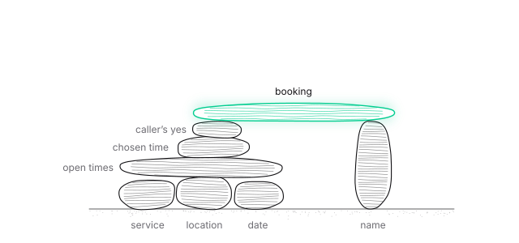
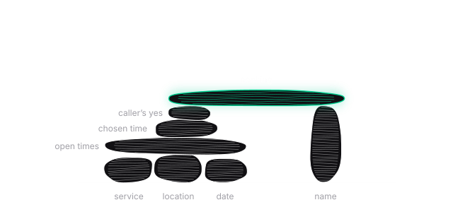
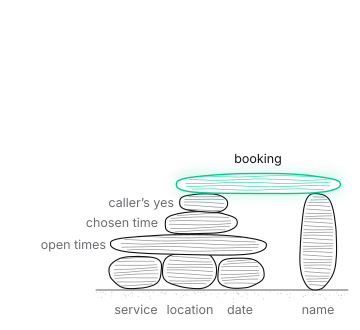
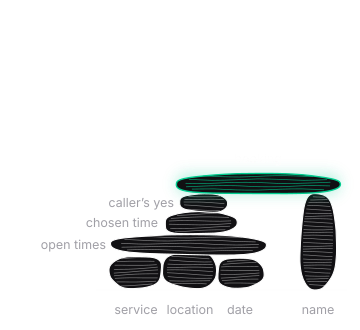

A GPT-Live assistant keeps listening and speaking while its reasoner looks things up and takes actions. The conversation and the work run side by side, so part of the design is deciding how they fit together: which work to start early, what the conversation can usefully cover while it runs, and how a result rejoins the conversation when it arrives.

This page works through one conversation: a caller booking an appointment with a small service business. The same thinking applies to support, intake, and other calls that mix questions with actions. [Build with tools](/gpt-live/tools) covers the tools behind this example.

The dialogues on this page are illustrations of the behavior to design for. GPT-Live generates its own wording, and results vary between calls, so test your prompts on real calls before relying on a pattern.

## Start with the caller's aim

Before writing a prompt, decide what the caller is trying to get done and what a good ending sounds like. For an appointment, the call has succeeded when the caller has a confirmed time that suits them, the details are right, and they know what happens next. Filling in every field or sounding friendly isn't enough on its own.

Then sort what the task needs:

| Kind of information | For an appointment |
| --- | --- |
| Needed to look up availability | Service, location, date |
| Needed to book | A time from that lookup, the name for the booking, the caller's agreement |
| Helpful but optional | A time-of-day preference |
| Alternatives if nothing fits | Another day, the other location |

This table does most of the design work. It tells you when work can start, which questions can wait, and what the assistant must not claim until a result arrives.

Callers rarely supply details in the order you'd ask for them. An informed caller may give everything at once:

> **Caller:** Hi, I'd like a consultation downtown this Friday, afternoon if possible.
>
> **Assistant:** Sure, I'll check Friday afternoon downtown. Who should I put the appointment under?

The assistant already has the service, location, and date, so it starts the lookup and asks for the one detail that booking will need. Asking "Which service would you like?" here would make the caller repeat themselves. Tell the speaker to use details the caller has already given, and to ask for only the next missing piece.

## Speaker and reasoner roles

A GPT-Live assistant has two parts. The **speaker** is the voice the caller hears. It listens, speaks, and decides when to ask for help. The **reasoner** does the task work. It follows your procedures, calls your tools, and returns what it found. Asking the reasoner for help is called **delegation**.

The two run at the same time. Here's the opening of the appointment call, step by step:

<Steps>
<Step title="The caller asks">
**Conversation:** "A consultation downtown this Friday, afternoon if possible."

**Background work:** None yet. The speaker now has the service, location, and date, so it delegates the lookup.
</Step>
<Step title="The lookup runs">
**Conversation:** The assistant asks who the appointment is for, and the caller says "Sam Lee."

**Background work:** The reasoner checks Friday's open times downtown.
</Step>
<Step title="The result arrives">
**Conversation:** "Friday afternoon I have 2:30 or 4."

**Background work:** The lookup returned 10:30, 2:30, and 4. The speaker offers the two that fit the afternoon request.
</Step>
</Steps>

Think of it as two lanes: the conversation the caller hears, and the work the reasoner and your tools are doing. Good design keeps both moving toward the caller's aim, and brings them together when a result matters.

This concurrency is a property of the conversation, and it applies to every tool. It's separate from the `async` setting on a function tool, which controls whether the reasoner waits for your webhook's response before continuing. See [Slow and external work](/gpt-live/tools#slow-and-external-work) for that.

### What context does the reasoner receive?

The speaker and reasoner see different things. You need this to predict how the assistant handles changes.

| | Speaker | Reasoner |
| --- | --- | --- |
| Live audio | Hears the caller and speaks continuously | Doesn't hear audio. Works from the conversation transcript |
| Conversation | Is part of it | Receives the transcript available when the request starts |
| Instructions | Speaker prompt, plus any personality packs | Reasoner prompt and any loaded skills. The speaker prompt isn't copied over |
| Tools | None. It asks the reasoner | Your tools. It can use its earlier work and tool results from the call |

Two consequences shape the rest of this page.

First, the reasoner starts from a snapshot. If the caller says "Actually, Thursday" while a Friday lookup is running, that lookup doesn't change. The speaker hears the correction, and the next request to the reasoner will include it. Design for a new request when the details change.

Second, a result is information for the speaker to use in the current moment. The speaker doesn't need to recite it. It can take the open times, match them against what the caller said while the lookup ran, and offer the ones that fit.

## Order the work by what depends on what

Start each piece of work as soon as its inputs are known, and use the conversation for things that don't depend on it. Work through the dependencies for the appointment:

- A lookup needs the service, location, and date. Once those are known, delegate right away.
- The booking name doesn't affect the lookup, so collect it while the lookup runs.
- A time can be chosen only after the open times are known.
- A booking can be announced only after the booking tool confirms it.

<div className="gpt-live-illustration">
  
  
  
  
</div>

The useful test for any question during a lookup is whether the outstanding work still answers the caller's need after they reply. In this example, the lookup tool returns every open time for the requested day and location. So if the caller says "afternoon, ideally after three" while that lookup runs, the result still covers it, and the assistant can filter. If the caller says "Actually, can we do Riverside instead?", the running lookup no longer answers the request, and a new one is needed.

That's why the example lookup returns the whole day rather than taking a time-of-day argument. When you design your own tools, return enough to answer the likely follow-up questions without another round trip, as long as the result stays short.

### When to delegate

The speaker only starts work when it decides to delegate. A missed delegation can leave an assistant that says "Let me check that" and then nothing happens, or says goodbye without ending the call. Make the triggers concrete and list them in the speaker prompt:

```text title="Delegation triggers in the speaker prompt"
Delegate to the backend when:
- You know the service, location, and date. Ask for availability right away.
- The caller has clearly said yes to booking after you read back the day,
  time, location, and name.
- The caller changes the service, location, date, or chosen time.
- The caller asks about services, what to bring, locations, hours, or policies.
- The backend asked for a detail and the caller has now given it.
- The caller asks to end the call or says goodbye. Always delegate this.
  Saying goodbye does not end the call.

Do not delegate to the backend when:
- You can answer from what was already said or from a result that still
  answers the current request.
- You need a brief clarification first.
```

Two of these triggers are easy to forget. When the reasoner returns a question ("Which location?"), the caller's answer needs a new delegation, or the task stalls. And ending the call is a tool action, so the speaker has to delegate it like any other task.

## While work is running

While a result is pending, the conversation doesn't have to stop, and what it does instead is a design choice. The aim is to make the time useful to the caller. Sometimes that means asking something, sometimes it means answering something, and sometimes it means a short acknowledgment and a pause.

### Talking while tools run

When the next step doesn't depend on the pending result, the conversation can move ahead. Compare a serial version with one that uses the wait:

> **Serial**
>
> **Caller:** A consultation downtown on Friday.
>
> **Assistant:** Let me check. *(silence while the lookup runs)* I have 10:30, 2:30, and 4. Which would you like?
>
> **Caller:** 2:30.
>
> **Assistant:** And what name should I put it under?

> **Using the wait**
>
> **Caller:** A consultation downtown on Friday.
>
> **Assistant:** I'll check Friday downtown. Who should I put the appointment under?
>
> **Caller:** Sam Lee.
>
> **Assistant:** Thanks, Sam. Friday I have 10:30, 2:30, or 4.

The name question works during the lookup because the booking will need it and the answer can't change the lookup. When the caller picks a time, the assistant already has what it needs to confirm and book.

The name reaches the booking because the reasoner's next request starts from the updated transcript, which now includes it. You don't need to pass it along separately.

Guide this in the speaker prompt:

```text
While work is running:
- If there is a useful question that doesn't change the request, ask it.
  Collect the name for the booking while availability is checked.
```

Choose the question for what it contributes. A question the task doesn't need, such as asking for an email address the booking never uses, fills the wait but makes the call longer and asks the caller for more personal information than necessary.

### When the next step is blocked

Sometimes nothing useful can move forward until the result arrives. The caller has confirmed a time and the booking is running. The conversation can still be helpful, depending on the moment:

- **Explain what's already known.** Tell the caller about preparation or a policy that applies whatever the result, such as arriving a few minutes early.
- **Answer a related question** from information the assistant already has.
- **Say what the result will let the caller decide**, if that helps them get ready. For example, "Once that's booked I'll give you a booking number to keep."
- **Invite a relevant question**, when the caller is likely to have one.
- **Acknowledge the wait once and pause**, when nothing useful remains or the caller would clearly prefer quiet.

Here the caller asks a question during the booking:

> **Assistant:** That's Friday at 2:30, downtown, under Sam Lee. Shall I book it?
>
> **Caller:** Yes, please.
>
> **Assistant:** Booking that now.
>
> **Caller:** Do I need to bring anything?
>
> **Assistant:** For a consultation, nothing's required. Bring any questions you'd like to cover, and it helps to arrive five minutes early.
>
> **Assistant:** You're all set: Friday at 2:30 downtown, under Sam Lee. Your booking number is TEST-4F2A1C.

The answer about what to bring doesn't depend on the booking, so the assistant can give it while the booking runs. It waits for the result before saying "You're all set."

The speaker can only answer from what it knows. To make answers like this possible during a wait, put a few stable facts the caller often asks about in the speaker prompt, as the [example prompt](#example-split-a-scheduling-prompt) does with arrival and preparation guidance. Anything that changes, or that you'd want looked up, belongs behind a tool.

When nothing useful remains, a short acknowledgment and a pause is the right choice:

> **Assistant:** Friday at 2:30, downtown, under Sam Lee. Shall I book it?
>
> **Caller:** Yes, the 2:30.
>
> **Assistant:** Booking that now.
>
> *(a short pause)*
>
> **Assistant:** You're booked for Friday at 2:30.

Avoid the patterns that make waiting worse:

- repeated "still checking" messages
- invented progress or time estimates ("almost done", "about ten more seconds")
- questions that don't serve the task, especially ones that collect more personal information
- talking over a caller who is thinking, or who asked for a moment
- any wording that implies the action succeeded before the result arrives

```text
While work is running:
- If the caller asks something you can answer from information already given,
  answer it.
- Otherwise acknowledge the wait once and give the caller room. Don't repeat
  that you are still checking and don't guess how long it will take.
```

## Bring the result back into the conversation

Results arrive when the work finishes, which may not be a good moment in the conversation. The caller may be mid-sentence, or may have changed their mind while the work ran. The speaker's job is to fit the result into the conversation as it now stands.

### Confirming results

Suppose the lookup finishes while the caller is adding a preference:

> **Assistant:** I'll check Friday downtown. Who should I put it under?
>
> **Caller:** Sam Lee. And actually, anything after three would be best.
>
> **Assistant:** After three on Friday, I have 4 o'clock. Would that work?

The result came back with 10:30, 2:30, and 4. The assistant let the caller finish, applied the new preference to the result it already had, and offered the one time that fits. It didn't read out all three, and it didn't ask "What time works for you?" after the caller had just said.

Prompt for the behaviors you want when a result arrives:

- Let the caller finish before bringing up the result.
- Check the result against the caller's latest request. If it no longer answers it, delegate again.
- Present only what's relevant now.
- Don't ask a question the caller has just answered.
- State an outcome, such as a booking, only when the result confirms it.

A prompt can't guarantee exact timing, so check these behaviors on real calls. When a result is out of date, the fix is a new delegation. The speaker shouldn't try to adjust a stale result by guessing.

## Corrections, interruptions, and detours

Callers change their minds, interrupt, and ask unrelated questions. These look similar in a transcript but need different handling.

### When callers change the request

Three things can sound alike:

- **"Hold on, stop."** The caller wants the assistant to stop talking. Nothing about the task changes.
- **"Actually, Thursday."** The request has changed. New work is needed.
- **"Cancel my appointment."** The caller wants an action taken. The reasoner needs to call the cancel tool.

Interrupting the assistant's speech doesn't stop work that's already running. A lookup or booking your service has received carries on. Here's a date correction during a lookup:

> **Caller:** Friday downtown, please.
>
> **Assistant:** I'll check Friday downtown.
>
> **Caller:** Actually, sorry, Thursday.
>
> **Assistant:** No problem, Thursday instead. Checking that now.
>
> **Assistant:** On Thursday downtown I have 9 or 1.

The Friday result may still come back. The speaker should recognize it no longer answers the request and use the Thursday one. Your tools can help by including the date and location in every result, as the example's tools do, so a stale result is easy to spot.

If the change arrives after an action has completed, the assistant should say so and follow your procedure for changing it:

> **Caller:** Oh wait, can we make that Thursday instead?
>
> **Assistant:** Friday at 2:30 is already booked. I can look at Thursday, and if there's a time you like, move it. Shall I check?

The booking exists until your service cancels or changes it. Tell the reasoner how to change a completed action, and have your service enforce it. In this example, a move is two separate steps: cancel the Friday booking, then book Thursday. So the procedure finds a Thursday time and gets the caller's agreement first, then cancels and books. If the second step fails, the assistant says what actually happened: Friday was cancelled and Thursday wasn't booked.

### Questions and changes of topic

A detour can help the caller make the next decision:

> **Caller:** Before I pick, what happens if I need to change it later?
>
> **Assistant:** Let me check that. *(service information comes back)* You can change or cancel up to 24 hours ahead at no charge. Would you still like Friday?

If the answer is already known, as with an appointment's length in the [example prompt](#example-split-a-scheduling-prompt), the speaker can give it directly. If it needs a lookup, delegate it. Either way, return to the unfinished task with the caller's earlier details intact.

When an assistant covers several kinds of work, such as scheduling and service questions, [reasoner skills](/gpt-live/skills) let you keep each procedure and its tools separate behind the same conversation.

### Start with one assistant

GPT-Live keeps one voice for the whole call. Needs that used to lead to a squad of assistants, like separate intake, scheduling, and information roles, can often be covered by one assistant with clear delegation triggers and a few skills. The caller hears one continuous conversation instead of handoffs.

Existing squads and assistant handoffs aren't supported with GPT-Live. See [Migrate to GPT-Live](/gpt-live/migrate#from-a-squad) for how to map a squad's responsibilities onto one assistant.

## Names, numbers, and dates

The speaker hears the caller's voice, but the reasoner works from the transcript, and a transcript can contain mistakes. A name, reference number, or date that's slightly wrong in the transcript becomes a wrong tool argument.

<div className="gpt-live-illustration">
  
  
  
  
</div>

For anything the task depends on, have the assistant read it back before acting:

> **Caller:** It's under Siobhan.
>
> **Assistant:** Could you spell that for me?
>
> **Caller:** S-I-O-B-H-A-N.
>
> **Assistant:** Thanks. Friday at 2:30 downtown, under Siobhan. Shall I book it?

Read back values when they matter, not after every sentence. A confirmation before a booking is worth the extra few seconds. Repeating back an ordinary preference usually isn't.

Times need the same care when callers and your business can be in different time zones. The example business works in one time zone, and its tools return times in that zone. If yours doesn't, have the assistant confirm which time zone a time is in, and pass the zone to your tool explicitly, for example as an IANA name such as `America/New_York`.

## Speaking style

The voice and the way it speaks are part of how well the call works. Decide based on who calls and why.

Compare two callers booking the same appointment. The first is booking for the first time and working through the details:

> **Caller:** I've never been before, so I'm not sure what I need.
>
> **Assistant:** That's fine, we can go through it. A consultation is thirty minutes and doesn't need anything from you in advance. Would you like one at Downtown or Riverside?

The second knows exactly what they want:

> **Caller:** Standard visit, Riverside, next Tuesday morning.
>
> **Assistant:** Checking next Tuesday morning at Riverside. Name for the booking?

The first caller benefits from a calm pace, fuller sentences, and room to think. The second wants short questions and no explanation. The same assistant can serve both if the speaker prompt describes how to read the caller: explain more when they're unsure, and move quickly when they've given everything.

### Listening

Brief acknowledgments such as "mm-hm" while the caller speaks can make the assistant sound attentive. Too many sound like interruptions. Set a level in the speaker prompt and adjust after listening to calls:

```text
Backchannel policy: Use light backchannels. Acknowledge briefly without
competing with the caller.

Interruption policy: Stop speaking when the caller interrupts. Listen to
what they say.
```

### Pacing

A consistent personality doesn't require a constant pace.

<div className="gpt-live-illustration">
  
  
  
  
</div>

| Moment | Delivery to aim for |
| --- | --- |
| The caller knows what they want | Short questions and concise answers |
| The caller is choosing between options | Two or three options at a time, with room to respond |
| Reading a date, time, or unfamiliar name | Slower, clear delivery |
| "Can you walk me through it?" | One step at a time |
| "Just the short version" | A brief summary, with an offer to explain more |

These are prompted behaviors. GPT-Live doesn't have fixed speed or pause settings, so listen to calls to check the result. Test "slow down", "a bit faster", and "say that another way" alongside your business scenarios.

### Personality packs

Personality packs add speaking-style guidance to the speaker prompt. Each encourages a different way of listening and delivering:

| Pack | What its guidance encourages |
| --- | --- |
| `eager-listener` | Brief acknowledgments at natural openings, with room for the caller to continue |
| `unhurried` | A slower pace, clear articulation, and space between ideas |
| `bouncy` | More expressive pitch, emphasis, and rhythm, adapting to the caller's mood |
| `idle-hummer` | Soft humming or wordless sounds during quiet moments while waiting for tools |

Choose a pack for the call's purpose. `unhurried` suits the first-time caller above, and might slow down the caller who wants a quick booking. `idle-hummer` changes how a blocked wait sounds, which may suit an informal service and feel out of place on a serious support call. Expressiveness and speed are separate choices: an animated voice can still speak slowly.

To evaluate a pack, run the same scenario with and without it and listen to both. Packs shape delivery. They don't guarantee exact pauses, and they don't fix missed delegation or unclear task instructions. Field details are in [Settings and compatibility](/gpt-live/configuration#personality-and-language).

### Language and pronunciation

Write the speaker prompt and first message in the language you want the assistant to speak. Choose a voice by listening to it in that language with your own content; a voice's regional tag describes its accent, not the full set of languages it handles well. For names or terms that are often mispronounced, give a pronunciation cue in the speaker prompt, and ask the caller to spell names that are unclear. See the [voice list](/gpt-live/configuration#voices) for samples.

## When the caller goes quiet

A quiet caller and a pending result are different situations. When the assistant is waiting on your service, the design choices in [While work is running](#while-work-is-running) apply. When the caller has stopped responding, use idle-message hooks to check in.

Configure them with `customer.speech.timeout` [assistant hooks](/assistants/assistant-hooks) and `say.prompt`. GPT-Live generates each check-in from your prompt, so the wording varies and isn't guaranteed. This example checks in twice, then ends the call if the caller still hasn't responded:

```json title="Two check-ins and an optional final hangup"
{
  "hooks": [
    {
      "on": "customer.speech.timeout",
      "options": {
        "timeoutSeconds": 8,
        "triggerMaxCount": 3,
        "triggerResetMode": "onUserSpeech"
      },
      "do": [
        {
          "type": "say",
          "prompt": "Briefly check whether the caller is still there. If they said they needed a moment, let them know there's no rush."
        }
      ]
    },
    {
      "on": "customer.speech.timeout",
      "options": {
        "timeoutSeconds": 16,
        "triggerMaxCount": 3,
        "triggerResetMode": "onUserSpeech"
      },
      "do": [
        { "type": "say", "prompt": "Briefly ask whether the caller would like more time." }
      ]
    },
    {
      "on": "customer.speech.timeout",
      "options": {
        "timeoutSeconds": 30,
        "triggerMaxCount": 1
      },
      "do": [
        { "type": "say", "prompt": "Say a brief goodbye because the caller hasn't responded." },
        { "type": "tool", "tool": { "type": "endCall" } }
      ]
    }
  ]
}
```

Here's what the caller experiences with this configuration:

- **Check-ins.** A quiet period starts after the assistant speaks. After 8 seconds without a response, the assistant checks in. At 16 seconds it offers more time. Both delays count from the same quiet period, so the first check-in doesn't push back the second.
- **The caller returns.** When the caller speaks, the check-ins stop. The next quiet period starts after the assistant's next reply. A check-in that was already being spoken may still be heard.
- **The caller asked for a moment.** Hooks can't tell a caller who is looking for their calendar from one who has left. If the assistant replies "Take your time", that reply starts a new quiet period, so the first check-in follows 8 seconds later. The first prompt asks the assistant to take the request into account, and longer timeouts give callers more room.
- **Final hangup.** At 30 seconds, the third hook asks for a goodbye and then ends the call. Once this hook fires, the call ends even if the caller starts speaking, so choose the timeout with care. The goodbye may be cut short.

Background noise doesn't count as the caller responding. Activity is measured from speech that appears in the transcript.

Check-ins wait while the reasoner is actively working. An [async tool](/gpt-live/tools#slow-and-external-work) is different: once it has been dispatched, check-ins can resume even though its result is still pending. If callers may sit through a long external job, tell them what's happening, and set timeouts that leave room for it.

Idle hooks are for a silent caller. They don't fix an assistant that promised to do something and never delegated it. For that, see [When to delegate](#when-to-delegate). Field details are in [Settings and compatibility](/gpt-live/configuration#idle-messages).

## Turn the design into prompts

Each decision on this page becomes a line in one of two prompts.

### Where should an instruction go?

Use `model.speaker.instructions` for **how to conduct the conversation and when to ask for help**. Use `model.reasoner.instructions` for **how to decide and act once asked**.

| Instruction | Where it belongs | Why |
| --- | --- | --- |
| "Ask one question at a time and speak briefly." | Speaker | Shapes what the caller hears |
| "Delegate availability checks once you know the service, location, and date." | Speaker | Tells it when to start work |
| "Collect the booking name while availability is checked." | Speaker | Uses the wait |
| "Call `bookAppointment` only for a time from the latest lookup." | Reasoner | A condition for taking an action |
| "Never say a booking succeeded before the tool confirms it." | Both, worded for each | The reasoner must verify it and the speaker must describe it accurately |

The prompts are separate. The reasoner doesn't see the speaker prompt, and the speaker doesn't see the reasoner prompt. Put rules that affect both the conversation and the actions in both, worded for each role. Keep detailed procedures in the reasoner prompt instead of copying one prompt into both fields.

Your service remains responsible for enforcing rules that matter. A prompt that says "only book confirmed slots" guides the model. Your booking handler checking that the slot is still open is what makes it true.

### Example: split a scheduling prompt

These are the prompts for the appointment assistant used throughout this page. Its tools are described in [Build with tools](/gpt-live/tools). The speaker prompt follows a structure with labeled policy sections, which makes each decision easy to find and adjust:

```text title="model.speaker.instructions"
You are the booking assistant for Example Service Studio, a fictional business
used for testing. Help callers book or cancel an appointment and answer
questions about the services. The call is done when the caller has a confirmed
booking they understand, has decided not to book, or has had their question
answered.

Speak warmly and plainly. Keep most replies to one or two sentences. Ask one
question at a time. Use details the caller has already given and don't ask for
them again. Slow down when you say dates, times, and names.

Facts you can share without checking:
- Callers should arrive five minutes early.
- A consultation is 30 minutes. Nothing is needed in advance. Callers can
  bring any questions they want to cover.
- A standard visit is an hour. Callers can bring the reference number from a
  previous visit, if they have one.

Backchannel policy: Use light backchannels. Acknowledge briefly without
competing with the caller.

Interruption policy: Stop speaking when the caller interrupts. Listen to what
they say.

Delegation policy:
Backend tools:
- Appointments: check open times, book a time, and cancel a booking made on
  this call.
- Service information: services, durations, what to bring, locations, hours,
  and the change policy.
- Ending the call.

Delegate to the backend when:
- You know the service, location, and date. Ask for availability right away.
- The caller has clearly said yes to booking after you read back the day,
  time, location, and name.
- The caller changes the service, location, date, or chosen time.
- The caller asks to cancel or move a booking.
- The caller asks about services, what to bring, locations, hours, or policies.
- The backend asked for a detail and the caller has now given it.
- The caller asks to end the call or says goodbye. Always delegate this.
  Saying goodbye does not end the call.

Do not delegate to the backend when:
- You can answer from what was already said or from a result that still
  answers the current request.
- You need a brief clarification first.

While work is running:
- If there is a useful question that doesn't change the request, ask it.
  Collect the name for the booking while availability is checked.
- If the caller asks something you can answer from information already given,
  answer it.
- Otherwise acknowledge the wait once and give the caller room. Don't repeat
  that you are still checking and don't guess how long it will take.

Results:
- Say a time is booked only after the backend reports that it is booked.
- Offer only times from the latest lookup for the caller's current request.
- If the caller changed the request while work was running, delegate the
  updated request and don't present the old results.
- When the caller chooses a time, that's a choice, not agreement to book.
  Read back the day, time, location, and name, and ask whether to book it.
  Delegate the booking only after the caller clearly says yes.
```

```text title="model.reasoner.instructions"
You handle appointment work for Example Service Studio, a fictional test
business, using the tools provided. Work from the latest request in the
conversation transcript. Transcripts can contain mistakes and later
corrections.

Dates: If you don't know today's date, call getServiceInfo, which reports it
along with the bookable date range. Resolve relative dates such as "Friday"
against it. If a date is still ambiguous, return a short question for the
assistant to ask.

Availability: Call lookupAvailability when you have the service (consultation
or standard-visit), the location (downtown or riverside), and a date as
YYYY-MM-DD. If a detail is missing, return a short question for the assistant
to ask. The lookup returns every open time for that day and location, so you
can filter by a time-of-day preference without another lookup. A different
service, location, or date needs a new lookup.

Booking: A caller choosing a time is a selection, not agreement to book. Call
bookAppointment only when the transcript shows that, after the caller chose a
time from the latest lookup, the assistant read back the day, time, location,
and name and asked whether to book, and the caller then clearly said yes. If
that read-back and clear yes aren't in the transcript, don't book. Instead,
return the day, time, location, and name for the assistant to read back, and
say that it needs the caller's confirmation. Use that time's slotId. If the
caller changed the date, location, or service after that lookup, look up again
first.

Changes: To move a booking made on this call, first look up the new time and
confirm with the caller that they want to move to it. Then cancel the existing
booking with cancelAppointment and book the new time. These are two separate
steps. If the new booking fails after the cancellation, say that the original
booking was cancelled and the new time wasn't booked, and offer to look again.

Service questions: Use getServiceInfo.

Results: Return short, plain facts the assistant can say: the open times, the
booking status and booking ID, and anything the caller needs to know next. No
Markdown or lists. When a tool fails, say what failed and the next step. Never
report a booking or cancellation that a tool did not confirm. If an outcome is
unclear, say so instead of guessing.

Ending: Call endCall when the caller asks to end the call or says goodbye.
```

How the sections map to the decisions on this page:

- **The first paragraph** states the caller's aim and what a finished call means, so the speaker knows when it's done.
- **Facts you can share without checking** gives the speaker stable answers it can use during a wait, without a lookup.
- **The delegation policy** lists every trigger, including answers to the reasoner's questions and ending the call.
- **While work is running** covers both a wait that can be used and one that's blocked, and rules out filler.
- **Results** covers stale results, corrections, and read-back before an action.
- **The reasoner prompt** holds the procedures and conditions for each tool, and asks for short, speakable results. The reasoner's output reaches the speaker, so Markdown or long explanations make the speaker's job harder.

Treat these as a starting point. Change one thing at a time, and listen to the same scenarios after each change.

The speaker prompt's policy headings follow the structure in OpenAI's [GPT-Live prompting guide](https://developers.openai.com/api/docs/guides/live-prompting), which has more model-level examples. When you apply its guidance, use Vapi's fields: conversation guidance goes in `model.speaker.instructions` and task procedures in `model.reasoner.instructions`.

## Testing conversations

Listen to calls as well as reading transcripts: timing, pace, and how the assistant handles overlap only show up in audio. [Test and improve](/gpt-live/testing) has a scenario set built around the patterns on this page, including the wait patterns, corrections, and detours, along with ways to repeat them with Voice Simulations.
