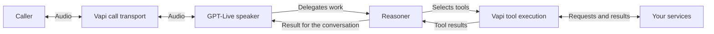

GPT-Live is a voice model that can listen and speak at the same time. Vapi connects it to a separate reasoning model and your tools so an assistant can hold a conversation while task work continues.

<Note>
GPT-Live access must be enabled for your organization. Contact Vapi if the model is unavailable. This section documents Vapi's integration; OpenAI's direct Live API exposes a different configuration and event interface.
</Note>

## How the models work together

The **speaker** handles the spoken conversation. The **reasoner** handles delegated requests, applies your task instructions, and selects tools. **Delegation** is the handoff from the speaker to the reasoner when a request needs backend work.

The speaker can continue listening and speaking while the reasoner works. A completed tool request, a spoken answer, and an action recorded in your service are separate outcomes.

| Component | Responsibility | Configuration |
| --- | --- | --- |
| Speaker | Conversation style, language, clarification, and delegation decisions | `model.speaker` |
| Reasoner | Task procedures, reasoning, tool selection, and interpreting results | `model.reasoner` |
| Vapi | Call transport, model connections, tools, post-call analysis, and observability | Assistant, call, and monitoring configuration |
| Your service | Authoritative records, permissions, input validation, and action status | Your tool implementation |

For example, the caller asks for Friday availability. The speaker delegates a lookup. The reasoner calls your availability tool, then returns the confirmed slots for the speaker to explain. No appointment exists until a booking operation succeeds.

## What full duplex changes

In a speech-to-text, language-model, and text-to-speech pipeline, separate components transcribe input, compose a response, and synthesize speech. GPT-Live handles the audio conversation directly. You do not choose a separate transcriber or text-to-speech provider for this integration.

Continuous conversation changes how you organize the application:

- Keep short conversational guidance in the speaker prompt.
- Put detailed procedures and tool-use rules in the reasoner prompt.
- Keep durable task state and authorization in your service.
- Evaluate what the caller hears alongside what the tools actually do.

A caller may correct a date while a lookup is running. Interrupting speech does not undo a booking or cancel an external request. The application needs a policy for those actions. See [Design GPT-Live conversations](/gpt-live/conversation-design).

## Choose an architecture for your requirements

GPT-Live is useful when overlapping speech, conversational timing, and continued dialogue during backend work matter. Evaluate it with recordings and tasks representative of your callers.

Check the [compatibility reference](/gpt-live/configuration) before migrating. Existing transcriber controls, voice fallbacks, and some call features do not carry over. A workflow that depends on those features needs a supported alternative before migration.

A natural acknowledgment is not a measure of task completion. Compare the time to a useful answer and the correctness of the final action, rather than measuring only the first sound.

## What Vapi provides around the conversation

Vapi manages the call lifecycle and provides tools to review outcomes after the conversation. Configure the features your application needs; selecting GPT-Live does not automatically configure analysis or quality alerts.

| Capability | What you use it for |
| --- | --- |
| [Call artifacts](/assistants/retrieve-call-artifacts) | Review transcripts, available recordings, and tool activity. |
| [Post-call analysis](/assistants/call-analysis) | Summarize a conversation and evaluate its outcome. |
| [Structured outputs](/assistants/structured-outputs) | Extract typed results such as the requested date, disposition, or whether a booking was confirmed. |
| [Scorecards](/observability/scorecard-quickstart) | Grade completed calls against criteria based on structured outputs. |
| [Boards](/observability/boards-quickstart) | Track call outcomes and trends across assistants. |
| [Monitoring](/observability/monitoring-quickstart) | Evaluate retained call data against configured thresholds and send alerts. |
| [Simulations](/observability/simulations-overview) | Define repeatable conversation scenarios; see the current GPT-Live limitation in the [testing guide](/gpt-live/testing#use-simulations-and-evals-appropriately). |
| [Evals](/observability/evals-quickstart) | Test supported model decisions; complement them with audio tests of the complete GPT-Live assistant. |

Monitoring here means quality evaluation and alerting from call data. It is separate from listen or monitor sockets, which this integration does not support. See the [compatibility reference](/gpt-live/configuration#post-call-analysis-and-observability) for configuration and data requirements.

## Start building

- [Create a GPT-Live assistant](/gpt-live/quickstart) and make a web call.
- [Configure the speaker and reasoner](/gpt-live/prompts) for your task.
- [Connect tools](/gpt-live/tools) to your services.
- [Migrate and evaluate an assistant](/gpt-live/testing) against an existing baseline.

For the underlying model architecture, see OpenAI's [GPT-Live overview](https://developers.openai.com/api/docs/guides/live).
