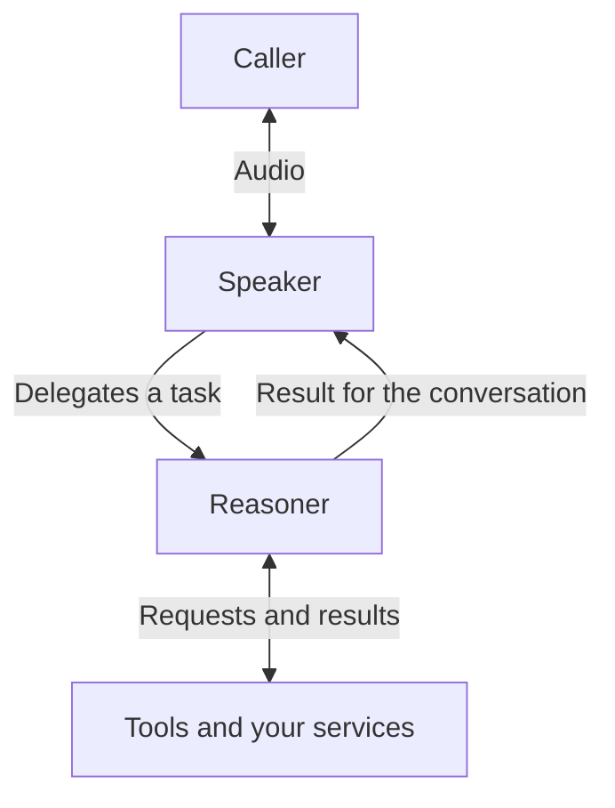

GPT-Live is an OpenAI voice model that can listen and speak at the same time. A caller can clarify a request while the assistant is talking, ask a question during a lookup, or ask it to slow down. This is **full-duplex conversation**: audio can flow in both directions at once.

Vapi connects that conversation to your tools and phone numbers, and provides the call records, analysis, and monitoring around it.

<Note>
GPT-Live must be enabled for your Vapi organization. Contact Vapi if the model isn't available in your dashboard.
</Note>

## How it works

A GPT-Live assistant uses a **speaker** for the spoken interaction and a **reasoner** for tasks that need tools or detailed procedures. **Delegation** is the speaker asking the reasoner to handle one of those tasks.

For a scheduling assistant, the speaker can guide the caller toward a suitable appointment. The reasoner checks availability through your service and returns the options. The speaker can keep listening while that work happens.

GPT-Live handles speech directly. You don't configure a separate speech-to-text transcriber or text-to-speech provider for the conversation.

## What changes with GPT-Live

You can design the interaction around the caller's goal, with room for questions and changes along the way. Detailed procedures belong with the reasoner. The speaker's instructions focus on how to guide the conversation.

You also have more to design than the words alone. Set a voice, give the speaker a delivery brief, and use personality packs to explore different styles. A concise assistant can slow down for a date, explain one step at a time, or give the short version when asked.

[Design your assistant](/gpt-live/design) explains these choices with examples, including how to rethink an existing squad.

## What Vapi provides

| Capability | Where to learn more |
| --- | --- |
| Browser, phone, and WebSocket calls | [Connect a call](/gpt-live/configuration#connect-a-call) |
| Tools that look up information or take actions | [Connect your tools](/gpt-live/configuration#connect-your-tools) |
| Speaker prompts, reasoner settings, and personality packs | [Model settings](/gpt-live/configuration#model-settings) |
| 22 preset voices, with audio previews | [Choose a voice](/gpt-live/configuration#voices) |
| Transcripts, available recordings, and post-call analysis | [Review calls](/gpt-live/configuration#review-and-monitor-calls) |
| Structured outputs, scorecards, Boards, and Monitoring | [Track quality](/gpt-live/configuration#review-and-monitor-calls) |

GPT-Live has a different set of supported features from Vapi's other voice architectures. Check [Limitations and FAQs](/gpt-live/limitations) if your application depends on squads, live call control, simulations, or a specific transfer flow.

## Get started

- **Explore the experience:** read [Design your assistant](/gpt-live/design) for architecture, conversation flow, and voice design.
- **Build a working assistant:** follow [Configure GPT-Live](/gpt-live/configuration#create-an-assistant) in the dashboard or API.
- **Assess a migration:** review [Limitations and FAQs](/gpt-live/limitations) against your current requirements.

For the underlying model, see OpenAI's [GPT-Live documentation](https://developers.openai.com/api/docs/guides/live). This section describes Vapi's integration and its supported configuration.
