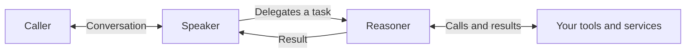

GPT-Live is an OpenAI voice model that listens and speaks at the same time. In a Vapi assistant, it handles the spoken conversation while a separate reasoner looks things up and takes actions through your tools. While the work runs, the assistant can keep listening, ask a useful question, or answer something else.

Here's an illustrative example of a caller booking an appointment:

> **Caller:** I'd like a consultation downtown on Friday.
>
> **Assistant:** I'll check Friday downtown. Who should I put the appointment under?
>
> **Caller:** Sam Lee. Actually, can we make it Thursday?
>
> **Assistant:** Sure, Thursday instead. On Thursday I have 9 or 1.

In this example, the assistant starts the lookup once it knows the service, location, and date, asks for the name while the lookup runs, and checks Thursday when the caller changes their mind. Designing for moments like these is the main work of building with GPT-Live. [Design conversations](/gpt-live/design) explains how.

<Note>
**Private beta.** GPT-Live must be enabled for your Vapi organization. See [Access](#access).
</Note>

## In this guide

<CardGroup cols={2}>
  <Card title="Make a first call" icon="fa-light fa-phone" href="/gpt-live/quickstart">
    Create an assistant and talk to it in a few minutes, with no server of your own.
  </Card>
  <Card title="Design conversations" icon="fa-light fa-comments" href="/gpt-live/design">
    Shape a conversation that reaches the caller's goal while work runs alongside it.
  </Card>
  <Card title="Migrate an assistant or squad" icon="fa-light fa-arrow-right-arrow-left" href="/gpt-live/migrate">
    Move an existing assistant or squad, compare it with the original, and keep a way back.
  </Card>
  <Card title="Check a feature" icon="fa-light fa-list-check" href="/gpt-live/configuration#compatibility">
    See what's supported before you build or migrate.
  </Card>
</CardGroup>

## How it works

A GPT-Live assistant has two parts. The **speaker** is the voice the caller hears. The **reasoner** does the task work: it follows your procedures and calls your tools. When the speaker needs something done, it **delegates** to the reasoner.

```mermaid
flowchart LR
  C[Caller] <-->|Conversation| S[Speaker]
  S -->|Delegates a task| R[Reasoner]
  R <-->|Calls and results| T[Your tools and services]
  R -->|Result| S
```

The two run side by side. While the reasoner works, the speaker keeps the conversation going. When a result arrives, the speaker fits it into the conversation as it stands.

GPT-Live hears and speaks directly, so there's no separate transcriber or text-to-speech provider to configure.

## What changes with GPT-Live

With GPT-Live, the conversation can continue while a tool runs, so you decide what happens during that time: which work to start early, what to ask while it runs, how to wait well when nothing else can happen, and how to bring the result back in. The assistant can also respond to interruptions, corrections, and detours while work is in progress.

A few things need deliberate design. The speaker only starts work when it delegates, so the triggers need to be explicit. Speech is generated, so exact wording isn't guaranteed. And speaking and acting are separate, so the assistant saying something happened is different from your service confirming it.

As an assistant takes on more kinds of work, [reasoner skills](/gpt-live/skills) let you organize each procedure and its tools behind the same conversation.

## What Vapi provides

Vapi connects GPT-Live to your phone numbers and tools, and provides call records and observability according to your recording and data settings:

- Browser, Twilio, Vapi SIP, and WebSocket calls.
- Function, API request, and MCP tools, plus built-in end-call, transfer, and DTMF tools.
- Speaker and reasoner prompts, reasoner skills, personality packs, and 22 voices.
- Idle-message hooks and HTTP live call control.
- Transcripts, recordings, structured outputs, scorecards, Boards, Monitoring, and Voice Simulations.

Before you commit, check whether your assistant depends on something GPT-Live doesn't support:

| If you need | With GPT-Live |
| --- | --- |
| Exact or prerecorded speech | Not available. All speech is generated |
| A voice from another provider, or a custom voice | Not available. Choose from 22 OpenAI voices |
| A squad with handoffs | Not supported. Use one assistant, often with skills |
| Knowledge bases or the Query tool | Not available. Use a retrieval tool |
| Warm transfers, or transfers on browser calls | Not supported. Blind transfers work on Twilio and Vapi SIP |
| Caller keypad input | Not supported |
| Native Telnyx or Vonage numbers | Not supported |

The full list is in [Settings and compatibility](/gpt-live/configuration#compatibility).

These pages describe Vapi's GPT-Live integration. OpenAI's API and ChatGPT offer some capabilities, such as web search, custom voices, and image input, that aren't available through Vapi. For background on the model itself, see OpenAI's [GPT-Live documentation](https://developers.openai.com/api/docs/guides/live).

## Access

GPT-Live is in private beta and must be enabled for your organization. If you don't have access yet, [join the waitlist](https://vapi.ai/gpt-live-waitlist). Joining doesn't guarantee early access.

## Cost

A GPT-Live call is billed for voice time by the second, including silence and waiting, plus Vapi's platform fee, the reasoner's token usage, and telephony. See [Cost](/gpt-live/testing#cost) for a worked example and how to check a real call.
