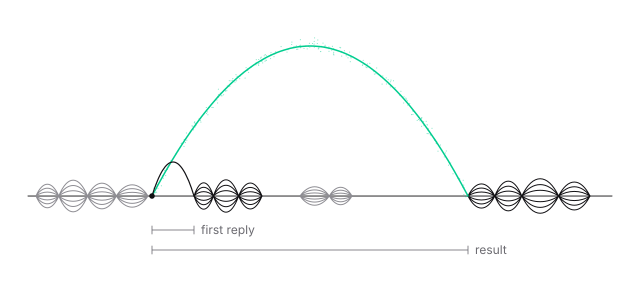
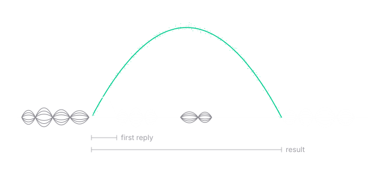
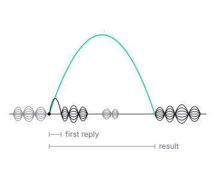
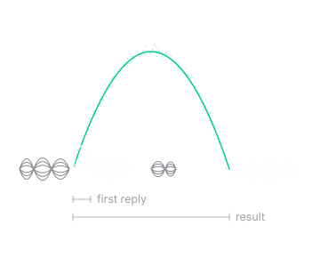

A GPT-Live call can go wrong in two separate ways. The conversation can be poor even when the task succeeds, for example when the caller has to repeat themselves. And the task can fail even when the conversation sounds fine, for example when the assistant says "You're booked" and nothing was booked. Test both, using evidence for each.

## What to look at

| Evidence | What it tells you |
| --- | --- |
| **Recording** | What the caller heard, and when: pace, overlap, interruptions, how waits sounded |
| **Transcript** | What was said. Transcripts can contain recognition mistakes, so check key details against the recording |
| **Call messages** | Tool calls with their arguments and results, including `endCall` and any skill loads |
| **Your service's state** | What actually happened: bookings made, changed, or not made |
| **Ended reason** | How the call ended |
| **Costs** | The call's cost breakdown, including billable voice time |

Tool results don't prove what the caller heard, and a good-sounding call doesn't prove the action happened. When you judge a scenario, check the one that answers your question: the recording for delivery, the call messages for what the reasoner did, and your service for the outcome.

## Scenarios to run

Start with a small set that covers what your assistant must get right, and repeat it after every prompt or setting change. Voice models vary from call to call, so run each important scenario several times.

| Scenario | What to do | Passes when |
| --- | --- | --- |
| Direct request | Give everything the task needs at once | The assistant starts work without re-asking, and the outcome is correct |
| Missing detail | Leave out something required | It asks for that one detail, then continues |
| Useful wait | Ask for something that needs a lookup | It asks a relevant question while the lookup runs, and uses the answer |
| Blocked wait | Confirm an action and stay quiet | One acknowledgment, no invented progress, and the outcome is stated only after the result |
| Question during a wait | Ask something related while an action runs | It answers from known information and returns to the result |
| Correction | Change a detail while work runs | New work for the new detail. The old result isn't presented |
| Change after completion | Change your mind after an action succeeds | It says the action was done and follows your change procedure |
| Detour and return | Ask an unrelated question mid-task | It answers, then returns to the task without repeating completed work |
| Tool failure | Make a tool fail | It explains what failed. Nothing is claimed |
| Interruption | Talk over the assistant | It stops and responds to you. Running work continues, and your service's state is correct |
| Quiet caller | Stop responding | Check-ins as configured. They stop when you speak again |
| End the call | Say goodbye | The call ends through `endCall` |
| Transfer | Ask for a person, on a phone call | The transfer is requested and connects |

To test failures and slow tools on demand, point your tools at a test version of your service that can return errors or delay its responses. [Actions that change state](/gpt-live/tools#actions-that-change-state) covers what your service should check in each case.

## Repeat scenarios with Voice Simulations

[Voice Simulations](/observability/simulations-quickstart) run scripted scenarios against your assistant with an AI tester, so you can repeat the set above without calling in yourself. GPT-Live can be the assistant under test, the tester, or both.

| Setup | Support |
| --- | --- |
| GPT-Live assistant with a classic AI tester | Supported in Voice mode |
| GPT-Live AI tester with a classic assistant | Supported in Voice mode |
| GPT-Live tester and assistant | Supported in Voice mode |
| Chat mode with a GPT-Live participant | Not supported. Use Voice mode |
| Squad runs with a GPT-Live participant | Not supported. Use a single assistant |

To run one:

1. Follow the [Simulations quickstart](/observability/simulations-quickstart) and select your GPT-Live assistant as the target.
2. Write the scenario and success criteria. If the tester uses GPT-Live, choose one of its supported voices.
3. Run in **Voice** mode, then review the transcript, evaluations, and recording.

Unmocked tools run for real. Use [tool mocks](/observability/simulations-advanced#mock-tool-responses), or point tools at a test service, before running scenarios that change data. A passing evaluation doesn't cover everything about the conversation, so listen to some recordings too.

[Evals](/observability/evals-quickstart) check supported text-model decisions, such as which tool is called, using mock conversations. They don't test GPT-Live's listening, speech, or turn-taking. Use Voice Simulations to test the spoken conversation.

## Watch production calls

GPT-Live supports Vapi's post-call analysis and monitoring features:

- **Extract data from each call.** Create [structured outputs](/assistants/structured-outputs-quickstart) and attach their IDs in `artifactPlan.structuredOutputIds`. Read the results in `call.artifact.structuredOutputs`.
- **Grade calls.** Create a [scorecard](/observability/scorecard-quickstart) from boolean or number structured outputs, and link it to the assistant. Read the grades in `call.artifact.scorecards`.
- **Receive call records on your server.** Set a Server URL and include `end-of-call-report` in the [server messages](/server-url/events). Your server receives an `end-of-call-report` message after the call.
- **Get alerts.** Create a [monitor](/observability/monitoring-quickstart) with its conditions, thresholds, evaluation windows, and notification destinations. Review its issues and alerts in Monitoring.

A few things to know when setting these up:

- When you update an assistant, keep its existing structured output IDs and artifact settings in the update, so you don't drop them.
- Existing [call analysis](/assistants/call-analysis) (`analysisPlan`) configurations keep working. For new setups, use structured outputs.
- A scorecard doesn't create a monitor. Set up monitors separately.
- [Authenticate your Server URL](/server-url/server-authentication). An end-of-call report can be delivered more than once, so handle repeats by call ID.
- [Boards](/observability/boards-quickstart) show call metrics and outcome trends for your assistant.

A structured output is a good way to catch the problems on this page after the fact. For example, a boolean output: "Did the assistant tell the caller an action was completed that no tool result in the call confirmed?" A scorecard can then flag those calls.

Some limits apply:

- Transcript-based checks need transcripts, and audio-based checks need a recording.
- If an assistant has a recording-consent plan, recording is disabled, because GPT-Live doesn't collect that consent.
- Monitoring isn't available with Zero Data Retention.
- Live listening and monitor sockets aren't available. Post-call Monitoring doesn't provide live audio.
- Classic transcriber and text-to-speech timing metrics don't describe GPT-Live calls.

## Latency

Callers notice two kinds of delay, and they have different causes:

- **Time until the caller hears something useful.** An acknowledgment, a relevant question, or an answer. This depends on the model's turn-taking, the call connection, and your speaker prompt, including whether it uses the wait well.
- **Time until the task is done correctly.** The result, stated accurately. This depends on when delegation happens, the reasoner, and your tools.

Measure them separately. The call's messages and your service's logs have timestamps for delegations and tool calls, and the recording shows when the caller heard each part.

<div className="gpt-live-illustration">
  
  
  
  
</div>

When the task takes too long, try these, one at a time, and check that the outcome is still correct after each change:

| Cause | What to try |
| --- | --- |
| Work starts late | Add a delegation trigger for the moment the inputs are known |
| Extra round trips | Return enough in one result to answer likely follow-ups, such as a whole day's times |
| Repeated lookups | Tell the reasoner when an earlier result still answers the request |
| Slow tools | Speed up your handler. Check the service log for the time each call takes |
| Reasoning time | Try a lower `model.reasoner.reasoningEffort`, such as `none`. The default is `low` |
| Model choice | Compare `gpt-5.6-luna`, `gpt-5.6-terra`, and `gpt-5.6-sol` on your scenarios |
| Skill loading | Each skill load adds a reasoning step. Keep the catalog small and descriptions distinct |

Lower effort or a smaller model can miss steps that a larger one handles. The right setting is the fastest one that still passes your scenarios.

## Cost

A GPT-Live call's cost has several parts:

- **GPT-Live voice time**, billed per second for the length of the call, including silence and time spent waiting on the reasoner.
- **Vapi's platform fee**, per minute.
- **The reasoner**, billed by the tokens each delegation uses. Delegations include conversation context, so long conversations and frequent delegations can add input usage.
- **Telephony** and any other services, such as a phone number provider.

Here's an illustrative estimate. It uses public rates as of September 30, 2026 and assumed token counts, so check current [Vapi pricing](https://vapi.ai/pricing) and your own calls before relying on it.

| Part | Assumption | Cost |
| --- | --- | --- |
| GPT-Live voice | 4 minutes at $0.05 per minute | $0.20 |
| Vapi platform fee | 4 minutes at $0.05 per minute | $0.20 |
| Reasoner, `gpt-5.6-terra` | 8 delegations, about 4,000 uncached input and 150 output tokens each, at \$2 per million input and \$12 per million output tokens | about $0.08 |
| Telephony | Depends on your provider | not included |
| **Total** | | **about $0.48 plus telephony** |

Your reasoner usage depends on the length of your prompts, tool results, and conversation, and on how often the assistant delegates.

To see what a real call cost, retrieve it after it ends:

```bash
curl --fail-with-body "https://api.vapi.ai/call/$CALL_ID" \
  -H "Authorization: Bearer $VAPI_PRIVATE_API_KEY"
```

The call's `costs` include the model cost with its billable voice time in `seconds`. If `usageComplete` is `false`, some usage wasn't reported and the cost may be understated.

## Troubleshooting

### GPT-Live isn't available, or calls don't start

- **GPT-Live isn't offered for your organization.** It must be enabled for your organization. See [Access](/gpt-live/overview#access).
- **You use your own OpenAI API key.** The key needs access to GPT-Live and to the reasoner model you selected.
- **The assistant is rejected when you save it.** See [A voice or tool is rejected when saving](#a-voice-or-tool-is-rejected-when-saving).
- **Calls stopped starting after you added a skill or saved tool.** Check that every saved tool ID the assistant or its skills reference still exists.

### The assistant said it would act, but nothing happened

Follow the request through the call, in order:

1. **Was there a tool call?** Check the call's messages at that point. If there's none, the speaker may not have delegated, or the reasoner may have returned a question instead of acting. Add a concrete trigger for that request to the speaker's delegation policy, and make answering the reasoner's questions a trigger too.
2. **Did the right tool run?** If a tool is missing, check that it's attached, and, if it's in a skill, that the skill's description covers the request.
3. **What did the tool return?** An error in the result means the action failed. The reasoner prompt should report failures plainly.
4. **What does your service show?** Its state is the answer to whether the action happened.

Delegation is a model decision, so check over several calls after changing the prompt.

### A tool result never reaches the conversation

The tool ran, but the assistant didn't use its result. Check your webhook's response against [the tool response contract](/gpt-live/tools#the-tool-response-contract): HTTP 200, one entry per call with the `toolCallId` from the request, and `result` or `error` as a string. For an async tool, the result must come back in the response to the original request. A job that finishes after your webhook has responded needs a status tool. See [Slow and external work](/gpt-live/tools#slow-and-external-work).

### Said goodbye but the call didn't end

A spoken goodbye doesn't end the call. For an assistant-initiated hangup, check the call's messages for an `endCall` tool call. If there's none, list ending the call in the speaker's delegation triggers, tell the reasoner to call `endCall`, and make sure the tool is attached. If there is one, check its result. `maxDurationSeconds` and a final [idle hook](/gpt-live/design#when-the-caller-goes-quiet) with `endCall` are backstops for calls that stay open.

### Answers are slow

Work out which delay it is, using [Latency](#latency). For a long silence before any response, compare the recording with your speaker prompt and connection. For a long wait for a result, check the timestamps for when delegation started, when each tool call started and finished, and when the result was spoken.

### A tool received the wrong value

The reasoner works from the transcript. Compare the tool arguments with the recording. If the transcript misheard a name, number, or date, have the assistant [read back](/gpt-live/design#names-numbers-and-dates) important details before acting, and ask callers to spell names.

### The assistant used an outdated result

A correction arrived while earlier work was running. Check that the speaker prompt says to delegate the updated request and not to present old results, and that your results include the request details, such as the date, so a stale one is recognizable.

### The wrong skill loaded, or a tool was unavailable

See [When skills misbehave](/gpt-live/skills#when-skills-misbehave).

### Waits feel awkward

Listen to the recording. Repeated "still checking" messages, invented progress, or unrelated questions point to the speaker's guidance for [while work is running](/gpt-live/design#while-work-is-running). Long silences with no acknowledgment point the other way. Adjust one line at a time.

### Check-ins happen at the wrong time

Check-ins come from `customer.speech.timeout` hooks. If they fire while an async tool's result or an external job is still pending, that's expected: check-ins can resume once an async tool has been dispatched. Tell the caller about the wait and lengthen the timeouts. If check-ins come sooner than you expected after the caller asked for a moment, remember that the assistant's reply starts a new quiet period. If a check-in fires fewer times than you expect over a call, check `triggerMaxCount` and `triggerResetMode`, which control how many times a hook can fire. See [idle-message hooks](/gpt-live/configuration#idle-messages).

### The assistant doesn't greet the caller

Set `firstMessageMode` to `assistant-speaks-first` and give a text `firstMessage`. Audio greetings aren't supported, and without usable text the assistant waits for the caller.

### A voice or tool is rejected when saving

Use `voice.provider: "openai"` with a [supported voice](/gpt-live/configuration#voices), and remove voice and model fallbacks. Use supported tool types with unique names, and check saved tools too. Disable keypad input.

### WebSocket calls fail to start or sound distorted

Set the transport audio format explicitly to raw `pcm_s16le` at `24000` Hz, and send mono 16-bit little-endian audio at that rate. See [Call connections](/gpt-live/configuration#connect-a-call).

### A transfer fails or doesn't connect

Transfers work only on native Twilio and Vapi SIP calls, and only as blind transfers. A successful transfer request means the carrier accepted it, not that the destination answered. Check the destination and your carrier's requirements.

### There's no recording or analysis result

Check that recording is enabled and that no recording-consent plan is configured. A missing analysis result isn't a pass: check that the output IDs are attached and that the call has the transcript or recording the analysis needs.
