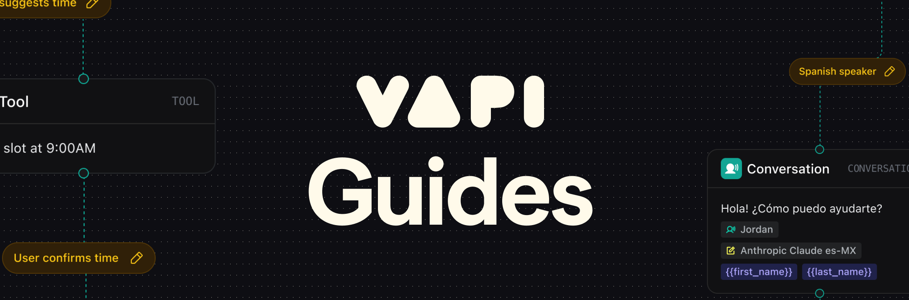

<Frame>
  
</Frame>

<CardGroup cols={2}>
  <Card title="Appointment Scheduling" icon="calendar-check" href="/workflows/examples/appointment-scheduling">
    

      <Icon icon="arrow-up-right-from-square" />
    

    
Built with Workflows

     
    Build an appointment scheduling assistant that can schedule appointments for a barbershop
  </Card>
  <Card title="Medical Triage & Scheduling" icon="stethoscope" href="/workflows/examples/clinic-triage-scheduling">
    

      <Icon icon="arrow-up-right-from-square" />
    

    
Built with Workflows

     
    Build a medical triage and scheduling assistant that can triage patients and schedule appointments for a clinic
  </Card>
  <Card title="Ecommerce Order Management" icon="shopping-cart" href="/workflows/examples/ecommerce-order-management">
    

      <Icon icon="arrow-up-right-from-square" />
    

    
Built with Workflows

     
    Build an ecommerce order management assistant that can track orders and process returns
  </Card>
  <Card title="Property Management" icon="building" href="/workflows/examples/property-management">
    

      <Icon icon="arrow-up-right-from-square" />
    

    
Built with Workflows

     
    Build a call routing workflow that dynamically routes tenant calls based on verification and inquiry type
  </Card>
  <Card title="Lead Qualification" icon="phone" href="/workflows/examples/lead-qualification">
    

      <Icon icon="arrow-up-right-from-square" />
    

    
Built with Workflows

     
    Create an outbound sales agent that can schedule appointments automatically
  </Card>
    <Card title="Multilingual Support Workflow" icon="globe" href="/workflows/examples/multilingual-support">
    

      <Icon icon="arrow-up-right-from-square" />
    

    
Built with Workflows

     
    Build a structured multilingual support workflow with language selection and dedicated conversation paths
  </Card>
  <Card title="Dynamic Multilingual Agent" icon="language" href="/assistants/examples/multilingual-agent">
    

      <Icon icon="arrow-up-right-from-square" />
    

    
Built with Assistants

     
    Build a dynamic agent with automatic language detection and real-time language switching
  </Card>
  <Card title="Support Escalation" icon="headset" href="/assistants/examples/support-escalation">
    

      <Icon icon="arrow-up-right-from-square" />
    

    
Built with Assistants

     
    Build an intelligent support escalation system with dynamic routing based on customer tier and issue complexity
  </Card>
  <Card title="Docs Agent" icon="book-open" href="/assistants/examples/docs-agent">
    

      <Icon icon="arrow-up-right-from-square" />
    

    
Built with Assistants

     
    Build a docs agent that can answer questions about your documentation
  </Card>
  <Card title="Inbound Support" icon="headset" href="/assistants/examples/inbound-support">
    

      <Icon icon="arrow-up-right-from-square" />
    

    
Built with Assistants

     
    Build a technical support assistant that remembers where you left off between calls
  </Card>
  <Card title="Voice Widget" icon="microphone" href="/assistants/examples/voice-widget">
    

      <Icon icon="arrow-up-right-from-square" />
    

    
Built with Assistants

     
    Easily integrate the Vapi Voice Widget into your website for enhanced user interaction
  </Card>

</CardGroup>
