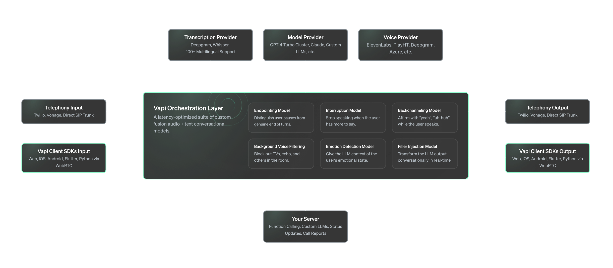

Vapi also runs a suite of audio and text models that make it's latency-optimized Speech-to-Text (STT), Large Language Model (LLM), & Text-to-Speech (TTS) pipeline feel human.

Here's a high-level overview of the Vapi architecture:

<Frame>
  
</Frame>

These are some of the models that are part of the Orchestration suite. We currently have lots of other models in the pipeline that will be added to the orchestration suite soon. The ultimate goal is to achieve human performance.

### Endpointing

Endpointing is a fancy word for knowing when the user is done speaking. Traditional methods use silence detection with a timeout. Unfortunately, if we want sub-second response-times, that's not going to work.

Vapi's uses a custom fusion audio-text model to know when a user has completed their turn. Based on both the user's tone and what they're saying, it decides how long to pause before hitting the LLM.

This is critical to make sure the user isn't interrupted mid-thought while still providing sub-second response times when they're done speaking.

### Interruptions (Barge-in)

Interruptions (aka. barge-in in research circles) is the ability to detect when the user would like to interject and stop the assistant's speech.

Vapi uses a custom model to distinguish when there is a true interruption, like "stop", "hold up", "that's not what I mean, and when there isn't, like "yeah", "oh gotcha", "okay."

It also keeps track of where the assistant was cut off, so the LLM knows what it wasn't able to say.

### Background Noise Filtering

Many of our models, including the transcriber, are audio-based. In the real world, things like music and car horns can interfere with model performance.

We use a proprietary real-time noise filtering model to ensure the audio is cleaned without sacrificing latency, before it reaches the inner models of the pipeline.

### Background Voice Filtering

We rely quite heavily on the transcription model to know what's going on, for interruptions, endpointing, backchanneling, and for the user's statement passed to the LLM.

Transcription models are built to pick up everything that sounds like speech, so this can be a problem. As you can imagine, having a TV on in the background or echo coming back into the mic can severely impact the conversation ability of a system like Vapi.

Background noise cancellation is a well-researched problem. Background voice cancellation is not. To solve this, we built proprietary audio filtering model that's able to **focus in** on the primary speaker and block everything else out.

### Backchanneling

Humans like to affirm each other while they speak with statements like "yeah", "uh-huh", "got it", "oh no!"

They're not considered interruptions, they're just used to let the speaker know that their statement has been understood, and encourage the user to continue their statement.

A backchannel cue used at the wrong moment can derail a user's statement. Vapi uses a proprietary fusion audio text model to determine the best moment to backchannel and to decide which backchannel cue is most appropriate to use.

### Emotion Detection

How a person says something is just as important as what they're saying. So we've trained a real-time audio model to extract the emotional inflection of the user's statement.

This emotional information is then fed into the LLM, so knows to behave differently if the user is angry, annoyed, or confused.

### Filler Injection

The output of LLMs tends to be formal, and not conversational. People speak with phrases like "umm", "ahh", "i mean", "like", "so", etc.

You can prompt the model to output like this, but we treat our user's prompts as **sacred**. Making a change like this to a prompt can change the behavior in unintended ways.

To ensure we don't add additional latency transforming the output, we've built a custom model that's able to convert streaming input and make it sound conversational in real-time.
