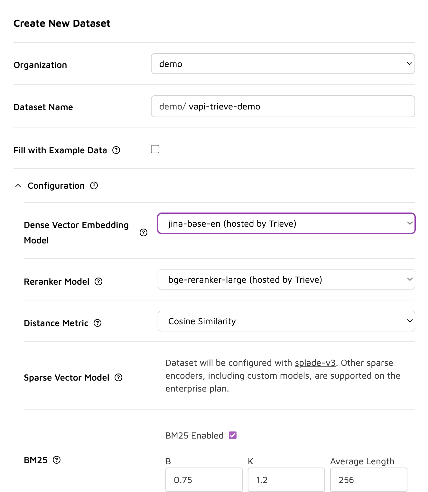
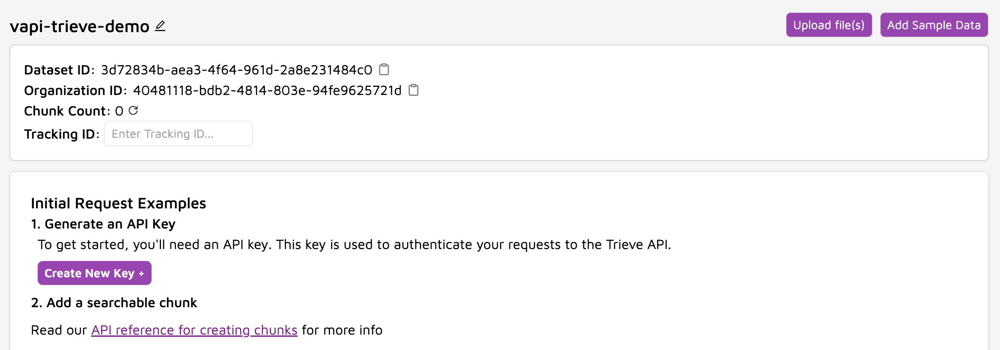
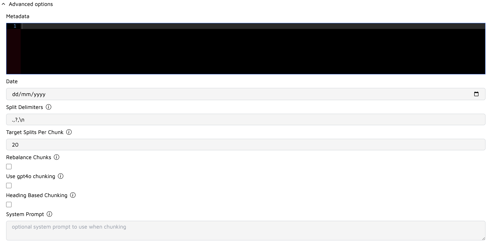
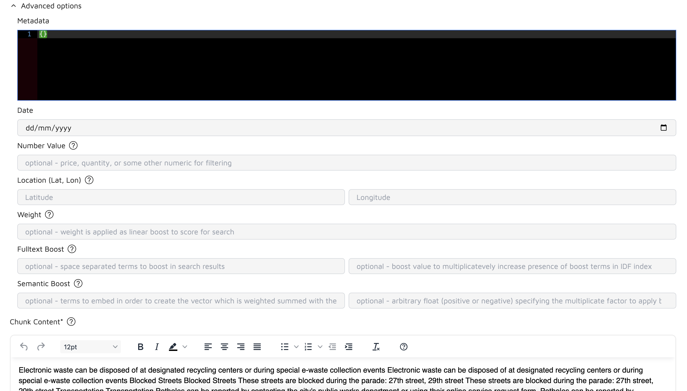
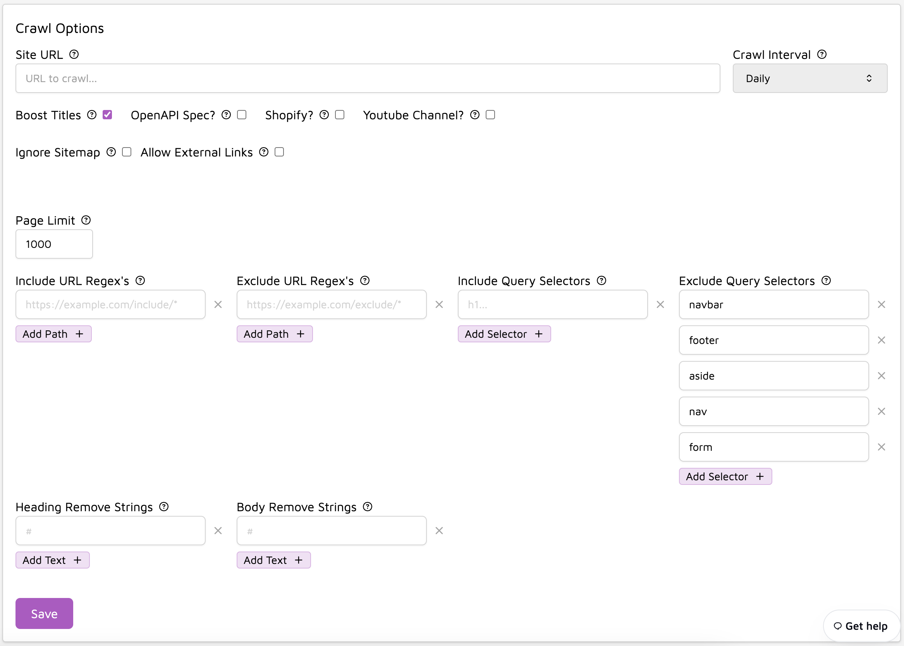
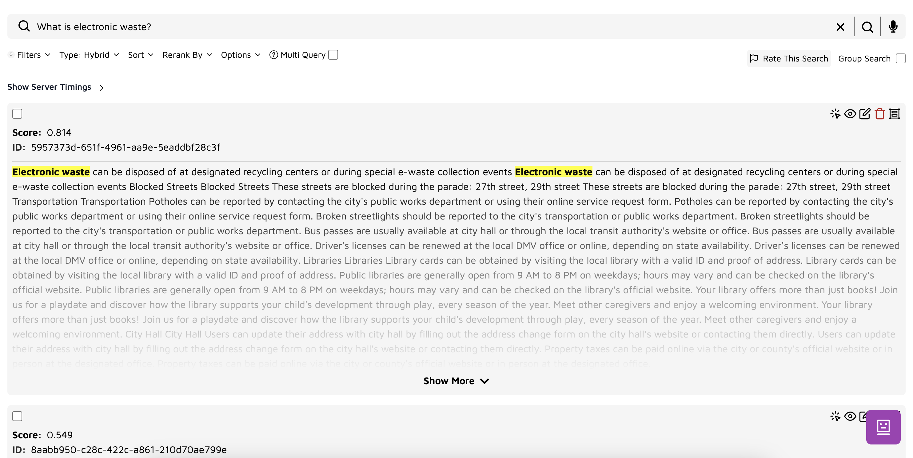
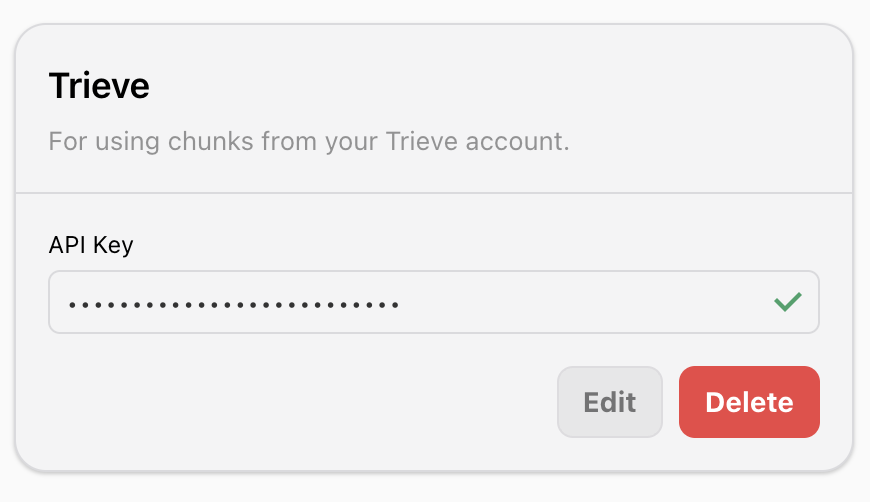

<Frame>
  <div class="video-embed-wrapper">
    <iframe
      src="https://www.youtube.com/embed/KZkYPSJPPk8?si=IFyBAL1zAXrUwv2L"
      title='An embedded YouTube video titled "Quickstart: Building a Hotel Voice Agent with Vapi and Trieve"'
      frameborder="0"
      allow="fullscreen; accelerometer; autoplay; clipboard-write; encrypted-media; gyroscope; picture-in-picture; web-share"
      allowfullscreen
      referrerpolicy="strict-origin-when-cross-origin"
    />
  </div>
</Frame>

# Using Trieve with Vapi

Vapi integrates with [Trieve](https://trieve.ai) through the BYOD (Bring Your Own Dataset) approach, allowing you to use your Trieve API key to import your existing Trieve datasets into Vapi.

## Integrating with Trieve

The BYOD approach offers flexibility and control over your datasets. You can:

- Fully manage your datasets in Trieve's native interface
- Use Trieve's advanced features like:
  - Custom chunking rules
  - Search playground testing
  - Manual chunk editing
  - Website crawling
  - Dataset visualization

### Step 1: Set Up Trieve Dataset

1. Create an account at [Trieve](https://trieve.ai)
2. Create a new dataset using Trieve's dashboard



When creating your dataset in Trieve, selecting the right embedding model is crucial for optimizing performance and accuracy. Here are some of the available options:

### jina-base-en

- **Provider**: Jina AI (Hosted by Trieve)
- **Performance**: Fast
- **Description**: This model is designed for speed and efficiency, making it suitable for applications where quick response times are critical. It provides a good balance of performance and accuracy for general use cases.

### text-embedding-3-small

- **Provider**: OpenAI
- **Performance**: Moderate
- **Description**: A smaller model from OpenAI that offers a compromise between speed and accuracy. It is suitable for applications that require a balance between computational efficiency and the quality of embeddings.

### text-embedding-3-large

- **Provider**: OpenAI
- **Performance**: Slow
- **Description**: This larger model provides the highest accuracy among the options but at the cost of slower processing times. It is ideal for applications where the quality of embeddings is prioritized over speed.

3. Add content through various methods:

#### Upload Documents

Upload documents directly through Trieve's interface:



When uploading files, you can configure advanced chunking options:



#### Edit Individual Chunks

After uploading documents, you can edit individual chunks to refine their content:



##### Editing Options

- **Chunk Content**: Modify the text directly in the rich text editor

  - Fix formatting issues
  - Correct errors or typos
  - Split or combine chunks manually
  - Add or remove content

- **Metadata Fields**:
  - Date: Update document timestamps
  - Number Value: Adjust numeric metadata for filtering
  - Location: Set or modify geographical coordinates
  - Weight: Fine-tune search relevance with custom weights
  - Fulltext Boost: Add terms to enhance search visibility
  - Semantic Boost: Adjust vector embedding influence

##### Best Practices for Chunk Editing

1. **Content Length**

   - Keep chunks between 200-1000 tokens
   - Maintain logical content boundaries
   - Ensure complete thoughts within each chunk

2. **Metadata Optimization**

   - Use consistent date formats
   - Add relevant numeric values for filtering
   - Apply weights strategically for important content

3. **Search Enhancement**
   - Use boost terms for critical keywords
   - Balance semantic and fulltext boosts
   - Test search results after significant edits

### Advanced Chunking Options

#### Metadata

- Add custom metadata as JSON to associate with your chunks
  - Useful for filtering and organizing content (e.g., `{"author": "John Doe", "category": "technical"}`)
  - Keep metadata concise and relevant to avoid storage overhead
  - Use consistent keys across related documents for better searchability

#### Date

- Specify the creation or relevant date for the document
  - Important for version control and content freshness
  - Helps with filtering outdated information
  - Use actual document creation dates when possible

#### Split Delimiters

- Define custom delimiters (e.g., ".,?\n") to control where chunks are split
  - Recommended defaults: ".,?\n" for general content
  - Add semicolons (;) for technical documentation
  - Use "\n\n" for markdown or structured content
  - Avoid over-aggressive splitting that might break context

#### Target Splits Per Chunk

- Set the desired number of splits per chunk
  - Default: 20 splits
  - Recommended ranges:
    - 15-25 for general content
    - 10-15 for technical documentation
    - 25-30 for narrative content
  - Lower values create more granular chunks, better for precise retrieval
  - Higher values maintain more context but may retrieve irrelevant information

#### Rebalance Chunks

- Enable to redistribute content evenly across chunks
  - Recommended for documents with varying section lengths
  - Helps maintain consistent chunk sizes
  - May slightly impact natural content boundaries
  - Best used with technical documentation or structured content

#### Use gpt4o chunking

- Enable GPT-4 optimized chunking for improved semantic coherence
  - Recommended for:
    - Complex technical documentation
    - Content with intricate relationships
    - Documents where context preservation is crucial
  - Note: Increases processing time and cost
  - Best for high-value content where accuracy is paramount

#### Heading Based Chunking

- Split content based on document headings
  - Ideal for well-structured documents (e.g., documentation, reports)
  - Works best with consistent heading hierarchy
  - Consider enabling for:
    - Technical documentation
    - User manuals
    - Research papers
  - May create uneven chunk sizes based on section lengths

#### System Prompt

- Provide custom instructions for the chunking process
  - Optional but powerful for specific use cases
  - Example prompts:
    - "Preserve code blocks as single chunks"
    - "Keep API endpoint descriptions together"
    - "Maintain question-answer pairs in the same chunk"
  - Keep prompts clear and specific
  - Test different prompts with sample content to optimize results

#### Website Crawling

Trieve offers powerful website crawling capabilities with extensive configuration options:



##### Crawl Configuration Options

- **Crawl Interval**: Set how often to refresh content

  - Options: Daily, Weekly, Monthly
  - Recommended: Daily for frequently updated content

- **Page Limit**: Control the maximum number of pages to crawl

  - Default: 1000 pages
  - Adjust based on your site size and content relevance

- **URL Patterns**

  - Include/Exclude specific URL patterns using regex
  - Example includes: `https://docs.example.com/*`
  - Example excludes: `https://example.com/internal/*`

- **Query Selectors**

  - Include specific HTML elements for targeted content extraction
  - Exclude navigation, footers, and other non-content elements
  - Common excludes: `navbar`, `footer`, `aside`, `nav`, `form`

- **Special Content Types**

  - OpenAPI Spec: Toggle for API documentation crawling
  - Shopify: Enable for e-commerce content
  - YouTube Channel: Include video transcripts and descriptions

- **Advanced Options**
  - Boost Titles: Increase weight of page titles in search results
  - Allow External Links: Include content from linked domains
  - Ignore Sitemap: Skip sitemap-based crawling
  - Remove Strings: Clean up headers and body content

##### Best Practices for Crawling

1. **Start Small**

   - Begin with a low page limit
   - Test with specific sections of your site
   - Gradually expand coverage

2. **Optimize Selectors**

   - Remove navigation and UI elements
   - Focus on main content areas
   - Use browser inspector to identify key selectors

3. **Monitor Performance**
   - Check crawl logs regularly
   - Adjust patterns based on results
   - Balance frequency with server load

### Step 2: Test and Refine

Use Trieve's search playground to:

- Test semantic search queries
- Adjust chunk sizes
- Edit chunks manually

- Visualize vector embeddings
- Fine-tune relevance scores



### Step 3: Import to Vapi

1. Create your Trieve API key from [Trieve's dashboard](https://dashboard.trieve.ai/org/keys)
2. Add your Trieve API key to Vapi [Provider Credentials](https://dashboard.vapi.ai/keys)
   
3. Once your dataset is optimized in Trieve, import it to Vapi via POST request to the [create knowledge base route](https://docs.vapi.ai/api-reference/knowledge-bases/create):

```json
{
  "name": "trieve-dataset",
  "provider": "trieve",
  "searchPlan": {
    "scoreThreshold": 0.2,
    "searchType": "semantic"
  },
  "createPlan": {
    "type": "import",
    "providerId": "<Your Trieve Dataset ID>"
  }
}
```

## Best Practices

1. **Dataset Organization**

   - Segment datasets by domain knowledge boundaries
   - Use semantic-based dataset naming (e.g., "api-docs-v2", "user-guides-2024")
   - Version control chunking configurations in your codebase

2. **Content Quality**

   - Implement text normalization (Unicode normalization, whitespace standardization)
   - Use regex patterns to clean formatting artifacts
   - Validate chunk semantic coherence through embedding similarity scores

3. **Performance Optimization**

   - Target chunk sizes: 200-1000 tokens (optimal for current embedding models)
   - Configure hybrid search with BM25 boost = 0.3 for technical content
   - Set score thresholds dynamically based on embedding model (0.2 for text-embedding-3-small, 0.25 for text-embedding-3-large)

4. **Maintenance**
   - Implement automated content refresh cycles via Trieve's API
   - Track search result relevance metrics (MRR, NDCG)
   - Rotate API keys on 90-day cycles

## Troubleshooting

Common issues and solutions:

1. **Search Relevance Issues**

   - Implement cross-encoder reranking for critical queries
   - Fine-tune BM25 vs semantic weights (recommended ratio: 0.3:0.7)
   - Analyze chunk boundary overlap percentage (aim for 15-20%)

2. **Integration Errors**

   - Validate dataset permissions (READ_DATASET scope required)
   - Check for dataset ID format compliance (UUID v4)
   - Monitor rate limits (default: 100 requests/min)

3. **Performance Optimization**
   - Implement chunk size normalization (max variance: 20%)
   - Enable query caching for frequent searches
   - Use batch operations for bulk updates (max 100 chunks/request)

Need help? Contact [support@vapi.ai](mailto:support@vapi.ai) for assistance.
