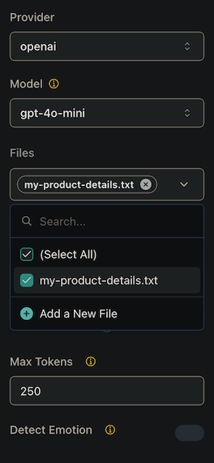

## **What is Vapi's Knowledge Base?**

A [**Knowledge Base**](/api-reference/knowledge-bases/create) is a collection of custom files that contain information on specific topics or domains. By integrating a Knowledge Base into your voice AI assistant, you can enable it to provide more accurate and informative responses to user queries based on your own data. Knowledge Bases are available through both the Vapi API and dashboard.

### **Why Use a Knowledge Base?**

Using a Knowledge Base with your voice AI assistant offers several benefits:

- **Improved accuracy**: Your assistant can provide responses based on your verified information rather than general knowledge.
- **Enhanced capabilities**: A Knowledge Base enables your assistant to answer complex domain-specific queries with detailed, contextually relevant responses.
- **Customization**: With a Knowledge Base, you can tailor your assistant's responses to specific domains or topics, making it more effective for your particular use case.
- **Up-to-date information**: You control the content, ensuring your assistant always has access to the latest information.

<Info>
  Knowledge Bases are configured through the API or dashboard. For advanced
  configuration options, view all configurable properties in the [API
  Reference](/api-reference/knowledge-bases/using-query-tool).
</Info>

## **How to Create a Knowledge Base**

There are two main approaches to creating a Knowledge Base in Vapi:

1. **Dashboard method**: A simplified approach using the Vapi UI
2. **API method**: A more customizable approach using direct API calls

### **Method 1: Using the Dashboard**

#### **Step 1: Upload Your Files**

1. Navigate to `Build > Files` in your Vapi dashboard
2. Click the "Upload" button to add your files
3. Select files in supported formats (`.txt`, `.pdf`, `.docx`, etc.)
4. Wait for the upload to complete - you'll see your files listed in the Files section

<Info>
  Vapi supports various file formats for Knowledge Bases including: .txt, .pdf, .docx, .doc, .csv, .md, .tsv, .yaml, .json, .xml, and .log files.
</Info>

<Frame caption="Adding files to your Knowledge Base">
  
</Frame>

#### **Step 2: Configure Your Assistant with the Knowledge Base**

1. Navigate to `Build > Assistant`
2. Select the assistant you want to enhance with the Knowledge Base
3. In the assistant configuration, locate the "Files" or "Knowledge Base" section
4. Select the files you uploaded in Step 1 to associate them with this assistant

<Frame caption="Select files from your Assistant">
  
</Frame>

#### **Step 3: Publish the Assistant**

1. Review your assistant configuration to ensure all settings are correct
2. Click the "Publish" button to make your changes live
3. This automatically creates a default knowledge base (using the query tool) with the selected files for the assistant

<Note>
  When you publish an assistant with selected files, Vapi automatically creates
  a query tool with those files configured as a knowledge base. For more
  advanced configurations, use the API method described below or see our [Query
  Tool documentation](/knowledge-base/using-query-tool).
</Note>

### **Method 2: Using the API**

For more advanced configurations, you can create and configure Knowledge Bases using the API through the Query Tool. This method offers greater flexibility and control over your knowledge base setup.

<Info>
  For detailed instructions on creating and configuring knowledge bases via the
  API, please refer to our dedicated guide: [Using the Query Tool for Knowledge
  Bases](/knowledge-base/using-query-tool).
</Info>

The API method allows you to:

- Upload files and obtain file IDs
- Create custom query tools with specific knowledge base configurations
- Configure multiple knowledge bases within a single query tool
- Attach query tools to your assistants
- Set advanced parameters for knowledge retrieval

This approach is recommended for developers and users who need precise control over their knowledge base implementation or are integrating Vapi into existing systems programmatically.

## **Best Practices for Creating Effective Knowledge Bases**

- **Optimize file size**: Keep individual files smaller than 300KB to ensure quick processing and response times.
- **Structure content logically**: Organize your files by topic or category with clear headings and sections.
- **Use clear and concise language**: Write in plain language with well-defined terminology to improve retrieval accuracy.
- **Update regularly**: Refresh your knowledge base files whenever information changes to maintain accuracy.
- **Test thoroughly**: After configuration, test your assistant with various queries to ensure it retrieves information correctly.
- **Provide context**: Include sufficient background information in your files to enable comprehensive responses.
- **Consider file formats**: While plain text works well, structured formats can improve information retrieval for complex topics.

<Tip>
  For more information on creating effective Knowledge Bases, check out our
  tutorial on [Best Practices for Knowledge Base
  Creation](https://youtu.be/i5mvqC5sZxU).
</Tip>

By following these guidelines, you can create a comprehensive Knowledge Base that enhances the capabilities of your voice AI assistant and provides valuable information to users.

<Info>
  Currently, Vapi's Knowledge Base functionality supports Google as a provider
  with the gemini-1.5-flash model for knowledge retrieval. For the most
  up-to-date information on supported providers and models, please refer to our
  [API documentation](api-reference/tools/create#request.body.query.knowledgeBases).
</Info>
