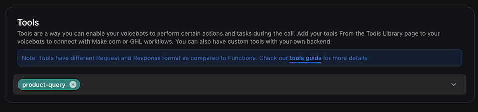

## **What is the Query Tool?**

The Query Tool is a powerful feature that allows your voice AI assistant to access and retrieve information from custom knowledge bases. By configuring a query tool with specific file IDs, you can enable your assistant to provide accurate and contextually relevant responses based on your custom data.

### **Benefits of Using the Query Tool**

- **Enhanced contextual understanding**: Your assistant can access specific knowledge to answer domain-specific questions.
- **Improved response accuracy**: Responses are based on your verified information rather than general knowledge.
- **Customizable knowledge retrieval**: Configure multiple knowledge bases for different topics or domains.

<Info>
  Currently, the Query Tool only supports Google as a provider with the
  gemini-1.5-flash model for knowledge base retrieval.
</Info>

## **How to Configure a Query Tool for Knowledge Bases**

### **Step 1: Upload Your Files**

Before creating a query tool, you need to upload the files that will form your knowledge base.

#### Option 1: Using the Dashboard (Recommended)

1. Navigate to **Files** in your Vapi dashboard
2. Click **Upload File** or **Choose file**
3. Select the files you want to upload from your computer
4. Wait for the upload to complete and note the file IDs that are generated

#### Option 2: Using the API

Alternatively, you can upload files via the API:

```bash
curl --location 'https://api.vapi.ai/file' \
--header 'Authorization: Bearer <YOUR_API_KEY>' \
--form 'file=@"<PATH_TO_YOUR_FILE>"'
```

After uploading, you'll receive file IDs that you'll need for the next step.

### **Step 2: Create a Query Tool**

Create a query tool that references your knowledge base files:

#### Option 1: Using the Dashboard (Recommended)

1. Navigate to **Tools** in your Vapi dashboard
2. Click **Create Tool**
3. Select **Query** as the tool type
4. Configure the tool:
   - **Tool Name**: "Product Query"
   - **Knowledge Bases**: Add your knowledge base with:
     - **Name**: `product-kb`
     - **Description**: "Use this knowledge base when the user asks or queries about the product or services"
     - **File IDs**: Select the files you uploaded in Step 1

#### Option 2: Using the API

Alternatively, you can create the tool via API:

```bash
curl --location 'https://api.vapi.ai/tool/' \
--header 'Content-Type: application/json' \
--header 'Authorization: Bearer <YOUR_API_KEY>' \
--data '{
    "type": "query",
    "function": {
        "name": "product-query"
    },
    "knowledgeBases": [
        {
            "provider": "google",
            "name": "product-kb",
            "description": "Use this knowledge base when the user asks or queries about the product or services",
            "fileIds": [
                "41a2bd44-d13c-4914-bbf7-b19807dd2cf4",
                "ef82ae15-21b2-47bd-bde4-dea3922c1e49"
            ]
        }
    ]
}'
```

<Note>
  The `description` field in the knowledge base configuration helps your
  assistant understand when to use this particular knowledge base. Make it
  descriptive of the content.
</Note>

### **Step 3: Attach the Query Tool to Your Assistant**

After creating the query tool, you need to attach it to your assistant:

#### Option 1: Using the Dashboard (Recommended)

1. Navigate to **Assistants** in your Vapi dashboard
2. Select the assistant you want to configure
3. Go to the **Tools** section
4. Click **Add Tool** and select your query tool from the dropdown
5. Save and publish your assistant

#### Option 2: Using the API

Alternatively, you can attach the tool via API using the tool ID:

```bash
curl --location --request PATCH 'https://api.vapi.ai/assistant/ASSISTANT_ID' \
--header 'Authorization: Bearer <YOUR_API_KEY>' \
--data '{
    "model": {
        "temperature": 0.2,
        "provider": "openai",
        "model": "gpt-4o",
        "toolIds": [
            "9441840b-6f2f-4b0f-a0fc-de8512549a0c"
        ]
    }
}'
```

<Warning>
  When using the PATCH request, you must include the entire model object, not
  just the toolIds field. This will overwrite any existing model configuration.
</Warning>

<Frame caption="Adding a query tool to your assistant">
  
</Frame>

## **Advanced Configuration Options**

### **Multiple Knowledge Bases**

You can configure multiple knowledge bases within a single query tool:

```json
"knowledgeBases": [
    {
        "provider": "google",
        "name": "product-documentation",
        "description": "Use this knowledge base for product specifications and features",
        "fileIds": ["file-id-1", "file-id-2"]
    },
    {
        "provider": "google",
        "name": "troubleshooting-guide",
        "description": "Use this knowledge base for troubleshooting and support questions",
        "fileIds": ["file-id-3", "file-id-4"]
    }
]
```

### **Knowledge Base Description**

The description field helps your assistant understand when to use a particular knowledge base. Make it specific and clear:

```json
"description": "Use this knowledge base when the user asks about pricing, subscription plans, or billing information"
```

## **Best Practices for Query Tool Configuration**

- **Organize by topic**: Create separate knowledge bases for distinct topics to improve retrieval accuracy.
- **Use descriptive names**: Name your knowledge bases clearly to help your assistant understand their purpose.
- **Keep descriptions specific**: Write clear descriptions that tell the assistant exactly when to use each knowledge base.
- **Update regularly**: Refresh your knowledge bases as information changes to ensure accuracy.
- **Test thoroughly**: After configuration, test your assistant with various queries to ensure it retrieves information correctly.

<Tip>
  For optimal performance, keep individual files under 300KB and ensure they
  contain clear, well-structured information.
</Tip>

By following these steps and best practices, you can effectively configure the query tool to enhance your voice AI assistant with custom knowledge bases, making it more informative and responsive to user queries.
