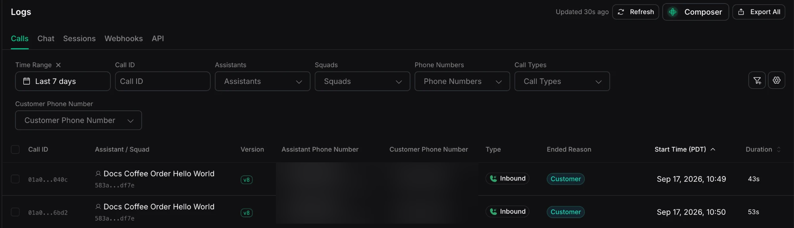
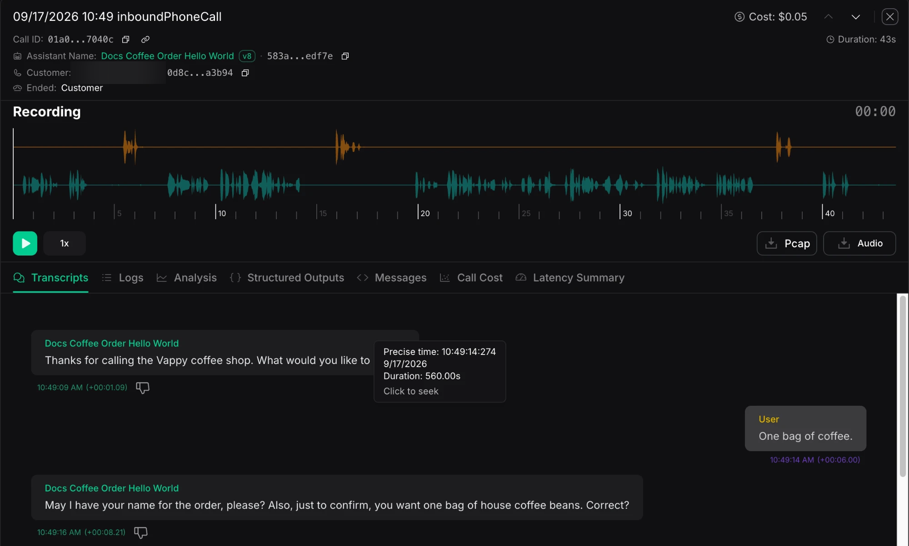

Call logs show what happened during voice calls in your account. Start with the **Calls** tab when you need to understand a call or diagnose a problem.

Vapi creates call records automatically. The assistant's **Logging** setting controls detailed pipeline logs, while separate artifact settings control recordings and transcripts. See [Retention and logging configuration](/observability/logs/overview#retention-and-logging-configuration) for availability, storage, and compliance behavior.

To understand why a call ended, see [Call ended reasons](/calls/call-ended-reason). This page is about reading the logs.

## Access call logs

- **Dashboard:** [Logs → Calls](https://dashboard.vapi.ai/logs)
- **API:** [List calls](/api-reference/calls/list) and [Get call](/api-reference/calls/get)

```bash title="List recent calls"
curl "https://api.vapi.ai/call" \
  -H "Authorization: Bearer $VAPI_PRIVATE_API_KEY"
```

```bash title="Get one call by ID"
curl "https://api.vapi.ai/call/YOUR_CALL_ID" \
  -H "Authorization: Bearer $VAPI_PRIVATE_API_KEY"
```

```bash title="Download a call's pipeline logs"
curl -L \
  -H "Authorization: Bearer $VAPI_PRIVATE_API_KEY" \
  -o call-logs.jsonl.gz \
  https://api.vapi.ai/call/YOUR_CALL_ID/call-logs
```

## The calls list

<Frame caption="The Calls tab in Logs">
  
</Frame>

The Calls tab lists available calls, most recent first. Depending on your account and enabled features, each row can show:

- **Call ID**: the call's unique identifier.
- **Assistant / Squad**: who handled the call.
- **Version**: the assistant or squad version.
- **Assistant Phone Number**: the Vapi or imported phone number used for the call.
- **Customer Phone Number**: the customer's phone number.
- **Type**: the call type.
- **Ended Reason**: how the call finished.
- **Start Time**: when the call began.
- **Duration**: how long it lasted.
- **Cost**: what the call cost to run, when available.

Filter by time range, assistant, squad, phone number, call type, or a specific call ID.

The ended reason explains how each call finished. See [Call ended reasons](/calls/call-ended-reason) for what each code means and how to act on it.

## Reading a single call

<Frame caption="A single call's detail view, with the recording and the per-call tabs">
  
</Frame>

When a recording is available, the top of the page shows a waveform you can play and scrub. Depending on the call and its artifact settings, downloads can include mono, stereo, assistant-only, customer-only, video, or packet capture (PCAP) files. Below are the per-call tabs.

### Transcripts

When a transcript is available, this tab shows the conversation as speaker-labeled bubbles. The assistant appears on one side and the caller on the other.

Each line shows the wall-clock time and its offset from the start of the call. Select a line to seek the recording to that moment. Tool calls can appear inline, and the tab marks the end of the call.

### Logs

The assistant's **Logging** setting controls detailed pipeline logging. When stored entries are available, this tab shows them in order. Each row includes the time, level, category, and message. Categories can include **Transcriber**, **Model**, **Voice**, **Endpointing**, **Tool**, **Transport**, **Knowledge Base**, **Transfer**, **Webhook**, **System**, **Latency**, **Hook**, and **Chat**.

Search and filter by level or category to narrow the list. You can also download the entries as gzipped JSON Lines (JSONL) from `GET /call/{id}/call-logs`. Clients must follow the `302` redirect.

### Analysis

The **Analysis** tab can show:

- **Summary**: the model's summary of the call.
- **Success Evaluation**: whether the call met the criteria you set, or a note that none applied.
- **Data**: the structured data extracted from the conversation.
- **Metadata** and **Assistant Override Variable Values**: the metadata and any override variable values that were in effect for the call.

Summary, success evaluation, and structured data appear when you configure the corresponding analysis. Metadata and assistant override variable values appear when they are present on the call.

### Structured Outputs

This tab shows the values Vapi extracted from the conversation against your schema. It also identifies any structured outputs that Vapi skipped. See [Structured outputs](/assistants/structured-outputs) for how to define them.

### Messages

This tab shows the stored conversation-message objects for the call, in order. An object can represent a `user`, `bot`, or `system` message, a tool call, or a tool result. Each row shows its type or role, a timestamp, a copy button, and the full stored object as JSON.

Use this tab to inspect the message data retained for the call. The objects are not necessarily the exact payloads sent to or returned by the model provider. The stored history depends on your artifact configuration.

### Call Cost

When available, the **Call Cost** tab shows the call's total cost, duration, and per-category breakdown. The tab may be hidden for organizations with invoiced billing. Contact your account team for cost details that reflect your agreement.

Toggle between **Currency** and **Quantity** to view costs or usage. If the selected call has no stored cost breakdown, the tab shows **No Cost Breakdown Available**.

Categories can include speech-to-text (STT), large language model (LLM), text-to-speech (TTS), **Vapi Platform**, **Transport**, analysis, voicemail detection, and knowledge base. Some categories also show usage details, including model tokens or voice characters. See [Understanding cost](/assistants/model-intelligence/understanding-cost) for what drives each component and [Vapi pricing](https://vapi.ai/pricing) for current rates.

### Latency Summary

The **Latency Summary** tab shows where time was spent during the call. It includes the turn count, average turn latency, and a breakdown by stage. Stages include **Transcriber**, **Endpointing**, **LLM**, **Voice**, and transport in each direction.

Use the per-turn table to find which stage made the call feel slow. It shows each turn's total and per-stage milliseconds. The values are averages and per-turn measurements, not percentiles.

For the full object behind these views, see the [call object](/api-reference/calls/get). Recordings and artifacts are also covered in [Call recording](/assistants/call-recording) and [Retrieve call artifacts](/assistants/retrieve-call-artifacts).

## Debug with call logs

Reach for call logs when a call did not go as expected:

- **The call ended unexpectedly.** Start with the ended reason. [Call ended reasons](/calls/call-ended-reason) explains each code and the next step.
- **The assistant said something wrong.** Compare **Transcripts** with the stored message data under **Messages**.
- **The call was slow.** Use **Latency Summary** to find the slow component.
- **The cost was higher than expected.** When **Call Cost** is available, use it to see which component drove the cost.

## Related

- Why a call ended: [Call ended reasons](/calls/call-ended-reason)
- The call object and endpoints: [Get call](/api-reference/calls/get), [List calls](/api-reference/calls/list)
- Recordings and artifacts: [Call recording](/assistants/call-recording), [Retrieve call artifacts](/assistants/retrieve-call-artifacts)
