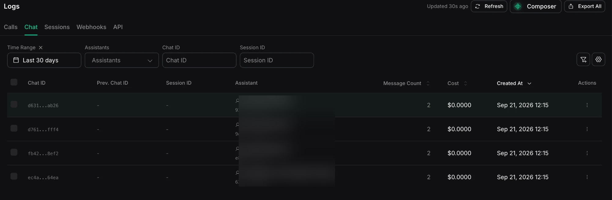

A chat is a single text interaction with an assistant: the current `input`, the resulting `output`, and any prior `messages` context. A chat can stand alone, continue a previous chat, or belong to a [session](/observability/logs/session-logs).

New to chats? Start with the [Chat quickstart](/chat/quickstart). See [Session management](/chat/session-management) to understand how turns keep context. This page is about reading the logs, not building with them.

## Access chat logs

- **Dashboard:** [Logs → Chat](https://dashboard.vapi.ai/logs/chat)
- **API:** [List chats](/api-reference/chats/list) and [Get chat](/api-reference/chats/get)

```bash title="List recent chats"
curl "https://api.vapi.ai/chat" \
  -H "Authorization: Bearer $VAPI_PRIVATE_API_KEY"
```

```bash title="Get one chat by ID"
curl "https://api.vapi.ai/chat/YOUR_CHAT_ID" \
  -H "Authorization: Bearer $VAPI_PRIVATE_API_KEY"
```

Chat logging has no separate enable or disable switch. See [Retention and logging configuration](/observability/logs/overview#retention-and-logging-configuration) for chat-history availability and retention behavior.

## The chat list

<Frame caption="The Chat tab in Logs with a 30-day range selected">
  
</Frame>

The Chat tab lists your chats, most recent first. Each row shows:

- **Chat ID**: the chat's unique identifier.
- **Prev. Chat ID**: the chat this one continues, if it is chained to an earlier turn.
- **Session ID**: the session this chat belongs to, if any.
- **Assistant**: the assistant that answered.
- **Message Count**: the number of messages in the current input and output.
- **Cost**: what the chat cost to run.
- **Created At**: when the chat was created.

Filter by time range, assistant, chat ID, session ID, or previous chat ID. The default time range is the last 14 days.

## Opening a chat

Select a chat to open its **Chat Details**:

- **Overview**: the assistant that answered, the organization, and when the chat was created. It can also show session, previous-chat, workflow, and streaming details when available.
- **Cost**: the chat's total cost, broken down into platform and model costs (with the model, provider, and token counts).
- **Input**: the current request input stored for the chat.
- **Output messages**: the messages produced for the current chat.
- **Messages history**: prior context loaded through `sessionId` or `previousChatId`. Depending on the conversation, the history can include `developer`, `system`, `user`, `assistant`, and `tool` messages.

For the complete object, see the [chat object](/api-reference/chats/get).

## Debug with chat logs

Reach for chat logs when a text conversation did not behave as expected:

- **The reply does not match the request.** Compare **Input** with **Output messages**. Then review **Messages history** for persisted prior context. If expected earlier turns are missing, check how the chat was linked.
- **The assistant lost the thread across turns.** Check the **Session ID** and **Prev. Chat ID** columns. The `sessionId` field associates the chat with a session. The `previousChatId` field continues context directly from one prior chat. These fields are mutually exclusive. A chat without either field does not load persisted context automatically. See [Session management](/chat/session-management).
- **A chat is missing.** Confirm the assistant and time range. Chats are separate from calls and appear only under the Chat tab.

## Related

- Build with chats: [Chat quickstart](/chat/quickstart)
- Keep context across turns: [Session management](/chat/session-management)
- The session a chat belongs to: [Session logs](/observability/logs/session-logs)
