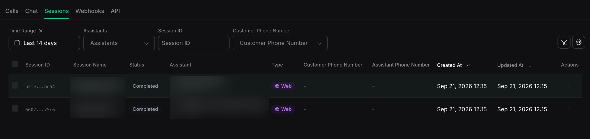

A session holds conversation state so it can continue across multiple chat requests. Use the **Sessions** tab to review what was said, which assistant handled it, and whether the session is still active.

New to sessions? Start with [Session management](/chat/session-management). It explains how `sessionId` groups chats into a session and how `previousChatId` continues directly from one prior chat. These options are mutually exclusive. This page is about reading the logs, not building with them.

## Access session logs

- **Dashboard:** [Logs → Sessions](https://dashboard.vapi.ai/logs/session)
- **API:** [List sessions](/api-reference/sessions/list) and [Get session](/api-reference/sessions/get)

```bash title="List recent sessions"
curl "https://api.vapi.ai/session" \
  -H "Authorization: Bearer $VAPI_PRIVATE_API_KEY"
```

```bash title="Get one session by ID"
curl "https://api.vapi.ai/session/YOUR_SESSION_ID" \
  -H "Authorization: Bearer $VAPI_PRIVATE_API_KEY"
```

Session logging has no separate enable or disable switch. Session expiration controls how long a session remains active, not its history window. See [Retention and logging configuration](/observability/logs/overview#retention-and-logging-configuration) for availability and retention behavior.

## The session list

<Frame caption="The Sessions tab in Logs">
  
</Frame>

The Sessions tab lists your sessions, most recent first. Each row shows:

- **Session ID** and **Session Name**.
- **Status**: `active` while the conversation is ongoing, `completed` once it ends.
- **Assistant**: the assistant handling the session.
- **Type**: `SMS` or `Web`. SMS sessions can also show **Customer Phone Number** and **Assistant Phone Number**.
- **Created At**: when the session started.
- **Updated At**: when the session last changed, such as a new message or a status change.

Filter by time range, assistant, session name, session ID, or customer phone number. The default time range is the last 14 days.

## Opening a session

Select a session to open its **Session Details**:

- **Overview**: the status (`active` or `completed`), session name, organization, assistant, and created and updated times. It can also show phone-number details, customer details, variable values, cost, workflow information, and structured outputs when available. Structured outputs appear after the session completes.
- **Messages**: the message history persisted for the session, with each message's role and the total count. Review it to see the context carried across chats that used this `sessionId`.

For the complete object, see the [session object](/api-reference/sessions/get).

## Debug with session logs

Reach for session logs when context did not behave as expected:

- **The assistant "forgot" earlier turns.** Open the session and read **Messages** to confirm that the earlier turns are part of it. If they are missing, confirm that later chats used the same `sessionId`. A `previousChatId` can continue context from one prior chat, but it does not add the chat to a session. See [Session management](/chat/session-management).
- **A conversation ended sooner than expected.** Check **Status** and **Created At**. A session expires `expirationSeconds` after it was created; **Updated At** does not extend the expiration window.
- **The assistant gave an unexpected reply.** Read **Messages** to review the history carried by the session. Then open [Chat logs](/observability/logs/chat-logs) and filter by **Session ID** to compare each chat's current input and output.

## Related

- Concept and setup: [Session management](/chat/session-management)
- The individual turns inside a session: [Chat logs](/observability/logs/chat-logs)
