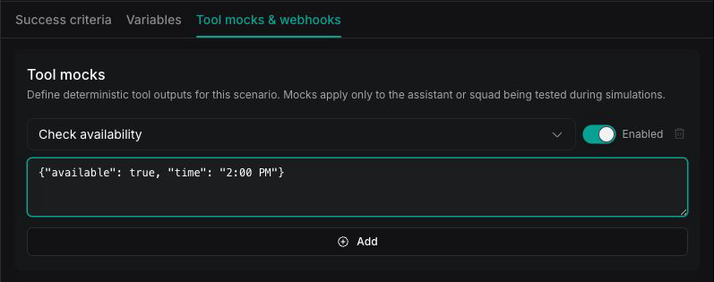
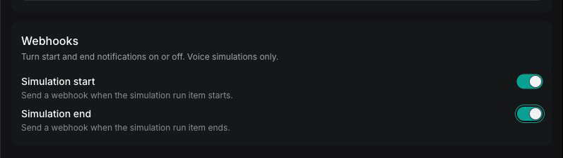

Advanced simulation options let you set variable values, mock tool responses, trigger lifecycle webhooks, and reuse structured outputs. Use them after you complete the [**Simulations quickstart**](/observability/simulations-quickstart) and need more control over behavior or test conditions.

## How it works

Advanced options belong to each simulation in a suite. They control which values the [**assistant**](/assistants) or [**squad**](/squads) receives, what mocked tools return, and which lifecycle events send webhooks.

Open a suite and select **Edit**, then **Next**. The review step contains the **Success criteria**, **Variables**, and **Tool mocks & webhooks** tabs.

<CardGroup cols={2}>
  <Card title="Configure the AI tester" icon="robot" href="/observability/simulations-configure-ai-tester">
    Define the AI tester's scenario, behavior, model, transcriber, and voice.
  </Card>
  <Card title="Set variables" icon="brackets-curly" href="#set-variable-values-for-the-assistant-or-squad">
    Supply dynamic-variable values without editing the assistant or squad.
  </Card>
  <Card title="Mock tool responses" icon="wrench" href="#mock-tool-responses">
    Return fixed tool results without calling live services.
  </Card>
  <Card title="Send lifecycle webhooks" icon="webhook" href="#send-webhooks-on-run-start-and-end">
    Notify your server when a simulation starts or ends.
  </Card>
  <Card title="Reuse structured outputs" icon="database" href="#reuse-structured-outputs">
    Apply the same evaluation criterion across simulations.
  </Card>
  <Card title="Manage test coverage" icon="flask" href="/observability/simulations-manage#testing-strategies">
    Build coverage with smoke tests, regression tests, and edge cases.
  </Card>
</CardGroup>

## Mock tool responses

During a simulation, the [**assistant**](/assistants) or [**squad**](/squads) under test runs its real [**tools**](/tools). Mock a tool to return fixed text instead, so that tool never calls its live service or API. A mock intercepts only the tool it names; every other tool the assistant or squad calls still runs for real.

<Tabs>
<Tab title="Dashboard">

On the review step, open **Tool mocks & webhooks**. Under **Tool mocks**, select **Add**, then configure each mock with three fields:

- **Tool**: Select one of the [**tools**](/tools) configured on the assistant or squad. Only its configured tools, including [**custom tools**](/tools/custom-tools), can be mocked.
- **Mock result**: Enter the string returned in place of the tool's live output.
- **Enabled**: Toggle the mock on or off. A disabled mock is ignored, and the tool runs live.

<Frame>
  
</Frame>

</Tab>
<Tab title="cURL">

Tool mocks are a property of the scenario. Add them when you create a scenario, or patch an existing one:

```bash
curl -X PATCH "https://api.vapi.ai/eval/simulation/scenario/<scenario-id>" \
  -H "Authorization: Bearer $VAPI_API_KEY" \
  -H "Content-Type: application/json" \
  -d '{
    "toolMocks": [
      {
        "toolName": "bookAppointment",
        "result": "{\"status\": \"success\", \"confirmationId\": \"MOCK-12345\"}",
        "enabled": true
      }
    ]
  }'
```

`toolName` must match the tool's name exactly, and only tools configured on the assistant or squad can be mocked. Set `enabled` to `false` to keep a mock defined without applying it.

</Tab>
</Tabs>

The mock result is always passed to the assistant or squad as a string. In the Dashboard, enter plain text or JSON-formatted text directly. In a cURL JSON body, escape the quotation marks inside JSON-formatted text, as shown in the example. Use tool mocks to keep tool behavior deterministic, avoid side effects, and steer the conversation down a specific path without depending on a live service.

### Common mock patterns

Choose a result that leads the assistant or squad through the behavior you want to test. These examples show how the `result` field appears in a cURL JSON body:

<Tabs>
<Tab title="Success">

Return the data that the tool normally provides after a successful action:

```json
{
  "result": "{\"status\": \"success\", \"confirmationId\": \"APT-12345\"}"
}
```

</Tab>
<Tab title="Handled error">

Return an error and recovery options to test how the assistant responds:

```json
{
  "result": "{\"error\": \"Time slot no longer available\", \"availableSlots\": [\"14:30\", \"15:00\"]}"
}
```

</Tab>
<Tab title="Unavailable service">

Return plain text to test how the assistant handles a service that is unavailable:

```json
{
  "result": "The booking service is temporarily unavailable."
}
```

</Tab>
</Tabs>

These strings replace the selected tool's output. They do not produce an HTTP error, add network latency, or cause a network timeout.

## Send webhooks on run start and end

Turn on webhooks to notify your server when a simulation iteration starts or ends. Each webhook sends a `POST` request to the URL you configure.

<Tabs>
<Tab title="Dashboard">

On the **Tool mocks & webhooks** tab, under **Webhooks**, toggle **Simulation start** and **Simulation end**.

<Frame>
  
</Frame>

</Tab>
<Tab title="cURL">

Webhooks are configured as `hooks` on the scenario:

```bash
curl -X PATCH "https://api.vapi.ai/eval/simulation/scenario/<scenario-id>" \
  -H "Authorization: Bearer $VAPI_API_KEY" \
  -H "Content-Type: application/json" \
  -d '{
    "hooks": [
      {
        "on": "simulation.run.started",
        "do": [{ "type": "webhook", "server": { "url": "URL_START" } }]
      },
      {
        "on": "simulation.run.ended",
        "do": [{
          "type": "webhook",
          "server": { "url": "URL_END" },
          "include": { "transcript": true, "messages": true, "recordingUrl": true }
        }]
      }
    ]
  }'
```

</Tab>
</Tabs>

Vapi sends `simulation.run.started` when a simulation iteration begins. The example below is a voice payload. A chat payload omits the `calls` object:

```json
{
  "type": "simulation.run.started",
  "simulationId": "8f2a9c1e-3b4d-4a7e-9c2f-1d6b0a5e7f34",
  "runId": "b7d4e2a0-6c9f-4e13-8a52-2f7c9b1d4e60",
  "simulationRunItemId": "c3e8f1a2-9d47-4b6c-8e30-5a1f2b9c7d84",
  "iterationNumber": 1,
  "isSimulation": true,
  "calls": {
    "testerCallId": "a1b2c3d4-...",
    "targetCallId": "e5f6a7b8-...",
    "listenUrl": "wss://..."
  }
}
```

Vapi sends `simulation.run.ended` when the simulation iteration finishes. The example below is a voice payload. A chat payload omits `calls`, `endedReason`, and `recordingUrl`:

```json
{
  "type": "simulation.run.ended",
  "simulationId": "8f2a9c1e-3b4d-4a7e-9c2f-1d6b0a5e7f34",
  "runId": "b7d4e2a0-6c9f-4e13-8a52-2f7c9b1d4e60",
  "simulationRunItemId": "c3e8f1a2-9d47-4b6c-8e30-5a1f2b9c7d84",
  "iterationNumber": 1,
  "isSimulation": true,
  "calls": { "testerCallId": "a1b2c3d4-...", "targetCallId": "e5f6a7b8-...", "listenUrl": "wss://..." },
  "endedReason": "...",
  "canceled": false,
  "failureReason": "...",
  "startedAt": "2026-07-28T17:10:05.000Z",
  "endedAt": "2026-07-28T17:12:30.000Z",
  "transcript": "...",
  "messages": [],
  "recordingUrl": "https://..."
}
```

Both chat and voice payloads include `simulationId`, `runId`, `simulationRunItemId`, `iterationNumber`, and `isSimulation`. The ended event adds `startedAt` and `endedAt`, plus `transcript` and `messages` when you include them. The call-specific fields appear for **voice simulations only**: `calls`, `endedReason`, and `recordingUrl`. The `calls` object includes `calls.listenUrl`, a WebSocket URL for monitoring the run in real time. For the complete list of `endedReason` values, see [**Call ended reasons**](/calls/call-ended-reason).

## Reuse structured outputs

Each evaluation references a [**structured output**](/assistants/structured-outputs-quickstart). Reuse a structured output when several simulations should apply the same evaluation criterion. For more patterns, see [**structured output examples**](/assistants/structured-outputs-examples).

<Tabs>
<Tab title="Dashboard">

Reuse an existing structured output across simulations to keep the same criterion consistent, or create a new one inline from the **Success criteria** tab.

</Tab>
<Tab title="cURL">

Reference an existing structured output by `structuredOutputId` in an evaluation instead of defining one inline:

```bash
curl -X PATCH "https://api.vapi.ai/eval/simulation/scenario/<scenario-id>" \
  -H "Authorization: Bearer $VAPI_API_KEY" \
  -H "Content-Type: application/json" \
  -d '{
    "evaluations": [
      { "structuredOutputId": "<structured-output-id>", "comparator": "=", "value": true, "required": true }
    ]
  }'
```

</Tab>
</Tabs>

## Set variable values for the assistant or squad

Variables provide values for the [**dynamic variables**](/assistants/dynamic-variables) used by the [**assistant**](/assistants) or [**squad**](/squads) during the simulation. On the **Variables** tab, add **Name** and **Value** pairs. Each name must match a `{{variable}}` placeholder in the assistant's prompt, and the value is substituted during the run.

Use variables to test specific inputs, such as a customer name or account tier, without editing the assistant or squad.

## Troubleshooting

| Issue | What to check |
| --- | --- |
| Every iteration fails | Review the transcript, then verify the evaluation's description, data type, comparator, and expected value. |
| A run stays queued or running | Check the assistant or squad configuration and its provider credentials. Fetch the run and its items to find a failure reason. |
| Results vary between runs | Make the intent and evaluations more specific, then run multiple iterations to measure consistency. |
| There is no audio or recording | Check whether the run used chat mode. Use voice mode to test or record audio. |
| Start or end webhooks do not trigger | Confirm the corresponding hook and its URL are configured on the scenario. |
| A tool mock does not apply | Confirm that `toolName` matches the configured tool name exactly and that `enabled` is `true`. |

## Next steps

<CardGroup cols={2}>
  <Card title="Simulations overview" icon="circle-info" href="/observability/simulations-overview">
    Learn what Simulations are and when to use them instead of Evals.
  </Card>
  <Card title="Simulations quickstart" icon="rocket" href="/observability/simulations-quickstart">
    Create and run your first simulation suite.
  </Card>
  <Card title="Manage simulations" icon="gear" href="/observability/simulations-manage">
    Edit suites, review and rerun results, maintain test coverage, and delete suites.
  </Card>
  <Card title="Structured outputs quickstart" icon="database" href="/assistants/structured-outputs-quickstart">
    Define the structured outputs used in evaluations.
  </Card>
</CardGroup>
