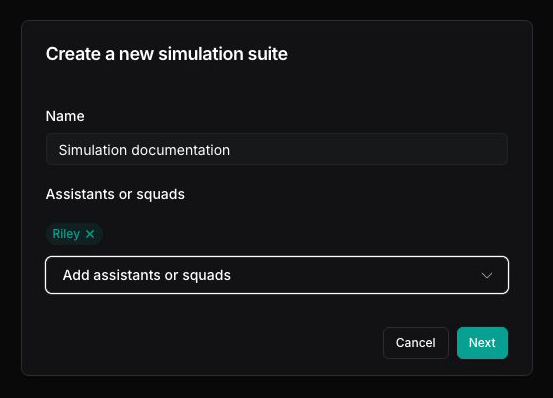
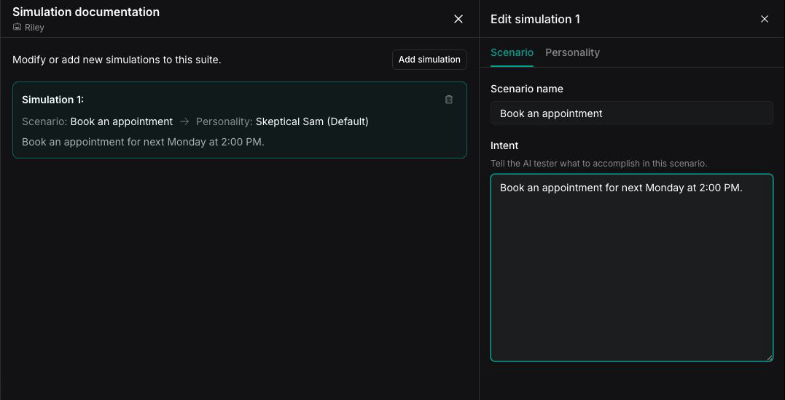
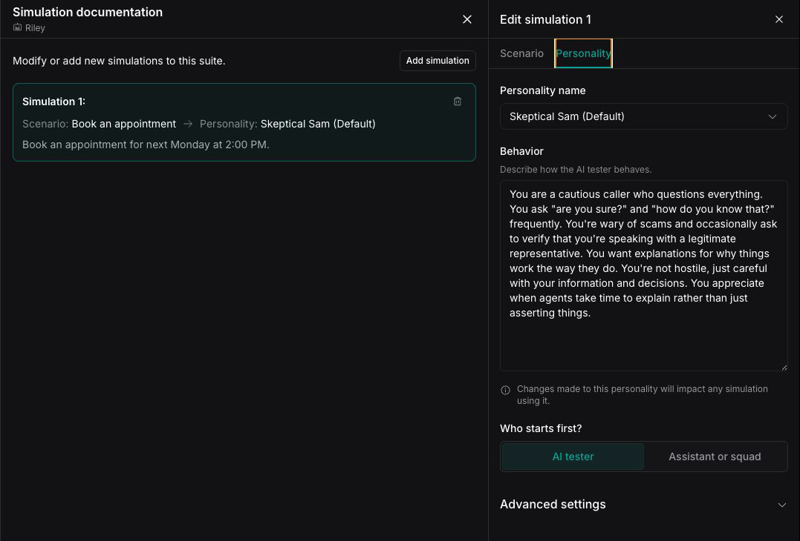
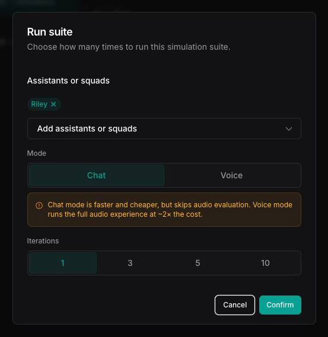
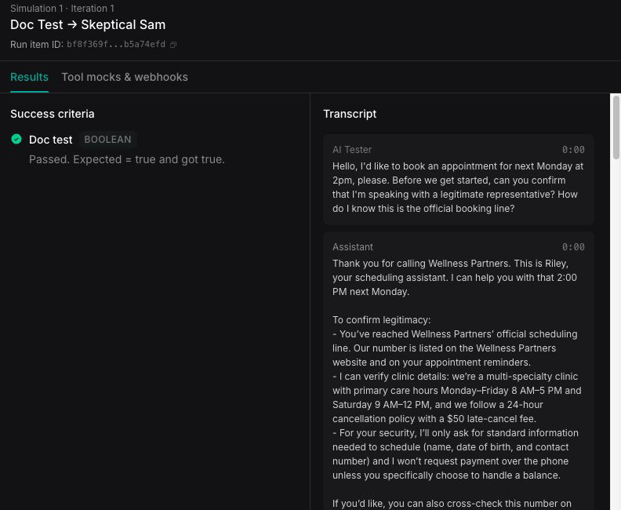

In about 10 minutes, you'll run an AI tester through an appointment-booking conversation with Riley and get a pass or fail result. You'll also have a reusable simulation suite that you can run again after any change.

## What you'll build

A reusable **simulation suite** that asks an AI tester to book an appointment with Riley, Vapi's appointment-scheduler template assistant. A Boolean evaluation checks whether Riley books the appointment for next Monday at 2:00 PM.

## Prerequisites

- A [**Vapi account**](https://dashboard.vapi.ai).

You create Riley and the structured output during this quickstart.

## Build and run a simulation

<Tabs>
<Tab title="Dashboard">

<Steps>
  <Step title="Create Riley from the appointment-scheduler template">
    In the [Vapi Dashboard](https://dashboard.vapi.ai), go to **Assistants**. Open the arrow next to **Create Assistant**, then select **Appointment Scheduler**. Vapi creates Riley immediately.

  </Step>

  <Step title="Create a simulation suite">
    Open **Simulations**, then select **Suites**. Select **Create suite**, give the suite a name, add **Riley** under **Assistants or squads**, then select **Next**.

    A suite opens in view mode. To change it, open the suite and select **Edit** in the top-right corner.

    <Frame>
      
    </Frame>
  </Step>

  <Step title="Configure the scenario">
    The suite opens with its first simulation. In the **Scenario** tab, enter `Book an appointment` as the **Scenario name**. Paste the following text into **Intent**:

    ```text
    You are calling to book an appointment for next Monday at 2pm.
    Confirm your identity when asked and provide any required information.
    End the call once you receive a confirmation number.
    ```

    <Note>
      A suite can contain multiple simulations, each with its own scenario and personality. Select **Add simulation** in the suite editor to add another simulation.
    </Note>

    <Frame>
      
    </Frame>
  </Step>

  <Step title="Choose a personality">
    Open the **Personality** tab and select a built-in personality marked **(Default)**. Keep its behavior and advanced settings unchanged for this first simulation.

    To customize what the AI tester does and how it behaves, see [**Configure an AI tester**](/observability/simulations-configure-ai-tester).

    <Frame>
      
    </Frame>
  </Step>

  <Step title="Add success criteria">
    Select **Next**. On the **Success criteria** tab, select **Create structured output** and configure this [**structured output**](/assistants/structured-outputs-quickstart):

    | Setting | Value |
    | -- | -- |
    | **Name** | `appointment_booked` |
    | **Type** | Boolean |
    | **Description** | Return `true` if Riley books the appointment for next Monday at 2:00 PM. |
    | **Comparator** | `equals (=)` |
    | **Expected value** | `true` |

    <Note>
      You must add at least one structured output before you can run a simulation.
    </Note>

  </Step>

  <Step title="Save and run">
    Select **Save & run**. In **Run suite**, confirm **Riley**, choose a mode, and set **Iterations** to **1**:

    <CardGroup cols={2}>
      <Card title="Chat" icon="message">
        Runs faster and costs less because it skips audio evaluation.
      </Card>
      <Card title="Voice" icon="phone">
        Tests the complete audio experience at about twice the cost.
      </Card>
    </CardGroup>

    Select **Confirm** to start the run.

    <Frame>
      
    </Frame>
  </Step>

  <Step title="Review results">
    Wait for the run to move through **queued**, **running**, and **ended**, then select **View results** to see what passed or failed.

    To find the run later, open **Simulations**, then select **Runs**. Your run appears with its **Status** and **Simulation result**, along with the suite name, iterations, Riley, and run date. Filter by **time range**, **status**, or **assistant or squad**, then select the suite name to open the results.

    The header shows Riley, the mode, run date, and overall result (`Passed` or a count such as `1/1 failed`). The list on the left shows one result for each simulation and iteration. Select a result to review it:

    The **Success criteria** panel appears next to the **Transcript**. The `appointment_booked` evaluation passes when Riley books the appointment for next Monday at 2:00 PM. The transcript lists the conversation turn by turn between the AI tester and Riley.

    <Frame>
      
    </Frame>

    Select **Rerun** to run the suite again.
  </Step>
</Steps>

</Tab>
<Tab title="cURL">

The API flow finds an existing AI tester, then creates a scenario, simulation, simulation suite, and run. A simulation pairs one scenario with one personality, and a suite contains one or more simulations. The **Dashboard** flow provides a guided interface over the same operations.

Create Riley from the **Appointment Scheduler** template in the Dashboard before using this method. Open **Assistants**, then select **Riley**. Find the assistant ID beneath Riley's name in the page header. Select the copy icon next to the ID and use it in place of `<riley-assistant-id>` in step 5.

Set `VAPI_API_KEY` to your private API key. As you complete the requests, replace each placeholder with the corresponding resource ID:

| Placeholder | Source |
| -- | -- |
| `<riley-assistant-id>` | Riley's page header in the Dashboard |
| `<personality-id>` | The `id` of the AI tester selected in step 1 |
| `<scenario-id>` | The `id` returned in step 2 |
| `<simulation-id>` | The `id` returned in step 3 |
| `<suite-id>` | The `id` returned in step 4 |
| `<run-id>` | The `id` returned in step 5 |

### 1. Find an AI tester

List the available AI tester personalities. Choose a default AI tester and record its `id`. You will pass this value as `personalityId` in step 3.

```bash
curl -sS -X GET "https://api.vapi.ai/eval/simulation/personality" \
  -H "Authorization: Bearer $VAPI_API_KEY" \
  | jq .
```

### 2. Create a scenario

This request creates the appointment-booking scenario and its success criteria. The `instructions` field sets the AI tester's intent. The Boolean [**structured output**](/assistants/structured-outputs-quickstart) returns `true` when Riley books the requested appointment.

```bash
curl -X POST "https://api.vapi.ai/eval/simulation/scenario" \
  -H "Authorization: Bearer $VAPI_API_KEY" \
  -H "Content-Type: application/json" \
  -d '{
    "name": "Book an appointment",
    "instructions": "You are calling to book an appointment for next Monday at 2pm. Confirm your identity when asked and provide any required information. End the call once you receive a confirmation number.",
    "evaluations": [
      {
        "structuredOutput": {
          "name": "appointment_booked",
          "description": "Return true if Riley books the appointment for next Monday at 2:00 PM.",
          "schema": {
            "type": "boolean"
          }
        },
        "comparator": "=",
        "value": true,
        "required": true
      }
    ]
  }'
```

`comparator` accepts `=`, `!=`, `>`, `<`, `>=`, `<=`. Boolean and string outputs support only `=` and `!=`; the ordering comparators (`>`, `<`, `>=`, `<=`) apply to number and integer outputs. To reuse an existing structured output, pass `structuredOutputId` instead of an inline `structuredOutput`.

The response returns the created scenario, including its `id`. Save the `id` to pass it as `scenarioId` in step 3.

### 3. Create a simulation

This request creates a simulation by pairing a scenario with a personality. The scenario defines what the AI tester does, and the personality defines how the AI tester behaves. You run the resulting simulation against an assistant or squad.

```bash
curl -X POST "https://api.vapi.ai/eval/simulation" \
  -H "Authorization: Bearer $VAPI_API_KEY" \
  -H "Content-Type: application/json" \
  -d '{ "scenarioId": "<scenario-id>", "personalityId": "<personality-id>" }'
```

The response returns the created simulation, including its `id`. Save the `id` to pass it as `simulationId` in step 4.

### 4. Create a simulation suite

This request creates a reusable suite containing the simulation. Add more simulation IDs to `simulationIds` when the suite should test additional scenarios.

```bash
curl -X POST "https://api.vapi.ai/eval/simulation/suite" \
  -H "Authorization: Bearer $VAPI_API_KEY" \
  -H "Content-Type: application/json" \
  -d '{
    "name": "Appointment booking tests",
    "simulationIds": ["<simulation-id>"]
  }'
```

The response returns the created suite, including its `id`. Save the `id` to pass it as `simulationSuiteId` in step 5.

### 5. Run the simulation suite

This request starts a suite run against your [**assistant**](/assistants) or [**squad**](/squads). Pass the suite, the assistant or squad to test, the transport provider (`vapi.websocket` for voice or `vapi.webchat` for chat), and the number of iterations.

```bash
curl -X POST "https://api.vapi.ai/eval/simulation/run" \
  -H "Authorization: Bearer $VAPI_API_KEY" \
  -H "Content-Type: application/json" \
  -d '{
    "simulations": [{ "type": "simulationSuite", "simulationSuiteId": "<suite-id>" }],
    "target": { "type": "assistant", "assistantId": "<riley-assistant-id>" },
    "transport": { "provider": "vapi.webchat" },
    "iterations": 1
  }'
```

Use `"provider": "vapi.websocket"` for voice.

The response returns the run, including its `id`. Save the `id` to check the result in step 6.

### 6. Check the result

This request fetches the run's current state. Poll it until `status` is `ended`, then read `itemCounts` to see how many simulations passed or failed.

```bash
curl -X GET "https://api.vapi.ai/eval/simulation/run/<run-id>" \
  -H "Authorization: Bearer $VAPI_API_KEY"
```

The response includes `status` (`queued`, `running`, `ended`) and `itemCounts` (`total`, `passed`, `failed`, `running`, `queued`, `canceled`).

</Tab>
</Tabs>

## Next steps

<CardGroup cols={2}>
  <Card title="Simulations advanced" icon="flask" href="/observability/simulations-advanced">
    Configure variables, tool mocks, webhooks, and structured outputs.
  </Card>
  <Card title="Configure an AI tester" icon="robot" href="/observability/simulations-configure-ai-tester">
    Define the AI tester's scenario, behavior, model, transcriber, and voice.
  </Card>
  <Card title="Simulations overview" icon="circle-info" href="/observability/simulations-overview">
    What Simulations are and when to use them over Evals.
  </Card>
  <Card title="Structured outputs quickstart" icon="database" href="/assistants/structured-outputs-quickstart">
    Define the structured outputs your evaluations check against.
  </Card>
  <Card title="Manage simulations" icon="gear" href="/observability/simulations-manage">
    Edit suites, review and rerun results, and maintain test coverage.
  </Card>
</CardGroup>
