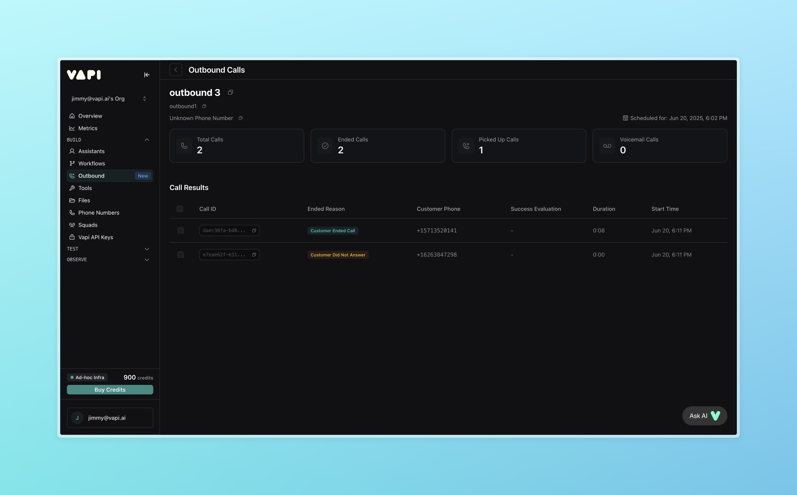

## Overview

Outbound Call Campaigns allow users to efficiently create, execute, and manage outbound phone campaigns directly within the Vapi Dashboard. It enables users to efficiently schedule calls, manage recipients, analyze performance metrics, and review detailed call logs and transcripts.

<Frame>
  
</Frame>

## Key benefits

- **Intuitive UI**: Quickly set up campaigns in an easy-to-follow setup page
- **Personalized**: Use dynamic variables to personalized outreach
- **Analytics**: Get real-time monitoring and detailed analysis of call performance and outcomes

## Common use cases

- **Conversion Optimization**: Re-engage potential customers via targeted follow-up calls for abandoned carts
- **Appointment Reminders**: Reduce missed appointments with timely reminder calls
- **Customer Satisfaction**: Conduct post-service feedback and follow-up calls to enhance customer experiences
- **Subscription Renewals**: Facilitate timely renewals with proactive call reminders
- **Insurance Updates**: Verify and update policy details through targeted calls

## Campaign setup process

Outbound Call Campaigns follow a structured process:

<Steps>
  <Step title="Campaign Configuration">
    Set campaign name and type.
  </Step>
  
  <Step title="Phone Number Selection">
    Choose outbound phone numbers (recommend Twilio).
  </Step>
  
  <Step title="Recipient Management">
    Upload recipients via CSV, supported with dynamic variables.
  </Step>
  
  <Step title="Assistant Selection">
    Select an existing assistant to handle the call.
  </Step>
  
  <Step title="Review & Execute">
    Review campaign and initiate or schedule calls for later.
  </Step>
</Steps>

## Campaign analytics

The Campaign Dashboard provides comprehensive insights:

- **Campaign Overview**: Monitor status, completed calls, pick up rate, and voicemail
- **Detailed Call Reports**: Access individual call details, customer information, call duration, outcome statuses, and transcripts

## Required information

Outbound Campaigns only require a number to work. `number` column is required and needs to be spelled in lowercase.

| number |  |
| --- | --- |
| +14151231234 |  |
| +14153455678 |  |

<Note>
Phone numbers must be formatted in E.164 format: [+] [country code] [subscriber number including area code]
- Example: +14151234567
- Maximum 15 digits total
- No spaces or special characters
</Note>

## Tips for Clean Data
- Use UTF-8 encoding when saving your CSV.
- Avoid blank rows or duplicated headers.
- Double-check that your column names match the variables used in your assistant.

## Avoiding Spam

To maximize call answer rates and establish trust with recipients, you should implement proper caller identification and trusted calling standards. This involves several key components that work together to verify your identity and build caller reputation.
Learn more about [Trusted Calling](/calls/outbound-calling#trusted-calling-and-caller-id)

## Dynamic variables

Outbound Campaigns allows users to specify dynamic variables to pass to Assistants via additional columns in the CSV file. Outbound Campaigns can take one more additional columns.

| number | name | customer_issue |
| --- | --- | --- |
| +14151231234 | John | password reset |
| +14153455678 | Mary | address update |

`{{name}}` and `{{customer_issue}}` can be used in the Assistant prompt as dynamic variables, based on this CSV file.

<Note>
- Column names cannot have spaces. Use `{{customer_issue}}` instead of `{{customer issue}}`
- Column names must start with a letter
- Users can use the same [Default Variables](/assistants/dynamic-variables#default-variables) as they can within Assistants
</Note>

## Concurrency

Check concurrency limits in your Vapi organization. If your org has a concurrency limit of 10, a maximum of 10 calls will be started at a single time. The rest of the calls will be queued and retried a few minutes later as your concurrency slots become available. To increase call rate, you need you increase your Vapi org concurrency limit.

Note that concurrency limits are on the Vapi side. Your telephony provider (e.g. Twilio) may have other rate limits.
