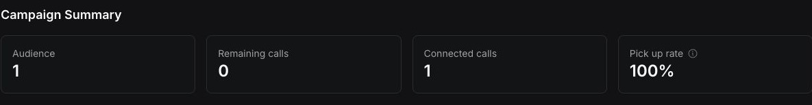

Outbound campaigns let you call a list of contacts with an assistant or squad. You choose the caller, upload or enter the contacts, decide when calls can run, and review the result of every attempt from one campaign.

Use a campaign when the same assistant or squad needs to make many related calls, such as appointment reminders, lead qualification, customer follow-ups, or surveys.

## How campaigns work

Every campaign combines four parts:

1. **Caller:** The assistant or squad that handles each conversation.
2. **Phone number:** The outbound-capable number used to place the calls. Vapi Free Numbers are not supported for campaigns.
3. **Contacts:** The people to call and any values used to personalize their conversations.
4. **Schedule:** When dialing starts, when it must stop, and how many calls the campaign can place concurrently.

When the campaign starts, contacts begin in a pending state. Vapi dispatches calls as capacity becomes available, up to the campaign's **Max concurrency** and your organization's available [call concurrency](/calls/call-concurrency).

Each contact is processed independently. A completed campaign therefore contains a result for each contact rather than one result for the campaign as a whole.

Creating a campaign launches it immediately or schedules it for later; there is no saved draft. After creation, its configuration is fixed:

- **You cannot edit the caller, contacts, or schedule.** These are locked when the campaign is created.
- **Before a scheduled run, you can only cancel.** You can cancel a queued or scheduled campaign, but you cannot change it.

A campaign runs once. To run it again, or to change its configuration, duplicate it, review the copied contacts and settings, and launch the duplicate.

## Campaign lifecycle

<Steps>
  <Step title="Configure the campaign">
    Select an outbound phone number and an assistant or squad that can detect and handle voicemail. Choose either the [voicemail tool](/tools/voicemail-tool) for assistant-driven handling or [automatic voicemail detection](/calls/voicemail-detection) for provider-based detection that does not depend on the assistant's prompt; do not configure both on the same assistant. Optionally configure a Server URL, event webhooks, and a pre-dial eligibility check.
  </Step>

  <Step title="Add contacts">
    Upload a CSV file or enter contacts manually. A campaign can contain up to 10,000 contacts.
  </Step>

  <Step title="Choose when calls run">
    Start immediately or define a scheduled calling window. The Dashboard supports scheduling a campaign up to seven days in advance.
  </Step>

  <Step title="Launch and monitor">
    Launch the campaign, then open its detail page to monitor contact progress, call outcomes, and overall results.
  </Step>

  <Step title="Cancel or duplicate">
    Cancel a queued or running campaign when it should stop. To run the campaign again or change its configuration, duplicate it and launch the duplicate as a new campaign.
  </Step>
</Steps>

## Personalize calls with contact data

Every contact needs a phone number. You can also provide a name and additional values that the assistant or squad uses as [dynamic variables](/assistants/dynamic-variables).

For example, this CSV provides `name`, `appointment_date`, and `location` for each contact:

```csv
number,name,appointment_date,location
+14155550100,Ada,August 21,Market Street
+14155550101,Sam,August 22,Mission Street
```

You can reference the values in an assistant prompt:

```text
Greet {{name}} and remind them about their appointment on
{{appointment_date}} at the {{location}} office.
```

The `number` and `name` columns have dedicated contact fields. Vapi also makes `name` and every additional populated column available to the caller as a variable. Empty cells are omitted for that contact.

## Control maximum call concurrency

**Max concurrency** limits how many calls this campaign can have active at once. It does not reserve capacity exclusively for the campaign or increase your organization's total concurrency.

For example, if the campaign limit is 10 but only four organization concurrency slots are available, the campaign can start up to four calls. Other calls in your organization use the same pool of concurrency slots.

Calls that cannot start immediately wait for capacity during the campaign's execution window. Review [call concurrency](/calls/call-concurrency) before launching a high-volume campaign. If the organization needs more simultaneous capacity, [purchase additional call concurrency](/billing/purchase-call-concurrency).

## Review campaign results

The campaign detail page remains available after the campaign is completed. Its summary shows:

- **Audience:** Every contact added to the campaign, including contacts that were skipped or failed.
- **Remaining calls:** Contacts that are still pending or dispatched and have not reached a final status.
- **Connected calls:** Calls answered by a person.
- **Pick up rate:** Connected calls divided by calls actually placed. Voicemail does not count as a pickup.

<Frame>
  
</Frame>

Use **Contact status** to filter the results by pending, dispatched, completed, failed, skipped, or pre-dial failed. The results table shows the call ID, customer phone number, contact status, call type, ended reason, start time, duration, and cost.

Contacts that were skipped or failed before dialing do not have a call ID or call details. When a call ID is present, select the row to open the call record and review its transcript, recording, analysis, and ended reason with the rest of your call logs.

## Next steps

<CardGroup cols={2}>
  <Card title="Create your first campaign" icon="rocket" href="/outbound-campaigns/quickstart">
    Upload contacts, configure the caller, and launch an outbound campaign.
  </Card>
  <Card title="Build a personalized appointment campaign" icon="sliders" href="/outbound-campaigns/build-personalized-appointment-campaign">
    Combine contact variables, voicemail handling, scheduling, concurrency, and webhooks.
  </Card>
  <Card title="Prepare for outbound calling" icon="phone" href="/calls/outbound-calling">
    Review caller identification, trusted calling, and outbound-call requirements.
  </Card>
  <Card title="Understand call concurrency" icon="gauge-high" href="/calls/call-concurrency">
    Learn how active calls share your organization's concurrency capacity.
  </Card>
  <Card title="Purchase call concurrency" icon="phone-plus" href="/billing/purchase-call-concurrency">
    Add more simultaneous call capacity from Billing & Add-Ons.
  </Card>
</CardGroup>
