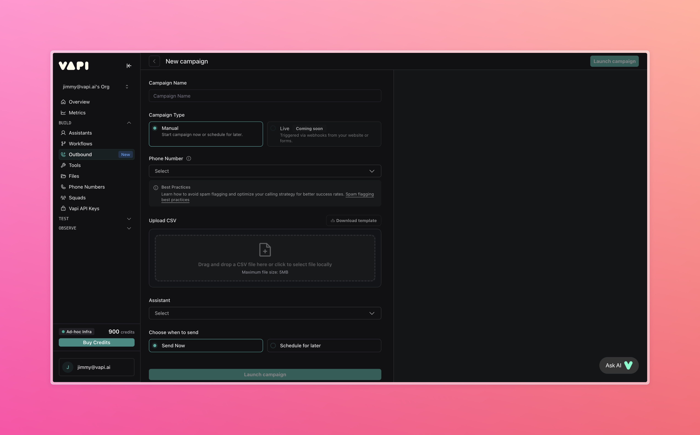

## Overview

Build a simple personalized outbound campaign using Vapi that conducts post-service feedback and follow-up calls to improve customer experience and gather valuable insights from your customers.

<Frame>
  
</Frame>

**In this quickstart, you'll learn to:**
- Set up an outbound campaign with customer data
- Configure personalized feedback collection calls
- Launch and monitor campaign performance
- Access detailed call outcomes and analytics

## Prerequisites

- A [Vapi account](https://dashboard.vapi.ai)
- Phone number set up in your organization with a provider like Twilio (Vapi free numbers do not work for Outbound Campaigns)
- Recipient information ready in CSV format
- An existing Assistant configured in your account

---

## 1. Launch a Campaign

<Steps>
  <Step title="Open the Vapi Dashboard">
    Go to [dashboard.vapi.ai](https://dashboard.vapi.ai) and log in to your account.
  </Step>
  
  <Step title="Navigate to Outbound Campaigns">
    Click `Outbound Campaigns` in the left sidebar to access the campaigns section.
  </Step>
  
  <Step title="Create a new campaign">
    - Click **Create Campaign**
    - Enter a **Campaign Name** (e.g., "Post-Service Feedback Campaign")
    - Select **Campaign Type** based on your feedback collection needs
  </Step>
  
  <Step title="Configure phone number">
    Select a phone number from your available numbers. This must be a number from your phone provider (like Twilio), not a Vapi free number.
  </Step>
  
  <Step title="Manage recipients">
    Upload your customer list:
    - Click **Manage Recipients**
    - Upload your CSV file with customer information
    - Review the recipient list for accuracy
    - Follow [best practices](/outbound-campaigns/overview#required-information) on how to format your CSV file
  </Step>
  
  <Step title="Select assistant">
    Choose the Assistant that will conduct the feedback calls:
    - Select from your existing Assistants
  </Step>
  
  <Step title="Review and execute">
    - Review all campaign settings
    - Verify recipient count and Assistant configuration
    - Click **Launch Campaign** to start the outbound calls
  </Step>
</Steps>

---

## 2. Monitor Your Campaign

<Steps>
  <Step title="Access campaign dashboard">
    Once launched, monitor your campaign performance in real-time through the Campaign Dashboard.
  </Step>
  
  <Step title="Review campaign outcomes">
    - View completion rates and call statuses
    - Track progress of scheduled campaigns
    - Cancel campaigns you no longer want to run
  </Step>
  
  <Step title="Track individual calls">
    See call logs for each customer contact, including:
    - Call duration and outcome
    - Transcript and recordings
  </Step>
</Steps>