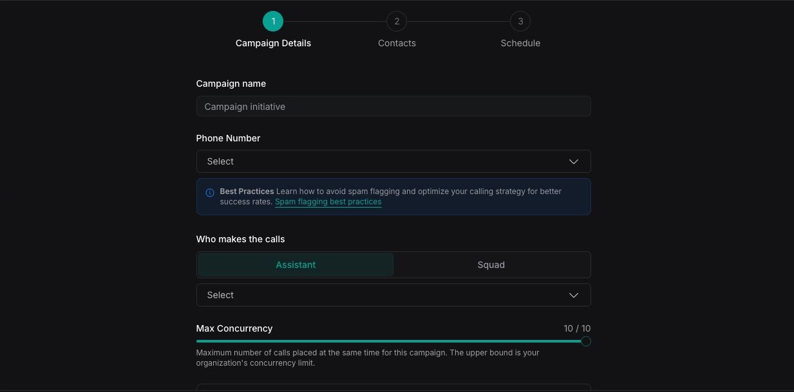
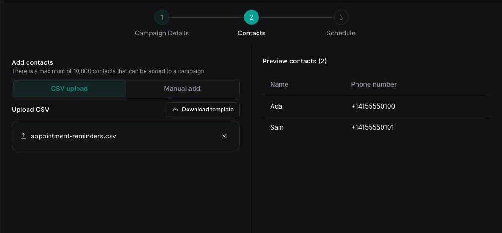

In about 10 minutes, you'll create a campaign that calls two fictional customers with a personalized appointment reminder. After launch, you'll monitor the campaign and open the result for each contact.

## What you'll build

A campaign that uses one assistant to call two contacts. The uploaded CSV supplies each contact's name and appointment date as dynamic variables.

## Prerequisites

- A [Vapi account](https://dashboard.vapi.ai)
- An assistant configured to handle the calls
- An outbound-capable phone number that appears in the campaign's **Phone Number** list

<Note>
  Vapi Free Numbers cannot be used to launch campaigns.
</Note>

## Prepare the assistant

Create an assistant that greets each contact by name and delivers the reminder. Both flows use the same system prompt.

```text title="System prompt"
You make concise appointment-reminder calls.

Greet {{name}} and remind them that their appointment is scheduled for
{{appointment_date}}. Ask them to confirm that they can attend. If they cannot
attend, tell them that a team member will follow up. End the call after they
answer.
```

<Tabs>
  <Tab title="Dashboard">
    <Steps>
      <Step title="Create the assistant">
        In the [Vapi Dashboard](https://dashboard.vapi.ai), go to **Assistants** and select **Create Assistant**. Give it a name, such as `Appointment reminders`.
      </Step>

      <Step title="Add the system prompt">
        In the assistant's **Model** section, paste the **system prompt** above into the system prompt field.
      </Step>

      <Step title="Publish the assistant">
        Publish the assistant so the campaign can use it.
      </Step>
    </Steps>
  </Tab>

  <Tab title="cURL">
    <Steps>
      <Step title="Create the assistant">
        Send `POST /assistant` with the system prompt as a `system` message. Save the `id` from the response to use as the campaign's `assistantId`.

        ```bash
        curl --request POST \
          --url https://api.vapi.ai/assistant \
          --header "Authorization: Bearer $VAPI_API_KEY" \
          --header 'Content-Type: application/json' \
          --data '{
            "name": "Appointment reminders",
            "model": {
              "provider": "openai",
              "model": "gpt-4.1",
              "messages": [
                {
                  "role": "system",
                  "content": "You make concise appointment-reminder calls. Greet {{name}} and remind them that their appointment is scheduled for {{appointment_date}}. Ask them to confirm that they can attend. If they cannot attend, tell them that a team member will follow up. End the call after they answer."
                }
              ]
            }
          }'
        ```
      </Step>
    </Steps>
  </Tab>
</Tabs>

<Tip>
  Campaign calls can reach voicemail or a phone's automated call screener. Before calling a large audience, configure the assistant to [handle voicemail and call screening](/outbound-campaigns/voicemail-and-call-screening).
</Tip>

## Create and launch the campaign

<Tabs>
  <Tab title="Dashboard">
<Steps>
  <Step title="Open Campaigns">
    In the [Vapi Dashboard](https://dashboard.vapi.ai), select **Campaigns**, then select **Create campaign**.
  </Step>

  <Step title="Configure campaign details">
    Enter `Appointment reminders` as the **Campaign name**. Under **Phone Number**, select the number that should place the calls.

    Under **Who makes the calls**, select **Assistant**, then choose the assistant you prepared. Keep **Max concurrency** at a value within your organization's available capacity.

    <Frame>
      
    </Frame>

    Leave **Webhook settings (optional)** collapsed for this quickstart. Use it when your server needs campaign events or a pre-dial eligibility check.
  </Step>

  <Step title="Create the contact CSV">
    Save the following example as `appointment-reminders.csv`:

    ```csv
    number,name,appointment_date
    +14155550100,Ada,August 21 at 10:00 AM
    +14155550101,Sam,August 22 at 2:30 PM
    ```

    <Note>
      Replace both reserved example numbers with numbers that you have permission to call before launching the campaign.
    </Note>
  </Step>

  <Step title="Upload and review contacts">
    Select **Next** to open **Contacts**. Keep **CSV upload** selected, then upload `appointment-reminders.csv`.

    Confirm that both contacts appear in the preview. The preview shows names and phone numbers; `appointment_date` is still included as a dynamic variable even though additional columns do not appear in the preview.

    <Frame>
      
    </Frame>

    You can also select **Download template** to start with a sample CSV or choose **Manual add** to enter phone numbers and optional names without a file.
  </Step>

  <Step title="Choose the schedule">
    Select **Next** to open **Schedule**. Choose **Send now** for this quickstart.

    To schedule the campaign instead, select **Schedule for later**, choose the time zone, and set the start and end of the calling window. Campaigns can be scheduled up to seven days in advance.

    Creating the campaign either launches it immediately or schedules it. You cannot save a campaign as a draft. After you schedule a campaign, its configuration is read-only, and you can only cancel it before it runs.

    <Warning>
      Launching a campaign can place real phone calls. Replace the example contacts, verify local calling requirements, and confirm that you intend to call every uploaded number.
    </Warning>
  </Step>

  <Step title="Launch the campaign">
    Review the campaign, then select **Launch campaign**. Vapi opens the campaign detail page and begins dispatching contacts as concurrency becomes available.
  </Step>

  <Step title="Review the results">
    Watch **Audience**, **Remaining calls**, **Connected calls**, and **Pick up rate** update. Use **Contact status** to filter the contact table.

    A dialed contact includes its call ID, ended reason, start time, duration, and cost. Select the row to open the call record and review its transcript, recording, and analysis.
  </Step>
</Steps>
  </Tab>

  <Tab title="cURL">
    The API accepts contacts as JSON rather than as an uploaded CSV. Map each additional CSV column to `assistantOverrides.variableValues` for that contact.

    <Steps>
      <Step title="Create and launch the campaign">
        Replace the resource IDs and example phone numbers, then send `POST /v2/campaign`. Creating a campaign launches or schedules it; there is no separate draft or launch request.

        ```bash
        curl --request POST \
          --url https://api.vapi.ai/v2/campaign \
          --header "Authorization: Bearer $VAPI_API_KEY" \
          --header 'Content-Type: application/json' \
          --data '{
            "name": "Appointment reminders",
            "assistantId": "<assistant-id>",
            "phoneNumberId": "<phone-number-id>",
            "maxConcurrency": 10,
            "customers": [
              {
                "number": "+14155550100",
                "name": "Ada",
                "assistantOverrides": {
                  "variableValues": {
                    "name": "Ada",
                    "appointment_date": "August 21 at 10:00 AM"
                  }
                }
              },
              {
                "number": "+14155550101",
                "name": "Sam",
                "assistantOverrides": {
                  "variableValues": {
                    "name": "Sam",
                    "appointment_date": "August 22 at 2:30 PM"
                  }
                }
              }
            ]
          }'
        ```

        Save the `id` from the response as the campaign ID.
      </Step>

      <Step title="Retrieve campaign progress">
        Request the campaign with counters to retrieve its status, contact counters, and call metrics.

        ```bash
        curl --request GET \
          --url 'https://api.vapi.ai/v2/campaign/<campaign-id>?includeCounters=true' \
          --header "Authorization: Bearer $VAPI_API_KEY"
        ```
      </Step>

      <Step title="Retrieve contact results">
        List the campaign contacts to inspect each contact's status and associated call outcome.

        ```bash
        curl --request GET \
          --url 'https://api.vapi.ai/v2/campaign/<campaign-id>/contacts?page=1&limit=20' \
          --header "Authorization: Bearer $VAPI_API_KEY"
        ```
      </Step>
    </Steps>
  </Tab>
</Tabs>

## Understand the result

Each uploaded row becomes one campaign contact. The contact progresses from pending to a terminal result such as completed, failed, skipped, or pre-dial failed.

The campaign ends after every contact reaches a terminal result or you cancel the campaign. Canceling removes calls that have not started; calls already in progress finish normally.

After creation, the campaign is read-only: you can monitor it and review its results, but you cannot edit or rerun it. Select **Duplicate campaign**, review the copied configuration and contacts, and launch the duplicate as a new campaign.

## Next steps

<CardGroup cols={2}>
  <Card title="Campaigns overview" icon="circle-info" href="/outbound-campaigns/overview">
    Understand campaign components, lifecycle, and results.
  </Card>
  <Card title="Build a personalized appointment campaign" icon="sliders" href="/outbound-campaigns/build-personalized-appointment-campaign">
    Combine CSV variables, voicemail handling, scheduling, concurrency, and webhooks.
  </Card>
</CardGroup>
