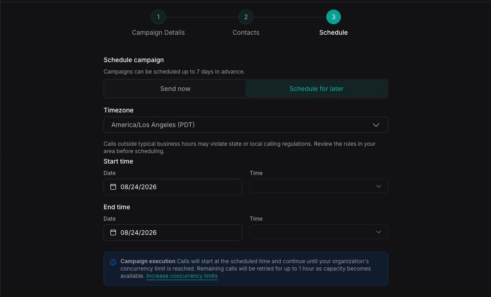

A campaign's schedule controls when it starts and stops dialing. Its concurrency controls how many calls it places at once. After it launches, you can monitor, cancel, duplicate, or archive it, but you cannot edit it.

## Schedule a calling window

<Tabs>
  <Tab title="Dashboard">
    The **Schedule** step provides two timing modes:

    | Mode | Behavior |
    | -- | -- |
    | **Send now** | Makes contacts eligible for dispatch immediately. |
    | **Schedule for later** | Defines the earliest and latest time at which contacts can be dispatched. |

    The Dashboard lets you schedule up to seven days in advance and uses 15-minute time increments. Select the time zone that should interpret the start and end values.

    <Frame>
      
    </Frame>
  </Tab>

  <Tab title="cURL">
    Add `schedulePlan.earliestAt` and `schedulePlan.latestAt` when creating the campaign. API timestamps use ISO 8601, so convert the intended local calling window to the correct UTC offset before sending the request.

    ```bash
    curl --request POST \
      --url https://api.vapi.ai/v2/campaign \
      --header "Authorization: Bearer $VAPI_API_KEY" \
      --header 'Content-Type: application/json' \
      --data '{
        "name": "Scheduled appointment reminders",
        "assistantId": "<assistant-id>",
        "phoneNumberId": "<phone-number-id>",
        "maxConcurrency": 10,
        "schedulePlan": {
          "earliestAt": "<start-time-in-ISO-8601>",
          "latestAt": "<end-time-in-ISO-8601>"
        },
        "customers": [
          {
            "number": "+14155550100",
            "name": "Ada"
          }
        ]
      }'
    ```

    Omit `schedulePlan` to make contacts eligible for dispatch immediately.
  </Tab>
</Tabs>

Calls begin at the start of the window as capacity becomes available. Vapi stops retrying contacts that have not been dispatched by the end of the window.

For both timing modes, Vapi may continue retrying contacts for up to one hour while it waits for concurrency to become available. For a scheduled campaign, retries also stop when the configured end time is reached.

<Note>
  Creating a campaign launches it immediately or schedules it for later; campaigns do not have a saved draft state. After you schedule a campaign, its configuration is read-only and the only available action before it runs is cancellation.
</Note>

<Warning>
  Choose a calling window that complies with the consent, quiet-hours, and telemarketing rules that apply to your recipients and use case.
</Warning>

## Scheduling best practices

- **Check the calling rules that apply to your recipients.** Consent, quiet-hours, and telemarketing regulations vary by location and use case, and they govern when you may call. Confirm the rules for each recipient and choose a calling window that follows them. See the [TCPA consent guide](/tcpa-consent).
- **Use the recipient's known time zone.** Do not infer location or local time from a phone number's area code. Mobile numbers can move with their owners, numbers can be ported, and a recipient may live or work somewhere else. Use a verified time zone from your CRM, account profile, address, or stated preference.
- **Separate audiences by time zone when possible.** A campaign uses one time zone and calling window for every contact. If you have reliable location or time-zone data, create separate campaigns for contacts that need different local calling windows.
- **Handle unknown locations conservatively.** If you cannot determine a recipient's time zone, use a window that is safe across the possible locations or exclude the contact until you have better data.
- **Account for daylight saving changes.** Select a named time zone in the Dashboard and verify campaigns scheduled near a clock change. Avoid calculating local time with a fixed UTC offset.
- **Leave enough time to dispatch the audience.** Estimate the number and typical duration of calls that can run within the window at your selected concurrency. Add capacity for longer calls and delayed concurrency instead of scheduling the end time immediately after the expected finish.
- **Avoid unnecessary overlap.** Campaigns share your organization's concurrency with other inbound and outbound calls. Overlapping campaigns can delay dispatch and leave contacts uncalled when a window closes.
- **Check eligibility against your source system.** Connect a [pre-dial webhook](/outbound-campaigns/webhooks#filter-contacts-before-dialing) to your CRM or other system of record. Immediately before dialing, it can confirm that the contact is still eligible based on current consent, suppression status, account state, time zone, or other business rules. Return `eligible: false` to skip a contact whose status has changed since the campaign was scheduled.
- **Review duplicated schedules.** A duplicate is a new campaign. Confirm its time zone, start and end times, audience, and calling requirements before launch.

## Set campaign concurrency

**Max concurrency** is the maximum number of calls this campaign can place at the same time. Its effective capacity is also bounded by the concurrency currently available to your organization.

```text
active campaign calls <= campaign max concurrency
active organization calls <= organization concurrency limit
```

Campaign calls share organization capacity with other inbound and outbound calls. Setting **Max concurrency** to 10 does not reserve 10 slots for the campaign. If other calls are active, the campaign uses only the slots that remain.

See [call concurrency](/calls/call-concurrency) to understand how capacity is shared. When the organization needs more simultaneous calls, [purchase additional call concurrency](/billing/purchase-call-concurrency) from the Dashboard.

## Manage campaigns

Once created, a campaign cannot be edited or rerun. You can monitor it, review its results, or cancel it while it is active. To make another run, duplicate the campaign, review its copied configuration and contacts, then launch the duplicate.

Campaigns support the following management operations:

| Operation | Dashboard or API behavior |
| -- | -- |
| Create | The creation wizard launches a new campaign. The API uses `POST /v2/campaign`. There is no draft state. |
| List and read | View campaigns and their summaries in the Dashboard. The API provides `GET /v2/campaign`, `GET /v2/campaign/:id`, and `GET /v2/campaign/:id/contacts`. |
| Update | Campaign configuration is read-only after creation. `PATCH /v2/campaign/:id` only accepts a status-only cancellation for an active campaign. |
| Archive | `DELETE /v2/campaign/:id` archives the campaign instead of permanently deleting its records. If the campaign is active, Vapi cancels it first. |
| Duplicate | In the Dashboard, select **Duplicate campaign**. Through the API, create a campaign with `duplicateFromCampaignId`; supplied fields override the source, and supplied contacts replace the copied contacts. |

## List and review campaigns

<Tabs>
  <Tab title="Dashboard">
    Open **Campaigns** to view campaign status, audience, pickup rate, and schedule. Select a campaign to see its summary and contact results.
  </Tab>

  <Tab title="cURL">
    List campaigns, retrieve one campaign with aggregate counters, or retrieve its paginated contacts.

    ```bash
    curl --request GET \
      --url 'https://api.vapi.ai/v2/campaign?page=1&limit=20' \
      --header "Authorization: Bearer $VAPI_API_KEY"
    ```

    ```bash
    curl --request GET \
      --url 'https://api.vapi.ai/v2/campaign/<campaign-id>?includeCounters=true' \
      --header "Authorization: Bearer $VAPI_API_KEY"
    ```

    ```bash
    curl --request GET \
      --url 'https://api.vapi.ai/v2/campaign/<campaign-id>/contacts?page=1&limit=20' \
      --header "Authorization: Bearer $VAPI_API_KEY"
    ```
  </Tab>
</Tabs>

## Duplicate a campaign

<Tabs>
  <Tab title="Dashboard">
    From the Campaigns list, open the actions menu for a campaign and select **Duplicate campaign**. The new campaign inherits the source campaign's configuration and contacts unless you replace them during creation.

    Review the caller, phone number, contacts, schedule, concurrency, and webhook settings before launching the duplicate. If you do not upload replacement contacts, Vapi copies the source campaign's contacts. A duplicated scheduled campaign does not reuse an expired calling window when you choose **Send now**.
  </Tab>

  <Tab title="cURL">
    Duplicate a campaign by creating a new one with `duplicateFromCampaignId`. Fields supplied in the request override the source. If `customers` is omitted, Vapi copies the source campaign's contacts.

    ```bash
    curl --request POST \
      --url https://api.vapi.ai/v2/campaign \
      --header "Authorization: Bearer $VAPI_API_KEY" \
      --header 'Content-Type: application/json' \
      --data '{
        "duplicateFromCampaignId": "<source-campaign-id>",
        "name": "Appointment reminders - follow-up",
        "schedulePlan": {
          "earliestAt": "<current-ISO-timestamp>"
        }
      }'
    ```

    Provide a new `schedulePlan` when the source had a scheduled window so the duplicate does not inherit an expired schedule.
  </Tab>
</Tabs>

## Cancel a campaign

<Tabs>
  <Tab title="Dashboard">
    Cancel a queued or in-progress campaign from its list row or detail page. Canceling prevents contacts that have not started from being dispatched. Calls already in progress continue until they end.

    Cancellation is final for that campaign. Duplicate it if you need to call the same audience again.
  </Tab>

  <Tab title="cURL">
    Send a status-only update to cancel an active campaign. Other campaign fields cannot be updated after creation.

    ```bash
    curl --request PATCH \
      --url https://api.vapi.ai/v2/campaign/<campaign-id> \
      --header "Authorization: Bearer $VAPI_API_KEY" \
      --header 'Content-Type: application/json' \
      --data '{ "status": "cancelled" }'
    ```
  </Tab>
</Tabs>

## Archive a campaign

Deleting a campaign archives it rather than permanently removing its records. If the campaign is active, Vapi cancels it before archiving.

```bash
curl --request DELETE \
  --url https://api.vapi.ai/v2/campaign/<campaign-id> \
  --header "Authorization: Bearer $VAPI_API_KEY"
```

## Next steps

<CardGroup cols={2}>
  <Card title="Prepare for voicemail" icon="voicemail" href="/outbound-campaigns/voicemail-and-call-screening">
    Prevent campaign calls from stalling on voicemail or device screeners.
  </Card>
  <Card title="Configure campaign webhooks" icon="webhook" href="/outbound-campaigns/webhooks">
    Check contact eligibility and receive campaign lifecycle events.
  </Card>
</CardGroup>
