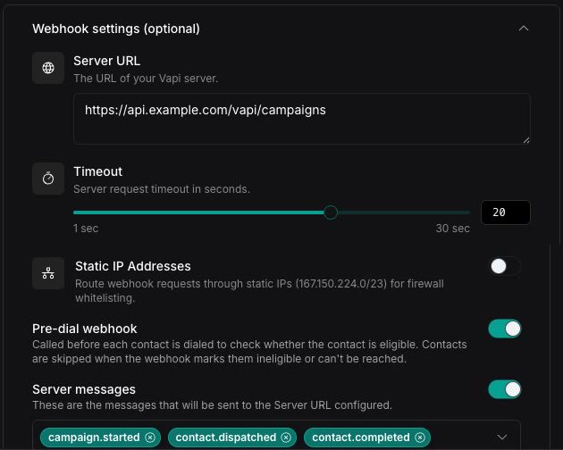

Expand **Webhook settings (optional)** on the **Campaign Details** step to connect the campaign to your server. A campaign can make a blocking eligibility request before each call and send asynchronous campaign or contact events.

## Configure the Server URL

<Tabs>
  <Tab title="Dashboard">
    Add the endpoint that should receive requests under **Server URL**. The Dashboard also lets you set a 1–30 second timeout, attach a credential, add HTTP headers, and route requests through Vapi's static IP range (`167.150.224.0/23`) for firewall allowlisting.

    Both **Pre-dial webhook** and **Server messages** require a Server URL.

    <Frame>
      
    </Frame>
  </Tab>

  <Tab title="cURL">
    Configure `server`, `predialPlan`, and `serverMessages` in the campaign creation request. Because a campaign is read-only after creation, these settings cannot be added later.

    ```bash
    curl --request POST \
      --url https://api.vapi.ai/v2/campaign \
      --header "Authorization: Bearer $VAPI_API_KEY" \
      --header 'Content-Type: application/json' \
      --data '{
        "name": "Account follow-ups",
        "assistantId": "<assistant-id>",
        "phoneNumberId": "<phone-number-id>",
        "maxConcurrency": 10,
        "customers": [
          {
            "number": "+14155550100",
            "name": "Ada"
          }
        ],
        "server": {
          "url": "https://example.com/vapi/campaigns",
          "timeoutSeconds": 20,
          "headers": {
            "X-Integration-ID": "campaigns"
          },
          "staticIpAddressesEnabled": true
        },
        "predialPlan": {
          "enabled": true
        },
        "serverMessages": [
          "campaign.started",
          "campaign.ended",
          "contact.completed",
          "contact.failed",
          "contact.skipped",
          "contact.predial-failed"
        ]
      }'
    ```

    To use a saved credential, add its ID as `server.credentialId`. Do not place secrets directly in campaign headers.
  </Tab>
</Tabs>

## Filter contacts before dialing

Enable **Pre-dial webhook** to ask your server whether each contact is eligible immediately before Vapi places the call. Because this request blocks dispatch, keep the handler fast and idempotent.

Before each contact is dispatched, Vapi sends:

```json title="campaign.predial request"
{
  "message": {
    "type": "campaign.predial",
    "timestamp": 1787266800000,
    "campaignId": "3f8f0c31-2db0-4fb8-95d4-27cb56a2d7bf",
    "contact": {
      "id": "9a32ab38-4f18-4767-bf41-6326f290ebd4",
      "campaignId": "3f8f0c31-2db0-4fb8-95d4-27cb56a2d7bf",
      "orgId": "8e8f1dc8-2993-4b4d-b2fd-9f0fc2739f6d",
      "number": "+14155550100",
      "name": "Ada",
      "createdAt": "2026-08-20T20:18:42.000Z"
    }
  }
}
```

The contact can also include `assistantOverrides` or `squadOverrides`, including dynamic variable values supplied for that contact.

Return `true` to allow the call:

```json title="Eligible response"
{
  "eligible": true
}
```

Return `false` to skip it:

```json title="Ineligible response"
{
  "eligible": false
}
```

The response must be valid JSON with a Boolean `eligible` field.

| Result | Contact behavior |
| -- | -- |
| `eligible: true` | Vapi continues dispatching the call. |
| `eligible: false` | Vapi does not place the call and records `contact.skipped`. |
| Unreachable server, timeout, non-`2xx`, or invalid response | Vapi does not place the call and records `contact.predial-failed`. |

The Dashboard allows a timeout of up to 30 seconds for this check. Use the pre-dial webhook for suppression lists, consent checks, account-state queries, or other rules that must be evaluated against your backend at call time.

## Receive campaign events

Enable **Server messages**, then select the events that Vapi should send:

- `campaign.started`
- `campaign.ended`
- `campaign.cancelled`
- `campaign.archived`
- `contact.dispatched`
- `contact.completed`
- `contact.failed`
- `contact.skipped`
- `contact.predial-failed`

Every selected event uses the same envelope. For example, `contact.completed` sends:

```json title="contact.completed"
{
  "message": {
    "type": "campaign.event",
    "timestamp": 1787266800000,
    "campaignId": "3f8f0c31-2db0-4fb8-95d4-27cb56a2d7bf",
    "eventType": "contact.completed",
    "data": {
      "contactId": "9a32ab38-4f18-4767-bf41-6326f290ebd4",
      "callId": "73a3d2bc-8bde-4a54-bc9d-3503ea8d6b1f",
      "endedReason": "customer-ended-call"
    }
  }
}
```

The `data` object depends on `eventType`:

| Events | `data` fields |
| -- | -- |
| `campaign.started` | `workflowId` |
| `campaign.ended`, `campaign.cancelled` | `endedReason` |
| `campaign.archived` | Empty object |
| `contact.dispatched`, `contact.skipped` | `contactId` |
| `contact.completed`, `contact.failed` | `contactId`, `callId`, `endedReason` |
| `contact.predial-failed` | `contactId`, `error` |

Campaign events are asynchronous. Return any successful `2xx` response; Vapi does not use the response body to control the campaign. Process duplicate deliveries safely and do not depend on events arriving in a particular order.

<Note>
  A campaign event reports lifecycle data, not the complete call record. To receive the transcript, recording information, analysis, and other call details, configure the assistant—or the relevant assistant in a squad—to send [`end-of-call-report`](/server-url/events). Use `callId` to associate that report with the campaign contact event.
</Note>

The default server timeout is 20 seconds. Campaign event delivery does not retry by default; configure a [Server URL backoff plan](/server-url) when your integration requires retries.

## Next steps

<CardGroup cols={2}>
  <Card title="Configure Server URLs" icon="webhook" href="/server-url">
    Authenticate webhook requests and configure delivery behavior.
  </Card>
  <Card title="Review campaign lifecycle" icon="calendar-clock" href="/outbound-campaigns/scheduling-and-lifecycle">
    Understand when contacts are dispatched and how campaigns end.
  </Card>
</CardGroup>
