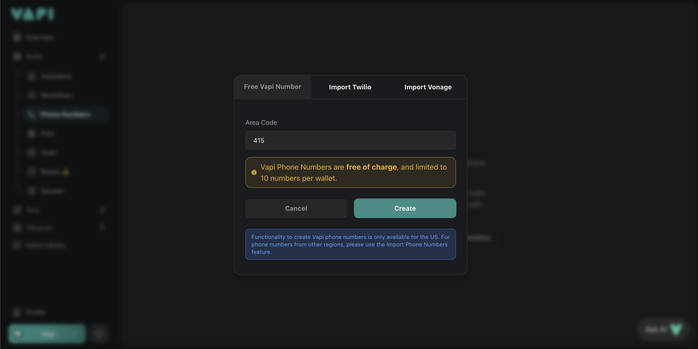

This guide details how to create free phone numbers on the Vapi platform, which you can use with your assistants or squads.

<Steps>
  ### Head to the “Phone Numbers” tab in your Vapi dashboard.

<Frame>
  
</Frame>

  ### Click on “Create a Phone Number”

<Frame>
  
</Frame>

  ### Within the "Free Vapi Number" tab, enter your desired area code

<Note>
    Currently, only US phone numbers can be directly created through Vapi.
</Note>

<Frame>
  
</Frame>

  ### Vapi will automatically allot you a random phone number — free of charge!

<Note>
    It takes a couple of minutes for the phone number to be fully activated. During this period, calls will not be functional.
</Note>

<Frame>
  
</Frame>

</Steps>

### Frequently Asked Questions

<AccordionGroup>
    <Accordion title="Can I get more than 10 free phone numbers?" icon="phone" iconType="regular">
        For now, each wallet can have up to 10 free numbers. This limit ensures we can continue offering reliable, high-quality service to everyone.
    </Accordion>
    <Accordion title="Are international calls and numbers also free?" icon="phone" iconType="regular">
        Not at this time. You can still bring in global numbers using our phone number import feature.
    </Accordion>
    <Accordion title="Is there a catch to the free service?" icon="phone" iconType="regular">
        None at all. We’re simply passing on the cost efficiencies we’ve gained through robust engineering and volume partnerships.
    </Accordion>
</AccordionGroup>