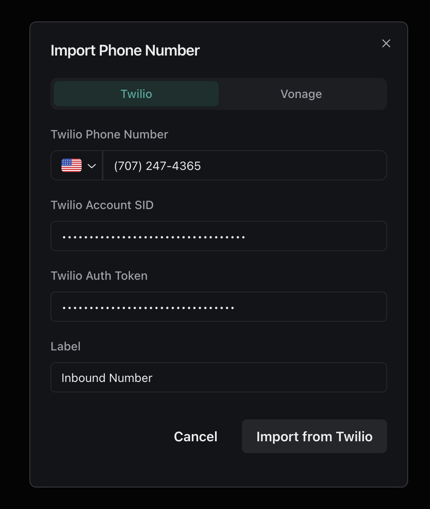

## Overview

As you scale your agents, you may want to use other telephony providers, like Twilio. In this guide, you'll learn how to add a new or existing Twilio number to Vapi.

## Prerequisites

- [A Twilio account](https://console.twilio.com/)

## Get started

<Steps>
  <Step title="Buy a Phone Number via Twilio (if needed)">
    If you don't have a Twilio number, purchase one in your Twilio console's "Buy a number" section.
    <Frame caption="The Twilio 'Buy a Number' page in the Twilio console.">
      
    </Frame>
  </Step>
  <Step title="Get Your Twilio Account SID & Auth Token">
    In your Twilio console, go to "API keys & tokens" to find your Account SID and Auth Token.
    <Frame caption="Navigate to the credentials section of your Twilio account.">
      
    </Frame>
    <Frame>
      
    </Frame>
  </Step>
  <Step title="Import Your Number in the Vapi Dashboard">
    1. Go to the "Phone Numbers" section in Vapi and click "Import".
    <Frame caption="Click 'Import' in the 'Phone Numbers' tab of your dashboard.">
      
    </Frame>
    2. Enter your phone number and Twilio credentials, then click "Import".
    <Frame>
      
    </Frame>
  </Step>
  <Step title="Your number is ready now ready">
    You can use the number with an assistant for inbound or outbound calls. 
    <Frame caption="The phone number detail page, where you can configure your phone number.">
      
    </Frame>
  </Step>
</Steps> 