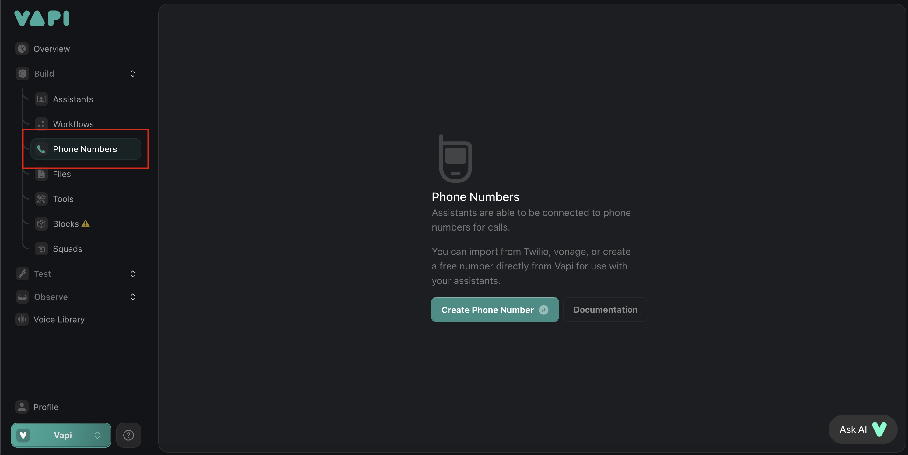
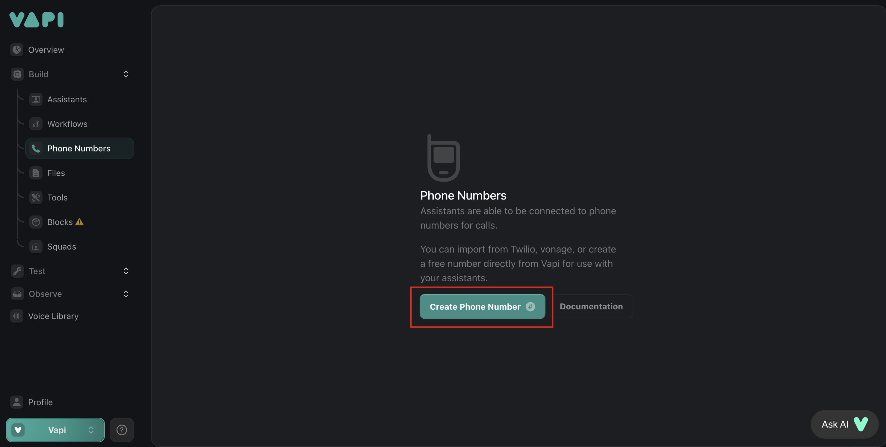
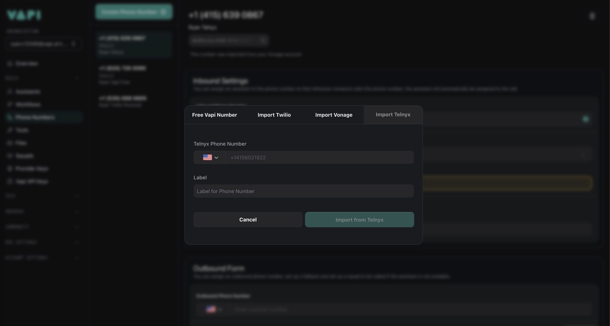

## Overview

This guide shows you how to import your existing Telnyx phone numbers to the Vapi platform and enable outbound calling. Follow the steps below to use your Telnyx numbers with your assistants or squads.

<Steps>
  <Step title="Go to the Phone Numbers tab in your Vapi dashboard">
    <Frame>
      
    </Frame>
  </Step>

  <Step title="Click on Create a Phone Number">
    <Frame>
      
    </Frame>
  </Step>

  <Step title="Select the Telnyx tab and enter your phone number details">
    <Note>
      You'll need to have an active Telnyx account with phone numbers that you want to import.
    </Note>
    <Frame>
      
    </Frame>
  </Step>
</Steps>

## Configuring outbound calling with Telnyx

To enable outbound calling with your imported Telnyx numbers, configure your Telnyx account:

<Steps>
  <Step title="Log in to the Telnyx Portal">
    Go to the [Telnyx Portal](https://portal.telnyx.com/#/outbound-profiles).
  </Step>
  <Step title="Create or edit an Outbound Voice Profile">
    Set up or select the outbound voice profile you want to use.
  </Step>
  <Step title="Add Vapi as a connection">
    Under the "Connections and Applications" tab, add Vapi as a connection.
  </Step>
  <Step title="Save your changes">
    Save your configuration to enable outbound calling.
  </Step>
</Steps>

<Note>
Without this configuration, outbound calling functionality will not work properly with your Telnyx numbers on the Vapi platform.
</Note>

