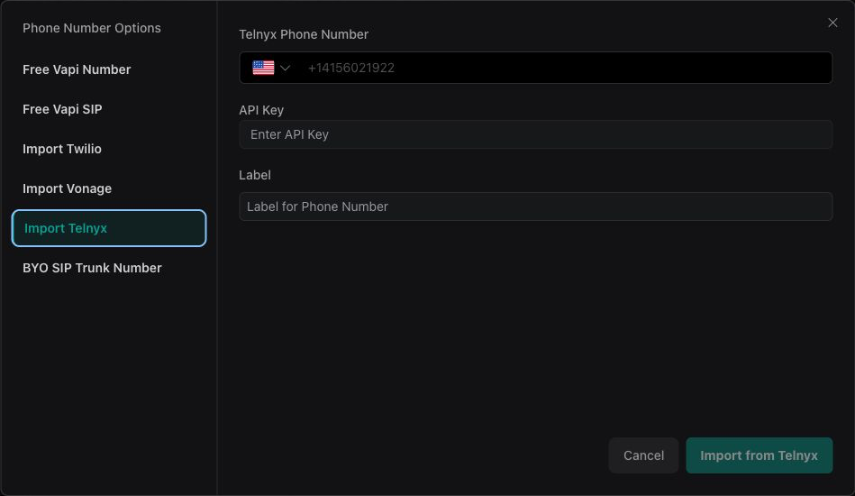

## Overview

This guide shows you how to import your existing Telnyx phone numbers to the Vapi platform and enable outbound calling. Follow the steps below to use your Telnyx numbers with your assistants or squads.

## Prerequisites

- An active Telnyx account
- A Telnyx phone number
- A Telnyx API key

<Steps>
  <Step title="Open Phone Numbers">
    Open the [Dashboard](https://dashboard.vapi.ai) and select **Phone Numbers**.

    <Frame caption="Create a phone number">
      
    </Frame>
  </Step>

  <Step title="Choose the Telnyx import option">
    Select **Create Phone Number**, then choose **Import Telnyx** under **Phone Number Options**.
  </Step>

  <Step title="Enter the Telnyx number and API key">
    Enter the number, including its country code, in **Telnyx Phone Number**. Enter your key in **API Key** and, optionally, enter a descriptive **Label**. Then select **Import from Telnyx**.

    <Frame caption="Import a Telnyx phone number">
      
    </Frame>
  </Step>
</Steps>

## Configuring outbound calling with Telnyx

To enable outbound calling with your imported Telnyx numbers, configure your Telnyx account:

<Steps>
  <Step title="Open Outbound Voice Profiles">
    Open the [Telnyx Portal](https://portal.telnyx.com/#/outbound-profiles) and select **Outbound Voice Profiles**.
  </Step>
  <Step title="Configure an Outbound Voice Profile">
    Create a profile or select the profile you want to use. Configure its allowed destinations and other calling limits as needed. For details, see Telnyx's [Outbound Voice Profiles documentation](https://developers.telnyx.com/docs/voice/sip-trunking/configuration/outbound-voice-profiles).
  </Step>
  <Step title="Add the Vapi connection">
    Select **Add connections/apps to profile**, then choose the connection used by Vapi.
  </Step>
  <Step title="Save your changes">
    Select **Save** to enable outbound calling for that connection.
  </Step>
</Steps>

<Note>
Without this configuration, outbound calling functionality will not work properly with your Telnyx numbers on the Vapi platform.
</Note>

## Troubleshooting

### Distorted caller audio on some calls outside North America

On some calls outside North America, the native Telnyx integration may receive static or garbled audio from the person on the phone. Transcripts may be empty or fragmented.

Some of these call legs use G.711 A-law (PCMA), while the native Telnyx integration currently expects G.711 µ-law (PCMU). This codec mismatch can make the phone audio unintelligible.

Try these in order:

1. Switch your transcriber to Deepgram Nova-3. It may recover transcripts on some calls, but it does not fix the underlying audio, so recordings may remain distorted.
2. Ask Telnyx support whether they can make PCMU the preferred codec for the affected phone number or connection.
3. Try a US-based Telnyx phone number. It may negotiate PCMU and avoid the mismatch, but verify the result with a test call.
4. Use a phone number from another provider, such as [Twilio](/phone-numbers/import-twilio) or Vonage.
5. If you already use a SIP trunk, route the number through it instead of the native Telnyx integration. This uses a different media path and may avoid the issue. See the [Telnyx SIP integration](/advanced/sip/telnyx).

<Note>
Browser-based web calls use a separate WebRTC media path rather than the native Telnyx media-streaming path. A successful web call does not rule out this issue on a Telnyx phone call.
</Note>
