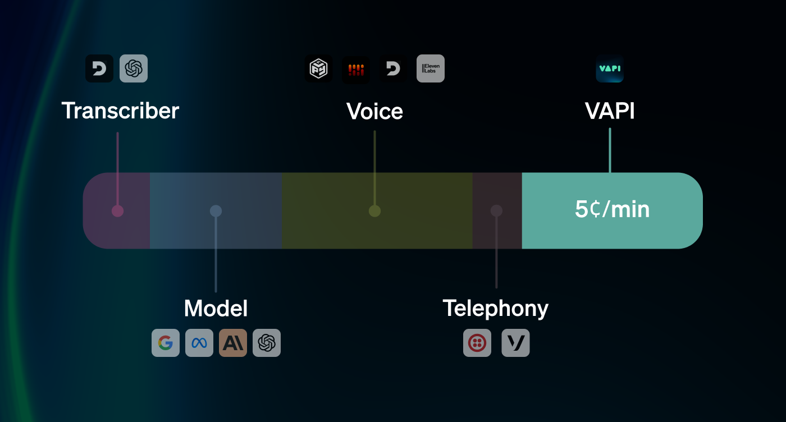

## Overview

Vapi offers flexible pricing to scale with your voice AI needs, from development to enterprise deployments.

**All plans include:**
- Unlimited assistants and workflows
- Real-time call control
- Advanced analytics and insights
- 24/7 support

## Pricing Plans

<CardGroup cols={2}>
  <Card title="Developer" icon="code" href="https://dashboard.vapi.ai/settings/billing">
    **Pay-as-you-go**
    
    Perfect for developers and small projects
    
    - No monthly fees
    - Pay only for usage
    - Full API access
    - Community support
  </Card>
  
  <Card title="Business" icon="building" href="https://dashboard.vapi.ai/settings/billing">
    **Custom pricing**
    
    For production applications and growing businesses
    
    - Volume discounts
    - Priority support
    - Custom integrations
    - SLA guarantees
  </Card>
</CardGroup>

## Usage-Based Pricing

Vapi charges based on actual usage:

- **Voice minutes**: Per minute of conversation
- **API calls**: Per request to Vapi endpoints
- **Storage**: For call recordings and files

View detailed pricing in your [Vapi Dashboard](https://dashboard.vapi.ai/settings/billing).

## Enterprise

For large-scale deployments, we offer:

- **Custom pricing** based on volume
- **On-premise deployment** options
- **Dedicated support** teams
- **Custom SLAs** and uptime guarantees

[Contact our sales team](https://form.typeform.com/to/iOcCsqVP?typeform-source=vapi.ai) for enterprise pricing.

## FAQ

<AccordionGroup>
  <Accordion title="Is there a free tier?">
    Yes! New accounts receive free credits to get started. No credit card required to begin building.
  </Accordion>
  
  <Accordion title="How is billing calculated?">
    Billing is calculated from usage across Vapi platform fees and provider passthrough costs (for example, transcriber, model, voice, and telephony). Some provider pricing is per stream, so dual-stream configurations can cost more than single-stream configurations. You can monitor usage in real-time in your dashboard.
  </Accordion>
  
  <Accordion title="Can I change plans anytime?">
    Yes, you can upgrade or adjust your plan at any time. Changes take effect immediately.
  </Accordion>
</AccordionGroup>

## Next Steps

- [Sign up for free](https://dashboard.vapi.ai/) to get started
- [View detailed usage](https://dashboard.vapi.ai/settings/billing) in your dashboard
- [Contact sales](https://form.typeform.com/to/iOcCsqVP?typeform-source=vapi.ai) for enterprise needs

<Frame>
  
</Frame>

 

<CardGroup cols={2}>
  <Card title="Startup Pricing: $0.05/min" icon="cent-sign" iconType="solid">
    Vapi itself charges $0.05 per minute for calls. Prorated to the second.
  </Card>
  <Card
    title="At-Cost for Providers"
    icon="chart-network"
    iconType="sharp-solid"
    color="#5BBFF1"
  >
    Transcriber, model, voice, & telephony costs charged at-cost.
  </Card>
  <Card
    title="Bring Your Own Keys"
    icon="key-skeleton-left-right"
    iconType="solid"
    color="#AD81F2"
  >
    Bring your own API keys for providers, Vapi makes requests on your behalf.
  </Card>
</CardGroup>

### Azure STT pricing clarification

Azure’s published real-time Speech-to-Text base price is typically around **$1.00/hour** (about **$0.0167/min**) **per stream**.

If you see **$0.016/min** in examples, treat it as a **single-stream reference rate**, not the default total for dual-stream calls.

By default, Vapi transcribes **two streams** for many voice pipelines:

- **Customer audio stream**
- **Assistant audio stream**

Because both streams are sent to Azure STT, the effective rate is typically about:

- **$0.033/min total STT** (2 × $0.0167/min), before any regional/provider-specific differences

<Note>
For streaming STT, Azure bills based on audio sent to the service. In continuous streaming, silence and pauses are still part of the streamed audio, so your billed minutes usually track stream duration.
</Note>

To reduce Azure STT cost toward single-stream pricing:

- Enable **`modelOutputInMessagesEnabled: true`** to skip assistant-channel retranscription when supported.
- This optimization currently requires **ElevenLabs voice** (word-level timestamps are needed for interruption handling).
- If you use other voice providers, the assistant stream may still be transcribed.

If you use **BYOK (your own Azure credentials)**, Vapi does not charge Azure STT passthrough on your behalf; Azure bills you directly in your own account.

### Starter Credits

Every new account is granted **$10 in free credits** to begin testing voice workflows. You can [begin using Vapi](/quickstart/phone) without a credit card.

---

## Enterprise

Handling a large volume of calls? You can find more information on our Enterprise plans [here](/enterprise).

- Higher concurrency and rate limits
- Hands-on 24/7 support
- Shared Slack channel with our team
- Included minutes with volume pricing
- Calls with our engineering team 2-3 times per week

## Further Reading

<CardGroup cols={2}>
  <Card
    title="Routing Provider Cost"
    icon="route"
    iconType="solid"
    href="/billing/cost-routing"
  >
    Learn more about how Vapi routes provider costs.
  </Card>
  <Card
    title="Estimating Costs"
    icon="equals"
    iconType="solid"
    href="/billing/estimating-costs"
  >
    Learn more about estimating costs for your voice pipeline.
  </Card>
  <Card
    title="Billing Limits"
    icon="meter"
    iconType="solid"
    href="/billing/billing-limits"
  >
    Learn how to set billing limits for your account.
  </Card>
  <Card
    title="Billing Examples"
    icon="books"
    iconType="solid"
    href="/billing/examples"
  >
    Read full end-to-end billing breakdowns to better understand how Vapi bills.
  </Card>
</CardGroup>
