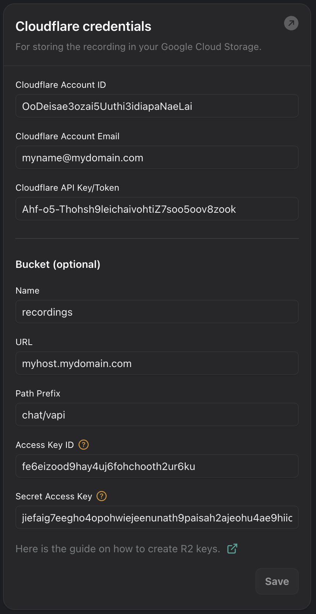

Your assistants can be configured to record chat conversations and upload
the recordings to a bucket in Cloudflare R2 when the conversation ends.  You will
need to configure the credential and bucket settings in the "Cloud Providers"
section of the "Provider Credentials" page in the Vapi dashboard.

See these [instructions](https://developers.cloudflare.com/r2/api/s3/tokens/) for generating R2 tokens and access keys.

## Credential Settings

Setting                  | Description                                            
------------------------ | -------------------------------------------------------
Cloudflare Account ID    | Your customer account id for Cloudflare
Cloudflare Account Email | The email address associated with the account id
Cloudflare API Key/Token | The value of an API Key/Token generated for the account  (Cloudflare uses the terms API Key and API Token interchangeably)
Bucket Name              | The name of the bucket in R2 to upload recordings to
Bucket URL               | This is required only for buckets with a custom hostname or domain name. Enter the hostname for the bucket. You will need to set up a CORS policy in R2 for the hostname/domain name. See [instructions](https://developers.cloudflare.com/r2/buckets/cors/) for configuring CORS.
Bucket Path Prefix       | An optional path prefix for recordings uploaded to the bucket
Bucket Access Key ID     | The access key id associated with the API token you generated for R2 (this a string of 32 characters)
Bucket Secret Access Key | The secret access key associated with the API token you generated for R2 (this is a string of 64 characters)

## Example

<Frame caption="Example Configuration">
  
</Frame>
