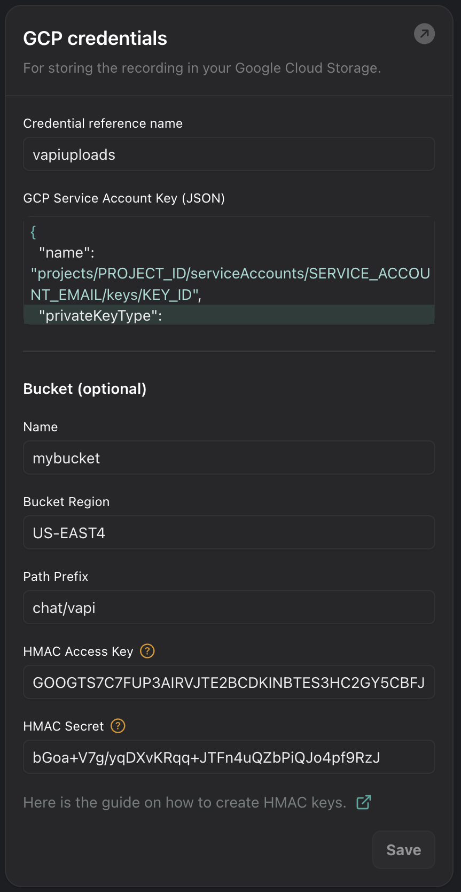

Your assistants can be configured to record chat conversations and upload
the recordings to a bucket in GCP Cloud Storage when the conversation ends.  You will
need to configure the credential and bucket settings in the "Cloud Providers"
section of the "Provider Credentials" page in the Vapi dashboard.

See these [instructions](https://cloud.google.com/iam/docs/keys-create-delete) for generating service account keys for GCP.

See these [instructions](https://cloud.google.com/storage/docs/authentication/hmackeys) for generating HMAC Keys for Cloud Storage.

## Credential Settings

Setting                        | Description
------------------------------ | -------------------------------------------------------
Credential Reference Name      | The credential reference name
GCP Service Account Key (JSON) | The service account key in JSON format
Bucket Name                    | The name of the bucket to upload recordings to
Bucket Region                  | The name of the region where the bucket is located
Bucket Path Prefix       | An optional path prefix for recordings uploaded to the bucket. Supports [LiquidJS Date format](https://liquidjs.com/filters/date.html) templating.
HMAC Access Key                | The HMAC access key for the GCP Cloud Storage API (This is a string of 24 characters when linked to a user account or a string of 61 characters when linked to a service account.)
HMAC Secret                    | The HMAC secret for the GCP Clodu Storage API (This is a 40-character base-64 encoded string.)

## Example

<Frame caption="Example Configuration">
  
</Frame>
