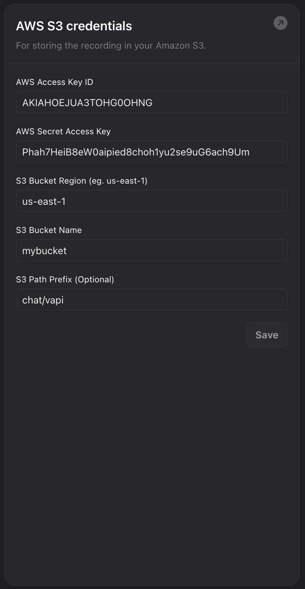

Your assistants can be configured to record chat conversations and upload
the recordings to a bucket in AWS S3 when the conversation ends.  You will
need to configure the credential and bucket settings in the "Cloud Providers"
section of the "Provider Credentials" page in the Vapi dashboard.

See these [instructions](https://docs.aws.amazon.com/IAM/latest/UserGuide/access-keys-admin-managed.html) for generating AWS access keys.

## Credential Settings

Setting                  | Description
------------------------ | -------------------------------------------------------
AWS Access Key ID        | The access key id for AWS
AWS Secret Access Key    | The secret access key for AWS
S3 Bucket Name           | The name of the bucket to upload recordings to
S3 Path Prefix           | An optional path prefix for recordings uploaded to the bucket

## Example

<Frame caption="Example Configuration">
  
</Frame>
