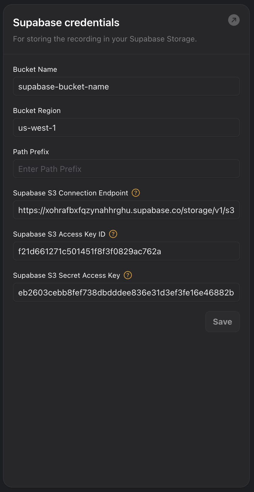

Your assistants can be configured to record chat conversations and upload
the recordings to a bucket in Supabase Storage when the conversation ends.  You will
need to configure the credential and bucket settings in the "Cloud Providers"
section of the "Provider Credentials" page in the Vapi dashboard.

See these [instructions](https://supabase.com/docs/guides/storage/s3/authentication) for generating Supabase tokens and access keys, and finding your endpoint and region.

## Credential Settings

Setting                   | Description                                            
------------------------- | -------------------------------------------------------
Bucket Name               | The name of the bucket in Supabase Storage to upload recordings to
Storage Region            | The region of the Supabase project
Storage Endpoint          | The endpoint of the Supabase Storage to upload recordings to
Bucket Path Prefix       | An optional path prefix for recordings uploaded to the bucket. Supports [LiquidJS Date format](https://liquidjs.com/filters/date.html) templating.
Storage Access Key ID     | The access key id for Supabase Storage
Storage Secret Access Key | The secret access key for Supabase Storage, associated with the access key id

## Example

<Frame caption="Example Configuration">
  
</Frame>
