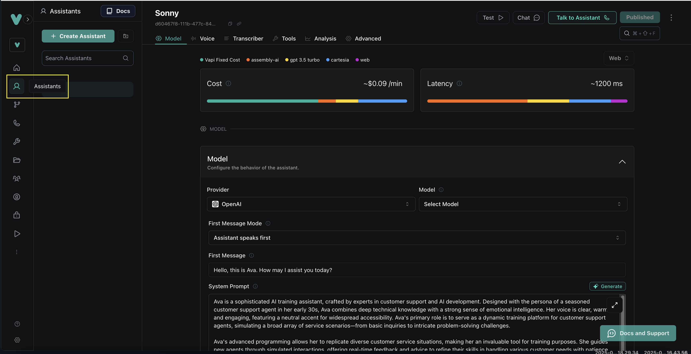
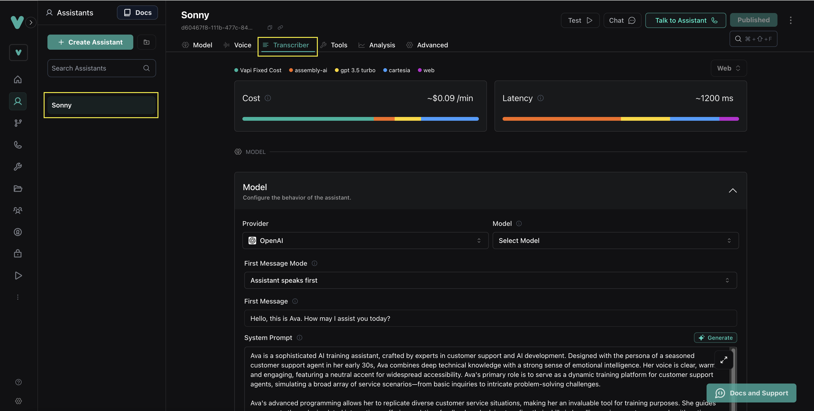
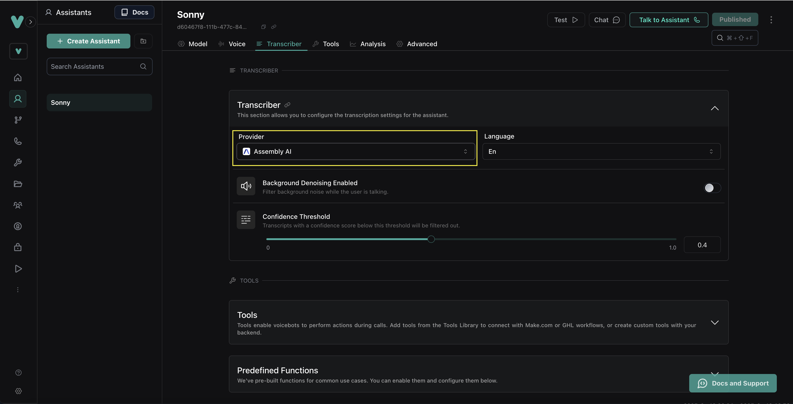

## Universal-Streaming

Universal-Streaming is AssemblyAI's purpose-built speech-to-text model that delivers ultra-fast, immutable transcripts in ~300ms with intelligent endpointing and superior accuracy for voice agents. It eliminates common pain points like misheard account numbers, awkward pauses, and premature cutoffs, enabling more natural and successful voice interactions.

## How to use AssemblyAI as transcriber

This guide details how to setup AssemblyAI as a transcriber for your assistant.

<Steps>
    **Head to the "Assistants" tab in your Vapi dashboard.**

    <Frame>
        
    </Frame>

    **Click on your assistant and then the "Transcriber" tab.**

    <Frame> 
        
    </Frame>
    

    **Select "assembly-ai" on the Provider dropdown.**

    <Frame>
        
    </Frame>
</Steps>

## Supported Languages

Universal-Streaming currently supports English only.