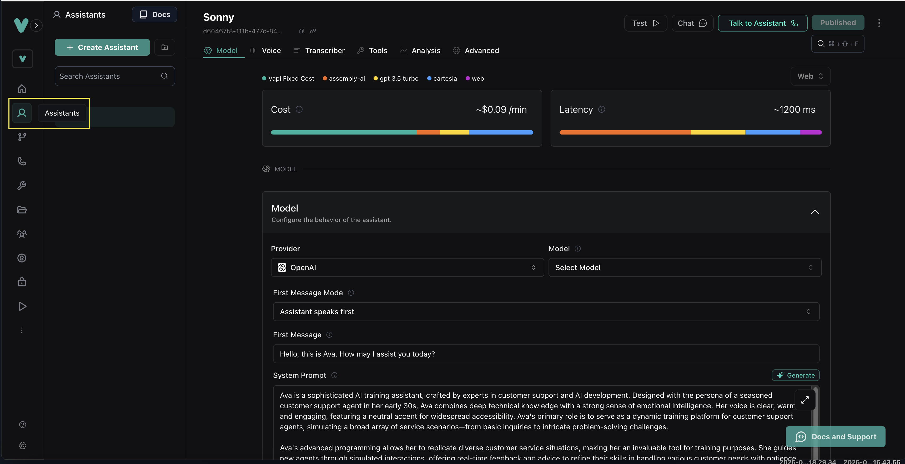
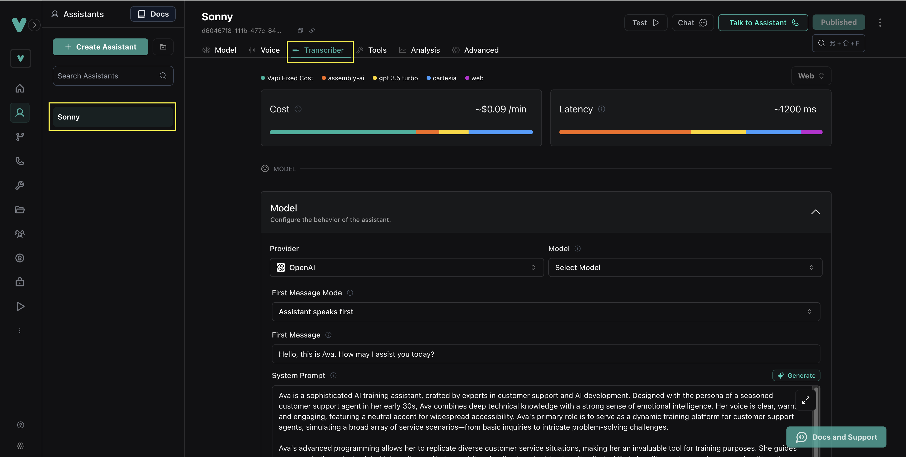
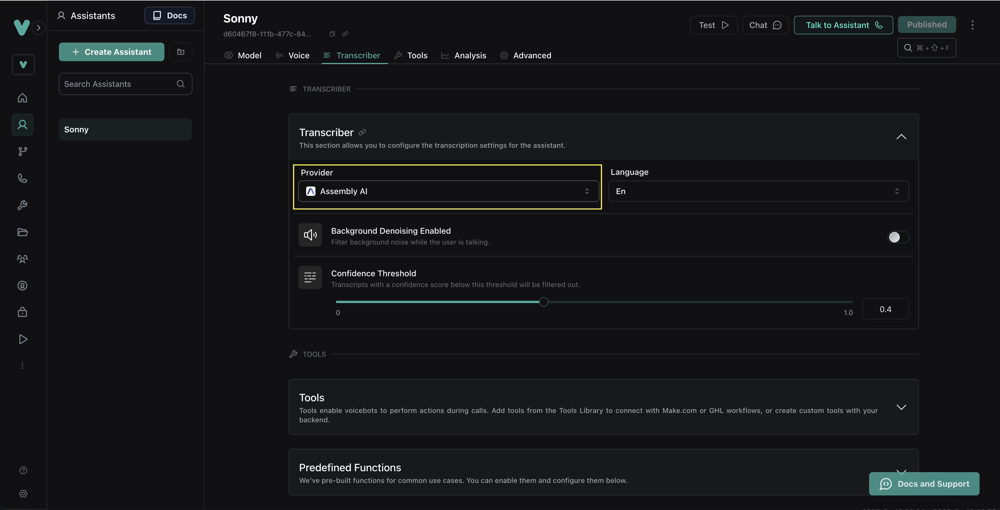

## Universal-Streaming

Universal-Streaming is AssemblyAI's purpose-built speech-to-text model that delivers ultra-fast, immutable transcripts in ~300ms with intelligent endpointing and superior accuracy for voice agents. It eliminates common pain points like misheard account numbers, awkward pauses, and premature cutoffs, enabling more natural and successful voice interactions.

AssemblyAI provides real-time speech-to-text and turn detection for Vapi voice agents.

## Supported capability

| Capability | Provider value |
| --- | --- |
| Speech-to-text | `assembly-ai` |

## Speech-to-text

Set `transcriber.provider` to `assembly-ai`. By default the `universal-streaming-english` speech model is used; set `transcriber.speechModel` to choose a different model.

```bash
curl -X PATCH "https://api.vapi.ai/assistant/ASSISTANT_ID" \
  -H "Authorization: Bearer $VAPI_API_KEY" \
  -H "Content-Type: application/json" \
  -d '{
    "transcriber": {
      "provider": "assembly-ai",
      "language": "en"
    }
  }'
```

For additional API configuration options, review the [`AssemblyAITranscriber` fields](/api-reference/assistants/create#request.body.transcriber.AssemblyAITranscriber) in the Create Assistant API reference.

### Universal 3.5 Pro

Universal 3.5 Pro (`universal-3-5-pro`) is AssemblyAI's most accurate voice-agent model, with automatic language detection and code-switching across 18 languages.

```bash
curl -X PATCH "https://api.vapi.ai/assistant/ASSISTANT_ID" \
  -H "Authorization: Bearer $VAPI_API_KEY" \
  -H "Content-Type: application/json" \
  -d '{
    "transcriber": {
      "provider": "assembly-ai",
      "speechModel": "universal-3-5-pro"
    }
  }'
```

Universal 3.5 Pro supports additional configuration:

- `mode`: Trade off accuracy and latency with `max_accuracy`, `balanced`, or `min_latency`.
- `prompt`: Provide additional context for the transcription model, up to 1,750 characters.
- `agentContext`: Provide context about the assistant that helps the transcription model interpret caller speech, up to 1,750 characters.
- `languageCodes`: Steer automatic language detection with language codes such as `["en", "es"]`.
- `keytermsPrompt`: Boost recognition of domain-specific terms.

### Configure in the dashboard

This guide details how to setup AssemblyAI as a transcriber for your assistant.

<Steps>
    **Head to the "Assistants" tab in your Vapi dashboard.**

    <Frame>
        
    </Frame>

    **Click on your assistant and then the "Transcriber" tab.**

    <Frame> 
        
    </Frame>
    

    **Select "assembly-ai" on the Provider dropdown.**

    <Frame>
        
    </Frame>
</Steps>

### Supported languages

Vapi supports AssemblyAI's English and multilingual Universal-Streaming modes, plus the Universal 3.5 Pro model.

| Mode | Speech model | Language value | Supported languages |
| --- | --- | --- | --- |
| English | `universal-streaming-english` | `en` | English |
| Multilingual | `universal-streaming-multilingual` | `multi` | English, French, German, Italian, Portuguese, and Spanish |
| Universal 3.5 Pro | `universal-3-5-pro` | Automatic | 18 languages with automatic language detection and code-switching |

Universal 3.5 Pro accepts the following `languageCodes` values for language steering. Omit `languageCodes` to keep automatic detection and code-switching across all supported languages. See [AssemblyAI's language steering guide](https://www.assemblyai.com/blog/fix-language-steering-streaming-transcription) for provider guidance.

| Language | Language code |
| --- | --- |
| Arabic | `ar` |
| Danish | `da` |
| Dutch | `nl` |
| English | `en` |
| Finnish | `fi` |
| French | `fr` |
| German | `de` |
| Hebrew | `he` |
| Hindi | `hi` |
| Italian | `it` |
| Japanese | `ja` |
| Mandarin Chinese | `zh` |
| Norwegian | `no` |
| Portuguese | `pt` |
| Spanish | `es` |
| Swedish | `sv` |
| Turkish | `tr` |
| Vietnamese | `vi` |

Keyterms prompting is supported with the `universal-streaming-english`, `universal-streaming-multilingual` and `universal-3-5-pro` models.

## Related

<CardGroup cols={1}>
  <Card title="Transcribers" icon="wave-square" href="/providers/transcriber/overview">
    Compare every speech-to-text provider Vapi supports.
  </Card>
</CardGroup>
