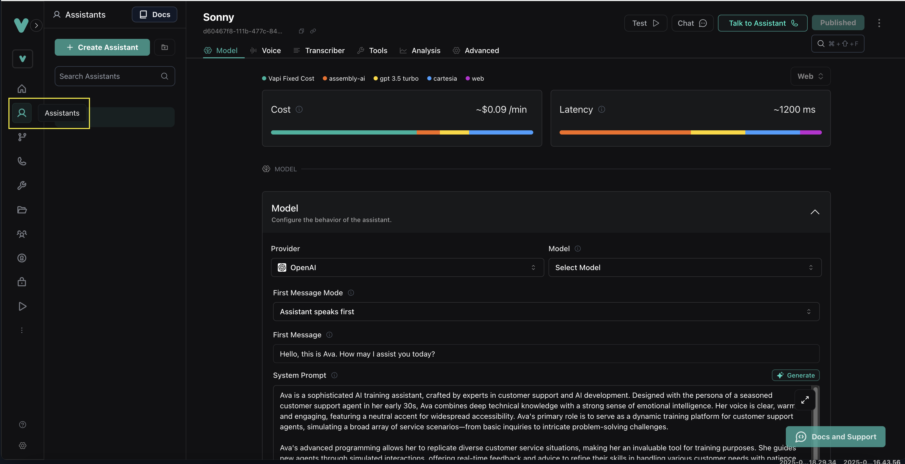
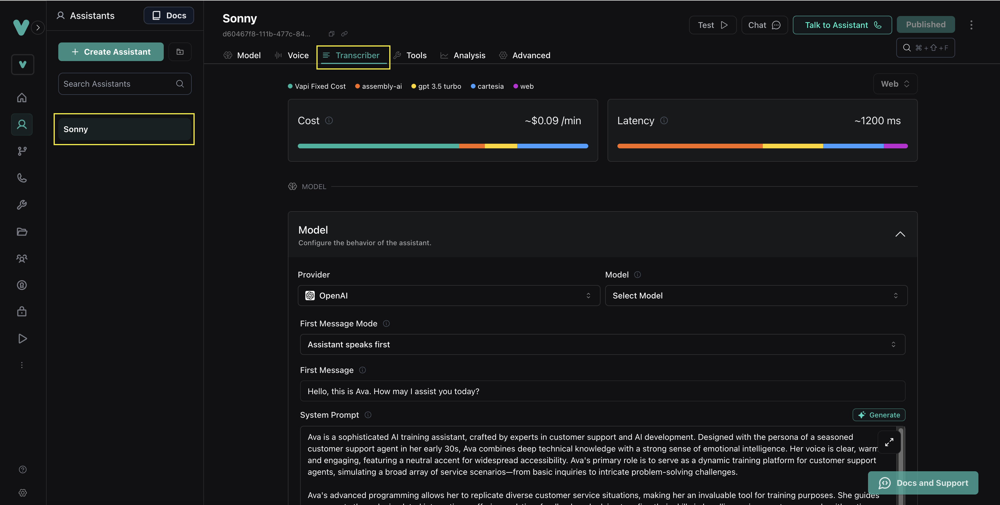
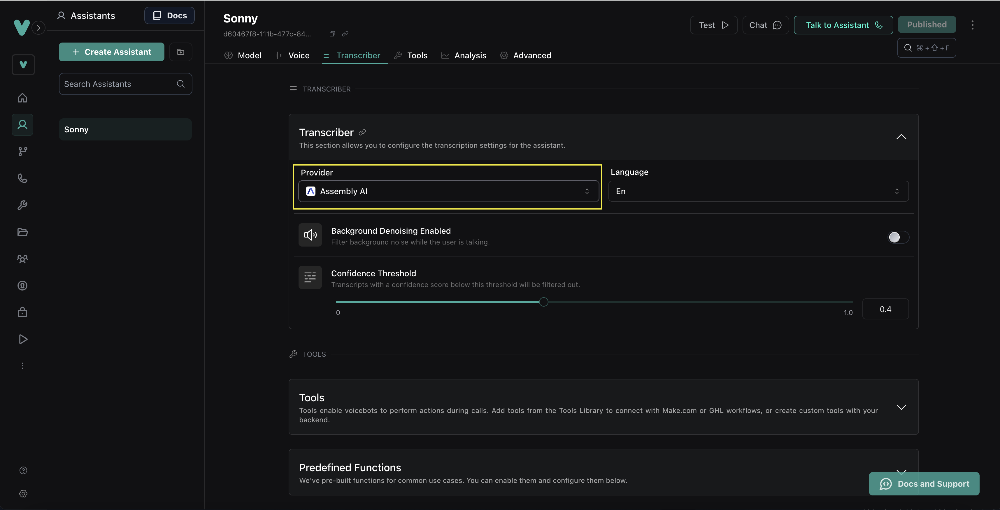

AssemblyAI provides real-time speech-to-text and turn detection for Vapi voice agents.

## Universal Pro models

Universal Pro is AssemblyAI's flagship streaming model, purpose-built for voice agents and harsh audio environments. It has broad language coverage with native code-switching across up to 32 languages, plus conversational context features like prompting, keyterms, and agent context (passing spoken agent turns back to the model to steer transcription of the next user reply).

| Model | Speech model | Languages |
| --- | --- | --- |
| Universal 3.6 Pro | `universal-3-6-pro` | 32 |
| Universal 3.5 Pro | `universal-3-5-pro` | 18 |

Universal 3.6 Pro (`universal-3-6-pro`) is the newest and most accurate model. It supports every Universal 3.5 Pro option and adds 14 languages.

```bash
curl -X PATCH "https://api.vapi.ai/assistant/ASSISTANT_ID" \
  -H "Authorization: Bearer $VAPI_API_KEY" \
  -H "Content-Type: application/json" \
  -d '{
    "transcriber": {
      "provider": "assembly-ai",
      "speechModel": "universal-3-6-pro",
      "mode": "balanced",
      "prompt": "Customer support call for a bank. Callers ask about account balances, card activation, and recent transactions.",
      "languageCodes": ["en", "es"],
      "keytermsPrompt": ["Acme Bank", "overdraft", "routing number"],
      "agentContext": "Hi, thanks for calling Acme Bank. Can I get your account number?",
      "agentContextAutoUpdateEnabled": true
    }
  }'
```

Both Universal Pro models support additional configuration:

- `mode`: Trade off accuracy and latency with `max_accuracy`, `balanced`, or `min_latency`. Defaults to `balanced`.
- `prompt`: Provide additional context for the transcription model, up to 1,750 characters.
- `agentContext`: Provide context about the assistant that helps the transcription model interpret caller speech, up to 1,750 characters.
- `agentContextAutoUpdateEnabled`: Automatically send what the assistant just said as agent context after every assistant turn. Defaults to `false`.
- `languageCodes`: Steer automatic language detection with language codes such as `["en", "es"]`.
- `keytermsPrompt`: Boost recognition of domain-specific terms. Included at no extra cost on the Universal Pro models.

### Automatic agent context

When `agentContextAutoUpdateEnabled` is `true`, Vapi sends the assistant's last spoken reply to AssemblyAI as agent context after every assistant turn, replacing the previous value. The caller's answer is then transcribed in the context of the question it responds to. For example, after "What's your email address?", the model expects an email and formats it as one.

- `agentContext` still seeds the first turn, so set it to your assistant's first message.
- Replies longer than 1,750 characters are trimmed to their last 1,750 characters.
- Assistant turns the caller interrupts are not sent when the interruption is detected by voice activity (the default, `stopSpeakingPlan.numWords: 0`).

## Universal-Streaming

Universal-Streaming is a transcription model offering a good balance of speed and cost-effectiveness. It is available in English, or multilingual across 6 languages: English, Spanish, German, French, Portuguese, and Italian.

## Supported capability

| Capability | Provider value |
| --- | --- |
| Speech-to-text | `assembly-ai` |

## Speech-to-text

Set `transcriber.provider` to `assembly-ai`. By default the `universal-streaming-english` speech model is used; set `transcriber.speechModel` to choose a different model.

```bash
curl -X PATCH "https://api.vapi.ai/assistant/ASSISTANT_ID" \
  -H "Authorization: Bearer $VAPI_API_KEY" \
  -H "Content-Type: application/json" \
  -d '{
    "transcriber": {
      "provider": "assembly-ai",
      "language": "en"
    }
  }'
```

For additional API configuration options, review the [`AssemblyAITranscriber` fields](/api-reference/assistants/create#request.body.transcriber.AssemblyAITranscriber) in the Create Assistant API reference.

### Configure in the dashboard

This guide details how to setup AssemblyAI as a transcriber for your assistant.

<Steps>
    **Head to the "Assistants" tab in your Vapi dashboard.**

    <Frame>
        
    </Frame>

    **Click on your assistant and then the "Transcriber" tab.**

    <Frame> 
        
    </Frame>
    

    **Select "assembly-ai" on the Provider dropdown.**

    <Frame>
        
    </Frame>
</Steps>

### Supported languages

Vapi supports AssemblyAI's English and multilingual Universal-Streaming modes, plus the Universal 3.5 Pro and Universal 3.6 Pro models.

| Mode | Speech model | Language value | Supported languages |
| --- | --- | --- | --- |
| English | `universal-streaming-english` | `en` | English |
| Multilingual | `universal-streaming-multilingual` | `multi` | English, French, German, Italian, Portuguese, and Spanish |
| Universal 3.6 Pro | `universal-3-6-pro` | Automatic | 32 languages with automatic language detection and code-switching |
| Universal 3.5 Pro | `universal-3-5-pro` | Automatic | 18 languages with automatic language detection and code-switching |

The Universal Pro models accept the following `languageCodes` values for language steering. Omit `languageCodes` to keep automatic detection and code-switching across all languages the selected model supports. See [AssemblyAI's language steering guide](https://www.assemblyai.com/blog/fix-language-steering-streaming-transcription) for provider guidance.

| Language | Language code | Supported models |
| --- | --- | --- |
| Afrikaans | `af` | Universal 3.6 Pro |
| Arabic | `ar` | Universal 3.5 Pro, Universal 3.6 Pro |
| Cantonese | `yue` | Universal 3.6 Pro |
| Catalan | `ca` | Universal 3.6 Pro |
| Danish | `da` | Universal 3.5 Pro, Universal 3.6 Pro |
| Dutch | `nl` | Universal 3.5 Pro, Universal 3.6 Pro |
| English | `en` | Universal 3.5 Pro, Universal 3.6 Pro |
| Estonian | `et` | Universal 3.6 Pro |
| Finnish | `fi` | Universal 3.5 Pro, Universal 3.6 Pro |
| French | `fr` | Universal 3.5 Pro, Universal 3.6 Pro |
| Galician | `gl` | Universal 3.6 Pro |
| German | `de` | Universal 3.5 Pro, Universal 3.6 Pro |
| Hebrew | `he` | Universal 3.5 Pro, Universal 3.6 Pro |
| Hindi | `hi` | Universal 3.5 Pro, Universal 3.6 Pro |
| Italian | `it` | Universal 3.5 Pro, Universal 3.6 Pro |
| Japanese | `ja` | Universal 3.5 Pro, Universal 3.6 Pro |
| Korean | `ko` | Universal 3.6 Pro |
| Mandarin Chinese | `zh` | Universal 3.5 Pro, Universal 3.6 Pro |
| Marathi | `mr` | Universal 3.6 Pro |
| Norwegian | `no` | Universal 3.5 Pro, Universal 3.6 Pro |
| Norwegian Nynorsk | `nn` | Universal 3.6 Pro |
| Persian | `fa` | Universal 3.6 Pro |
| Portuguese | `pt` | Universal 3.5 Pro, Universal 3.6 Pro |
| Romanian | `ro` | Universal 3.6 Pro |
| Russian | `ru` | Universal 3.6 Pro |
| Spanish | `es` | Universal 3.5 Pro, Universal 3.6 Pro |
| Swedish | `sv` | Universal 3.5 Pro, Universal 3.6 Pro |
| Turkish | `tr` | Universal 3.5 Pro, Universal 3.6 Pro |
| Urdu | `ur` | Universal 3.6 Pro |
| Vietnamese | `vi` | Universal 3.5 Pro, Universal 3.6 Pro |
| Xhosa | `xh` | Universal 3.6 Pro |
| Zulu | `zu` | Universal 3.6 Pro |

Keyterms prompting is supported with the `universal-streaming-english`, `universal-3-5-pro`, and `universal-3-6-pro` models.

## Related

<CardGroup cols={1}>
  <Card title="Transcribers" icon="wave-square" href="/providers/transcriber/overview">
    Compare every speech-to-text provider Vapi supports.
  </Card>
</CardGroup>
