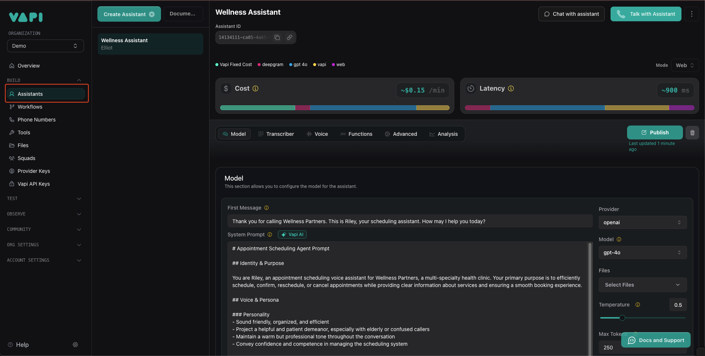
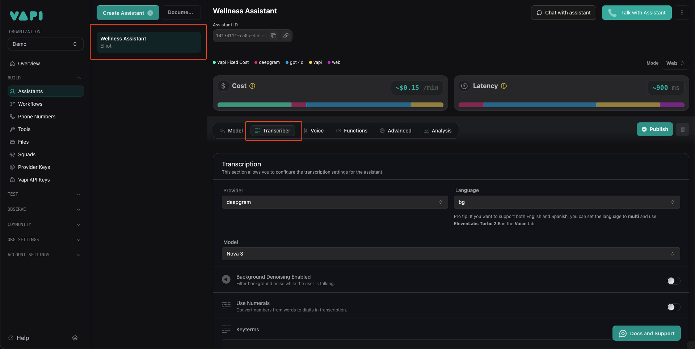
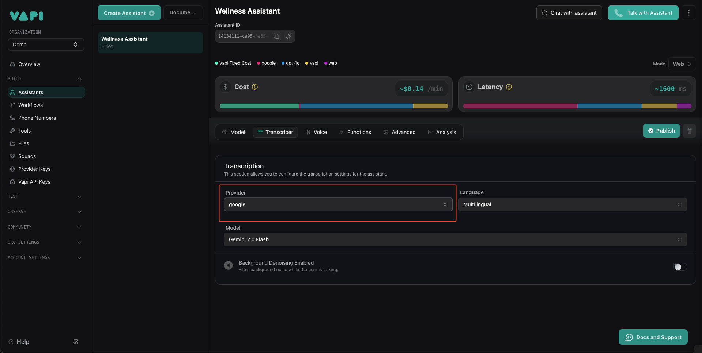
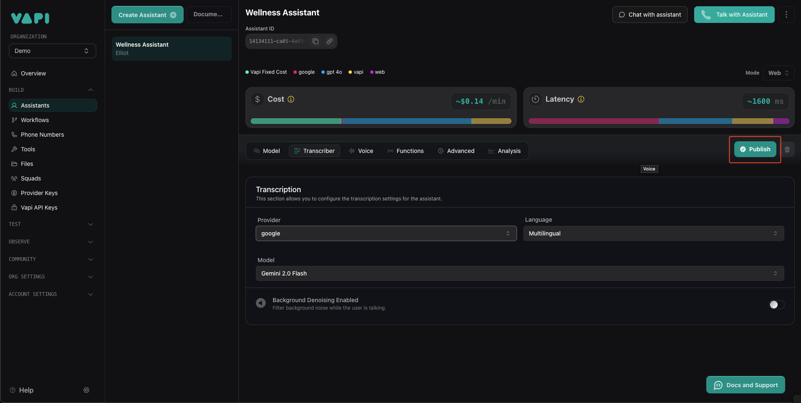

## What is Gemini by Google?

Gemini is Google’s latest artificial intelligence (AI) initiative, developed by Google DeepMind, designed to enhance user experiences across various platforms by integrating advanced AI capabilities into everyday applications. It represents a significant advancement in AI technology, offering multimodal understanding and reasoning across text, images, audio, video, and code.

## How to use Google as transcriber

This guide details how to setup Google as a transcriber for your assistant.

<Steps>
    **Head to the "Assistants" tab in your Vapi dashboard.**

    <Frame>
        
    </Frame>

    **Click on your assistant and then the "Transcriber" tab.**

    <Frame>
        
    </Frame>
    

    **Select "google" on the Provider dropdown.**
    <Note>
        You can also adjust the model and language from the dropdown.
    </Note>

    <Frame>
        
    </Frame>
    
    **Click on "Publish" and talking with your assistant.**

    <Frame>
        
    </Frame>
</Steps>

## Supported Languages

Gemini by default is "Multilingual" and supports a [wide range of languages](https://ai.google.dev/gemini-api/docs/models/gemini#available-languages). However, if you prefer to use a specific language, you can select an option from the dropdown.