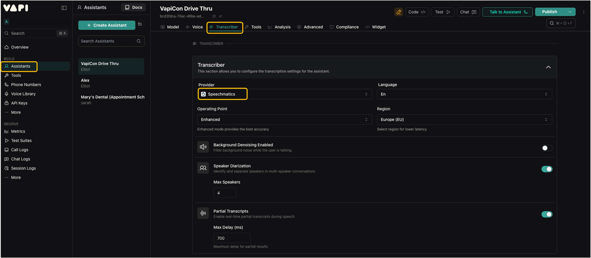

## What is Speechmatics?

Speechmatics is an enterprise-grade speech recognition platform delivering industry-leading accuracy and speed for Voice AI applications. Built on advanced self-supervised learning models, Speechmatics provides inclusive Automated Speech Recognition (ASR) that works seamlessly across diverse accents, dialects, and challenging acoustic environments — regardless of gender or demographic.

## Why Choose Speechmatics on Vapi?

### Unmatched Accuracy for Voice Agents
Speechmatics is the most accurate real-time speech-to-text engine, delivering final transcripts in under one second without compromising accuracy. This balance of speed and precision is critical for voice agents that need to respond naturally to users while keeping the conversation flow intact.

### Truly Global Language Coverage
With support for 55+ languages covering over half the world’s population, Speechmatics enables businesses to build voice experiences that work globally. Each language model supports all associated accents and dialects — whether Brazilian Portuguese or Canadian French — without requiring separate configurations.

### Speaker Diarization
Speechmatics is the only transcriber on Vapi to provide **speaker diarization** — the ability to identify who said what in multi-party conversations. Each word is labeled with a speaker label.  
> Note: This feature is rolling out and may not yet be fully functional.

### Custom Vocabulary
Boost accuracy for proper nouns, acronyms, technical jargon, or industry-specific terminology by providing a list of custom words. This ensures your voice agent correctly transcribes domain-specific language critical to your application.

## Getting Started

1. Go to the **Assistants** tab in the left-hand navigation pane.  
2. Create a new assistant, or select the voice assistant you’d like to configure.  
3. Open the **Transcriber** tab in the top navigation (or scroll down to the Transcriber module).  
4. In the **Provider** dropdown menu, select **Speechmatics**.  

You can also follow along with the [“How to Get Started” demo video](https://youtu.be/vhP0Xwp6z8A?si=sOupiFdNd49y5HNd).

<Frame>
    
</Frame>

## Best Practices

- **Operating Point** – Select the **Enhanced** model for the best accuracy in real-time voice agents.  
- **Region** – Choose the region closest to your users to optimize latency.  
- **Custom Vocabulary** – Use this feature to add key terms (e.g., product names) and leverage the *Sounds Like* option for tricky pronunciations.
