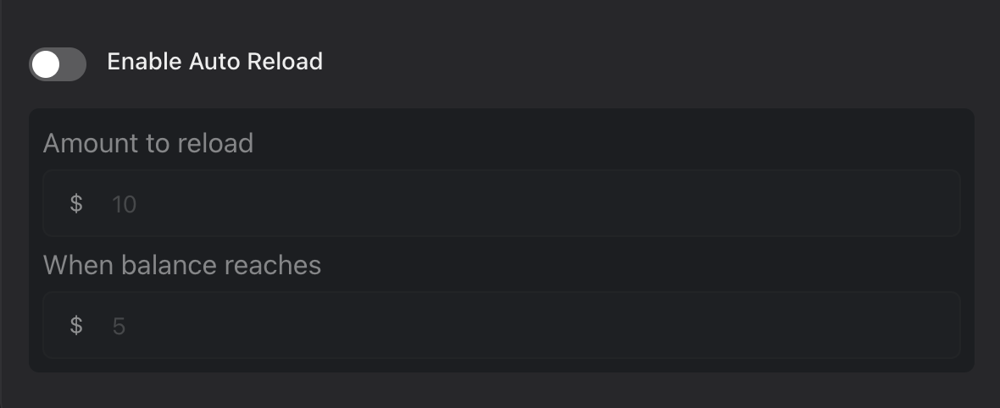
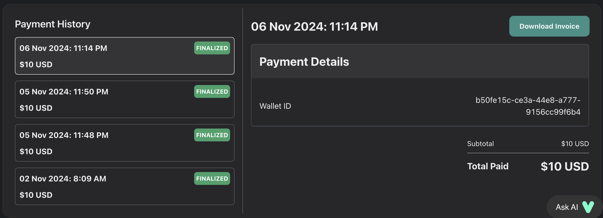
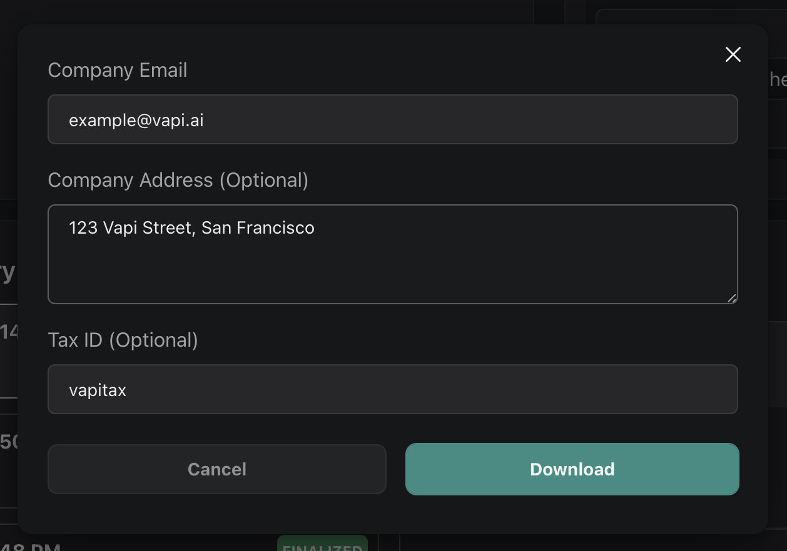
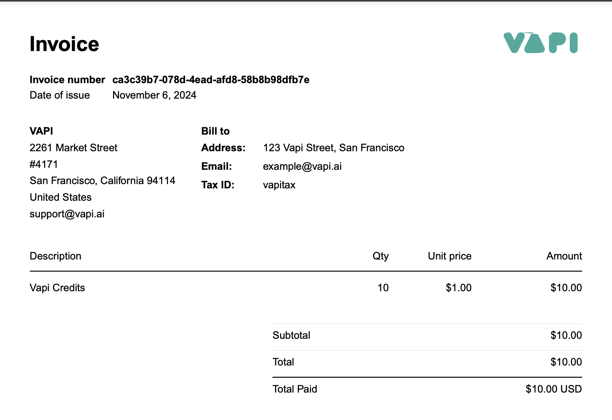

### Overview 
Vapi uses a credit-based billing system where credits serve as the platform's currency. Every billable action, including making calls and purchasing add-ons, requires credits. One credit equals one US dollar ($1 = 1 credit).

Each new trial account receives 10 complimentary credits in their wallet to help you get started. These credits can be used for making calls, but not purchasing add-ons.

To continue using Vapi after your trial credits are depleted, you'll need to:
1. Add your payment details
2. Purchase additional credits
3. Your wallet will then be upgraded to pay-as-you-go status.

<Warning>
  Your wallet will be marked as frozen while your credit balance is negative. Frozen wallets are unable to make calls or purchase add-ons. 
</Warning>

### What is auto-reload?

Auto-reload is a billing mechanism in which Vapi will automatically top up your credits when it hits a certain threshold. It can be enabled through the [billing page](https://dashboard.vapi.ai/org/billing) and we highly recommend enabling it to prevent billing-related operational issues.

<Note>
  Auto-reload amounts must be at least \$10. We recommend setting a threshold above \$0.
</Note>

<Frame caption="Enabling auto-reload through the Vapi dashboard.">
  
</Frame>

### What are add-ons?
Add-ons are platform enhancements that you may purchase. They are purchased through the [billing add-ons page](https://dashboard.vapi.ai/org/billing/add-ons). 

The following add-ons are currently available:
| Add-on | Price (credits / month) | Description |
|--------|-------------------------|-------------|
| Phone Numbers | 2 | Twilio phone numbers for your calls |
| Reserved Concurrency Lines | 10 | Guaranteed capacity for concurrent calls |
| HIPAA Compliance | 1,000 | HIPAA Compliance and a BAA agreement |
| Slack Support | 5,000 | Priority support via dedicated Slack channel |

Here's how the billing works:
- You'll be charged a prorated amount for the remainder of the current billing cycle when you first purchase an add-on
- Subsequently, you'll be billed the full amount at the start of each billing cycle (the 1st of each month)
- If you cancel an add-on, you'll receive a prorated refund for the unused portion of the billing cycle. 
- Add-ons can be cancelled at any time through the billing page

<Warning>
  If your wallet is frozen at the time of billing, all add-ons will be automatically cancelled. You'll need to repurchase them once your wallet is reactivated.
</Warning>

### How do I download invoices for my credit purchases?

You may download invoices within the [billing page](https://dashboard.vapi.ai/billing). 

Find the relevant credit purchase within the payment history table, and click on **Download Invoice**. You may then optionally choose to fill in extra details which will be reflected within the Invoice.

<Frame caption="Downloading an invoice.">
  
</Frame>

<Frame caption="Optional invoice details.">
  
</Frame>

<Frame caption="Sample invoice.">
  
</Frame>

