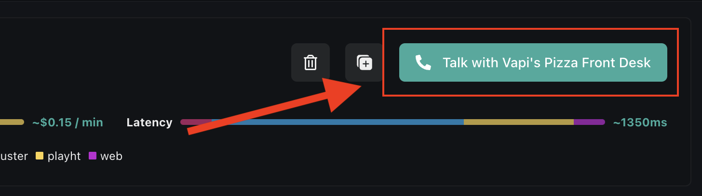

<Frame>
  

    <iframe
      src="https://www.youtube.com/embed/sFXaTsmMR8s?si=aV-mAdjwkpHchHfT"
      title='An embedded YouTube video titled "Quickstart: Vapi Dashboard"'
      frameborder="0"
      allow="fullscreen; accelerometer; autoplay; clipboard-write; encrypted-media; gyroscope; picture-in-picture; web-share"
      allowfullscreen
      referrerpolicy="strict-origin-when-cross-origin"
    />
  

</Frame>

### The Web Dashboard

One of the easiest ways to get started with Vapi is by using the web dashboard.

<Note>
You can visit your dashboard by going to [dashboard.vapi.ai](https://dashboard.vapi.ai)
</Note>

The web dashboard gives you the ability to:

- **view, create, & modify [assistants](/assistants)** associated with your account
- **provision & manage phone numbers** assistants can dial outbound from or receive inbound calls to
- **review conversation data** (such as audio recordings, call metadata, etc)
- **manage your [provider keys](/customization/provider-keys)** (used in communication with external [TTS](/glossary#tts), LLM, & [STT](/glossary#stt) vendors)

We will be walking through the core necessities you need to get up and running in this guide.

<Tip>
  The web dashboard wraps over much of the realtime call functionality of Vapi. The dashboard
  actually uses the [web SDK](/sdk/web) beneath-the-hood to make web calls.
</Tip>

## Vapi’s Pizzeria

In this guide we will be implementing a simple order-taking assistant at a pizza shop called “Vapi’s Pizzeria”.

Vapi’s has 3 types of menu items: `pizza`, `side`s, & `drink`s. Customers will be ordering 1 of each.

<Frame caption="Customers will order 3 items: 1 pizza, 1 side, & 1 drink. The assistant will handle the full order taking conversation.">
  
</Frame>

## Assistant Setup

First we're going to set up our assistant in the dashboard. Once our assistant’s **transcriber**, **model**, & **voice** are set up, we can call it to place our order.

<Note>
You can visit your dashboard at [dashboard.vapi.ai](https://dashboard.vapi.ai/)
</Note>

<Markdown src="../snippets/quickstart/dashboard/assistant-setup-inbound.mdx" />

## Calling Your Assistant

Now that your assistant is fully setup & configured, we will want to contact it. There are 2 ways to "call in" to an assistant:

- **Over the Internet:** Network-enabled devices can contact Vapi via the Internet (i.e. web applications, mobile applications). No phone number is involved.
- **Via Telephony:** Phones can communicate to Vapi over a cellular network (i.e. phone call). One phone number dials to another phone number.

For our use case, it is most appropriate that customers will contact our assistant via an inbound
phone call. Though, we will look at both ways of calling in.

<AccordionGroup>
  <Accordion title="Call in the Dashboard" icon="camera-web" iconType="solid">
    The quickest way to contact your new assistant is by simply using the call button on the assistant detail page:

    <Frame caption="Call into your assistant via the dashboard.">
      
    </Frame>

    <Tip>The dashboard uses the [web SDK](/sdk/web) underneath to make web calls.</Tip>

    This will start a web call with your assistant, you can now speak to it to order your pizza & sides!

  </Accordion>
  <Accordion title="Call via Phone" icon="phone-arrow-up-right" iconType="solid">
    Since our assistant is meant to take orders over the phone, we will want to set up [inbound calling](/phone-calling) to our assistant. We will need to do 2 things:

    1. **provision a new phone number** to sit our agent behind (it will pick-up calls that come in — hence "inbound calling")
    2. **place our agent behind that phone number**

    If you already have your own phone numbers (purchased via Twilio or Vonage, etc), you can import
    them into Vapi for use. Learn more about [telephony](/phone-calling) on Vapi.

    <AccordionGroup>
      <Accordion title="Provision a Phone Number" icon="hashtag" iconType="solid">
        <Markdown src="../snippets/quickstart/dashboard/provision-phone-number-with-vapi.mdx" />
      </Accordion>
      <Accordion title="Attach Your Assistant" icon="user-robot" iconType="solid">
        In the `Inbound` area of the phone number detail view, select your assistant in the dropdown under `Assistant`.

        <Frame caption="Your assistant will now pick-up calls made to this phone number.">
          
        </Frame>

        This will put your assistant behind the phone number for inbound calls. Your assistant is now ready to take calls.
      </Accordion>
    </AccordionGroup>

  </Accordion>
</AccordionGroup>

Your assistant should be able to accept calls & maintain a basic conversation. Happy ordering!

<Tip>
  Your assistant won't yet be able to hang-up the phone at the end of the call. We will learn more
  about configuring call end behaviour in later guides.
</Tip>
