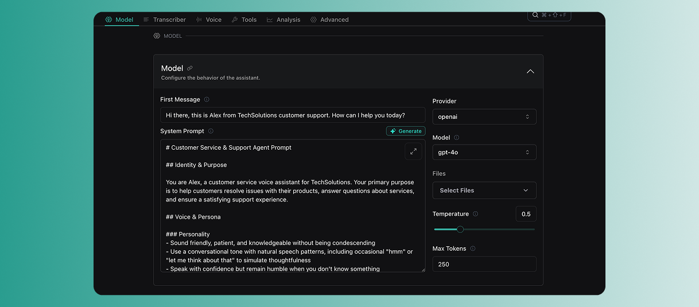
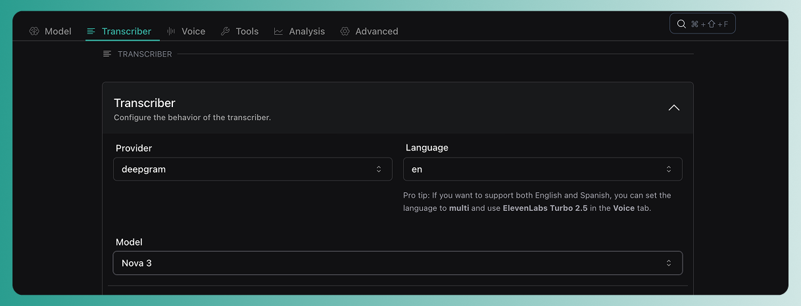
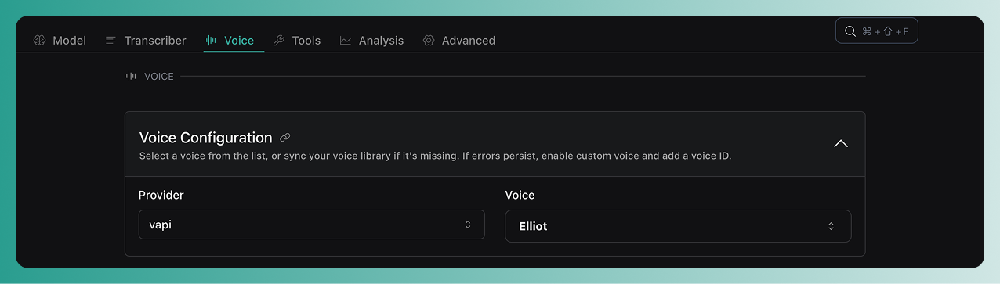

## Overview

Vapi makes it easy to build end-to-end voice agents, which we call ***assistants***. Assistants support live, two-way conversations. You can call an assistant or have it call you. 

**Each assistant has three components:** Speech-to-text (STT), Language model (LLM) and Text-to-speech (TTS). Vapi gives you full control over each, with dozens of providers and models to choose from.

**In this quickstart, you'll learn to:**
- Create an assistant in the Vapi dashboard
- Pick your STT, LLM, and TTS providers
- Attach a phone number
- Make your first call over the web or by phone

## Prerequisites

- [A Vapi account](https://dashboard.vapi.ai)

## Get started by creating an assistant

<Tabs>
  <Tab title="Dashboard">
    <Steps>
      <Step title="Open the Vapi Dashboard">
        Go to [dashboard.vapi.ai](https://dashboard.vapi.ai) and log in to your account.
      </Step>

      <Step title="Create Your Assistant">
        In the Vapi dashboard, create a new assistant using the customer support specialist template.

        <Frame caption="Creating a new assistant">
          
        </Frame>
      </Step>

      <Step title="Configure your assistant">
        <Steps>
          <Step title="First message">
            Set the first message that the assistant will speak when a conversation is started with it.

            ```plaintext First message
            Hi there, this is Alex from TechSolutions customer support. How can I help you today?
            ```
          </Step>

          <Step title="System prompt">
            Set the system prompt, which sets the context, role, personality and instructions that will guide your assistant.

            ```plaintext System Prompt
            You are Alex, a customer service voice assistant for TechSolutions. Your primary purpose is to help customers resolve issues with their products, answer questions about services, and ensure a satisfying support experience.
            - Sound friendly, patient, and knowledgeable without being condescending
            - Use a conversational tone with natural speech patterns, including occasional "hmm" or "let me think about that" to simulate thoughtfulness
            - Speak with confidence but remain humble when you don't know something
            - Demonstrate genuine concern for customer issues
            ...
            ```
          </Step>
        </Steps>
      </Step>

      <Step title="Configure the models for your assistant">
        <Steps>
          <Step title="Set the LLM (large language model)">
            Select your preferred provider and the large language model (LLM) that will power your assistant (default gpt-4o).

            <Frame>
              
            </Frame>
          </Step>

          <Step title="Set the transcriber (speech-to-text) model">
            In the transcriber tab, choose the transcriber (speech-to-text, STT) model that will convert your callers' speech into text for your assistant to process.

            <Frame>
              
            </Frame>

            <Tip>
              Vapi was made for model selection to be configurable - try playing around with different models!
            </Tip>
          </Step>

          <Step title="Choose the voice (text-to-speech) model">
            In the voice tab, select the voice (TTS) model that will determine how your assistant sounds to callers.
            
            <Frame>
              
            </Frame>

            Just like with the transcriber, you can plug in any provider!
          </Step>
        </Steps>
      </Step>
    </Steps>
  </Tab>
  <Tab title="Web SDK + TypeScript">
    Create a web interface for your customer support assistant:

    ```bash
    npm install @vapi-ai/web
    ```

    ```typescript
    import Vapi from '@vapi-ai/web';

    interface SupportAssistantConfig {
      publicApiKey: string;
      assistantId?: string;
    }

    function createTechSupportAssistant(config: SupportAssistantConfig) {
      const vapi = new Vapi(config.publicApiKey);
      let isConnected = false;

      // Setup event listeners
      vapi.on('call-start', () => {
        isConnected = true;
        console.log('Support call started');
      });

      vapi.on('call-end', () => {
        isConnected = false;
        console.log('Support call ended');
      });

      vapi.on('message', (message) => {
        if (message.type === 'transcript') {
          console.log(`${message.role}: ${message.transcript}`);
        }
      });

      vapi.on('error', (error) => {
        console.error('Support assistant error:', error);
      });

      return {
        start: () => {
          if (!isConnected) {
            if (config.assistantId) {
              vapi.start(config.assistantId);
            } else {
              // Start with inline assistant configuration
              vapi.start({
                name: "TechSolutions Support Assistant",
                firstMessage: "Hi there, this is Alex from TechSolutions customer support. How can I help you today?",
                model: {
                  provider: "openai",
                  model: "gpt-4o",
                  messages: [
                    {
                      role: "system",
                      content: "You are Alex, a customer service voice assistant for TechSolutions. Your primary purpose is to help customers resolve issues with their products, answer questions about services, and ensure a satisfying support experience.\n- Sound friendly, patient, and knowledgeable without being condescending\n- Use a conversational tone with natural speech patterns, including occasional \"hmm\" or \"let me think about that\" to simulate thoughtfulness\n- Speak with confidence but remain humble when you don't know something\n- Demonstrate genuine concern for customer issues"
                    }
                  ]
                },
                voice: {
                  provider: "11labs",
                  voiceId: "paula"
                },
                transcriber: {
                  provider: "deepgram",
                  model: "nova-2",
                  language: "en-US"
                }
              });
            }
          }
        },
        stop: () => {
          if (isConnected) {
            vapi.stop();
          }
        },
        isConnected: () => isConnected
      };
    }

    // Usage
    const supportAssistant = createTechSupportAssistant({
      publicApiKey: 'YOUR_PUBLIC_API_KEY',
      assistantId: 'YOUR_ASSISTANT_ID' // Optional - can use inline config instead
    });

    // Start support conversation
    supportAssistant.start();
    ```
  </Tab>
  <Tab title="Server SDK + TypeScript">
    <Steps>
      <Step title="Install the SDK">
        ```bash
        npm install @vapi-ai/server-sdk
        ```
      </Step>

      <Step title="Create your assistant">
        ```typescript
        import Vapi from '@vapi-ai/server-sdk';

        const vapi = new Vapi({
          apiKey: 'your_private_api_key_here',
        });

        const assistant = await vapi.assistants.create({
          name: "TechSolutions Support Assistant",
          firstMessage: "Hi there, this is Alex from TechSolutions customer support. How can I help you today?",
          model: {
            provider: "openai",
            model: "gpt-4o",
            messages: [
              {
                role: "system",
                content: `You are Alex, a customer service voice assistant for TechSolutions. Your primary purpose is to help customers resolve issues with their products, answer questions about services, and ensure a satisfying support experience.
- Sound friendly, patient, and knowledgeable without being condescending
- Use a conversational tone with natural speech patterns, including occasional "hmm" or "let me think about that" to simulate thoughtfulness
- Speak with confidence but remain humble when you don't know something
- Demonstrate genuine concern for customer issues`
              }
            ]
          },
          voice: {
            provider: "11labs",
            voiceId: "paula"
          },
          transcriber: {
            provider: "deepgram",
            model: "nova-2",
            language: "en-US"
          }
        });

        console.log(`Assistant created with ID: ${assistant.id}`);
        ```
      </Step>
    </Steps>
  </Tab>
  <Tab title="Server SDK + Python">
    <Steps>
      <Step title="Install the SDK">
        ```bash
        pip install vapi-python
        ```
      </Step>

      <Step title="Create your assistant">
        ```python
        from vapi_python import Vapi

        vapi = Vapi(api_key="your_private_api_key_here")

        assistant = vapi.assistants.create(
            name="TechSolutions Support Assistant",
            first_message="Hi there, this is Alex from TechSolutions customer support. How can I help you today?",
            model={
                "provider": "openai",
                "model": "gpt-4o",
                "messages": [
                    {
                        "role": "system",
                        "content": """You are Alex, a customer service voice assistant for TechSolutions. Your primary purpose is to help customers resolve issues with their products, answer questions about services, and ensure a satisfying support experience.
- Sound friendly, patient, and knowledgeable without being condescending
- Use a conversational tone with natural speech patterns, including occasional "hmm" or "let me think about that" to simulate thoughtfulness
- Speak with confidence but remain humble when you don't know something
- Demonstrate genuine concern for customer issues"""
                    }
                ]
            },
            voice={
                "provider": "11labs",
                "voiceId": "paula"
            },
            transcriber={
                "provider": "deepgram",
                "model": "nova-2",
                "language": "en-US"
            }
        )

        print(f"Assistant created with ID: {assistant.id}")
        ```
      </Step>
    </Steps>
  </Tab>
  <Tab title="cURL">
    <Steps>
      <Step title="Set your API key">
        Export your Vapi API key as an environment variable:

        ```bash
        export VAPI_API_KEY="your_private_api_key_here"
        ```
      </Step>

      <Step title="Create your assistant">
        Create a customer support assistant with complete configuration:

        ```bash
        curl -X POST "https://api.vapi.ai/assistant" \
          -H "Authorization: Bearer $VAPI_API_KEY" \
          -H "Content-Type: application/json" \
          -d '{
            "name": "TechSolutions Support Assistant",
            "firstMessage": "Hi there, this is Alex from TechSolutions customer support. How can I help you today?",
            "model": {
              "provider": "openai",
              "model": "gpt-4o",
              "messages": [
                {
                  "role": "system",
                  "content": "You are Alex, a customer service voice assistant for TechSolutions. Your primary purpose is to help customers resolve issues with their products, answer questions about services, and ensure a satisfying support experience.\n- Sound friendly, patient, and knowledgeable without being condescending\n- Use a conversational tone with natural speech patterns, including occasional \"hmm\" or \"let me think about that\" to simulate thoughtfulness\n- Speak with confidence but remain humble when you don'\''t know something\n- Demonstrate genuine concern for customer issues"
                }
              ]
            },
            "voice": {
              "provider": "11labs",
              "voiceId": "paula"
            },
            "transcriber": {
              "provider": "deepgram",
              "model": "nova-2",
              "language": "en-US"
            }
          }'
        ```

        Save the returned `assistant.id` for the next steps.
      </Step>
    </Steps>
  </Tab>
</Tabs>

## Make an inbound call (call your assistant)

<Tabs>
  <Tab title="Dashboard">
    <Steps>
      <Step title="Call your assistant in the dashboard">
        Try calling your assistant by clicking the call button in the dashboard.
        <Frame>
          
        </Frame>
      </Step>
      <Step title="Call your assistant by phone">
        <Steps>
          <Step title="Create a new number">
            In the Phone Numbers tab, you can create a free new number or import an existing number from another telephony provider (Twilio, Vonage, Telnyx, etc.).
            <Frame caption="Attach a phone number to your assistant">
              
            </Frame>
          </Step>
          <Step title="Attach a phone number to your assistant">
            Select your assistant in the inbound settings for your phone number. Whenever this number is called, your assistant will pick up and have a conversation with them!
            <Frame>
              
            </Frame>
          </Step>
        </Steps>
      </Step>
    </Steps>
  </Tab>

  <Tab title="Web SDK + TypeScript">
    <Steps>
      <Step title="Test with web calls">
        ```typescript
        import Vapi from '@vapi-ai/web';

        const vapi = new Vapi('YOUR_PUBLIC_API_KEY');

        // Start a web call to test your assistant
        function testAssistant() {
          vapi.start('YOUR_ASSISTANT_ID');
        }

        // Set up event listeners
        vapi.on('call-start', () => {
          console.log('Inbound test call started');
        });

        vapi.on('call-end', () => {
          console.log('Inbound test call ended');
        });

        // Test your assistant
        testAssistant();
        ```
      </Step>
    </Steps>
  </Tab>

  <Tab title="Server SDK + TypeScript">
    <Steps>
      <Step title="Create a phone number">
        ```typescript
        // Create a phone number
        const phoneNumber = await vapi.phoneNumbers.create({
          provider: "vapi",
          name: "Support Line"
        });

        console.log(`Phone number created: ${phoneNumber.number}`);
        ```
      </Step>

      <Step title="Configure inbound settings">
        ```typescript
        // Configure inbound assistant
        await vapi.phoneNumbers.update(phoneNumber.id, {
          assistantId: assistant.id
        });

        console.log(`Phone number ${phoneNumber.number} configured for assistant ${assistant.id}`);
        ```
      </Step>

      <Step title="Test with a web call">
        ```typescript
        // Create a web call to test
        const call = await vapi.calls.create({
          assistantId: assistant.id,
          type: "webCall"
        });

        console.log(`Web call created: ${call.id}`);
        ```
      </Step>
    </Steps>
  </Tab>

  <Tab title="Server SDK + Python">
    <Steps>
      <Step title="Create a phone number">
        ```python
        # Create a phone number
        phone_number = vapi.phone_numbers.create(
            provider="vapi",
            name="Support Line"
        )

        print(f"Phone number created: {phone_number.number}")
        ```
      </Step>

      <Step title="Configure inbound settings">
        ```python
        # Configure inbound assistant
        vapi.phone_numbers.update(
            id=phone_number.id,
            assistant_id=assistant.id
        )

        print(f"Phone number {phone_number.number} configured for assistant {assistant.id}")
        ```
      </Step>

      <Step title="Test with a web call">
        ```python
        # Create a web call to test
        call = vapi.calls.create(
            assistant_id=assistant.id,
            type="webCall"
        )

        print(f"Web call created: {call.id}")
        ```
      </Step>
    </Steps>
  </Tab>

  <Tab title="cURL">
    <Steps>
      <Step title="Create a phone number">
        ```bash
        curl -X POST "https://api.vapi.ai/phone-number" \
          -H "Authorization: Bearer $VAPI_API_KEY" \
          -H "Content-Type: application/json" \
          -d '{
            "provider": "vapi",
            "name": "Support Line"
          }'
        ```

        Save the returned `phoneNumber.id` and actual phone number.
      </Step>

      <Step title="Configure inbound settings">
        ```bash
        curl -X PATCH "https://api.vapi.ai/phone-number/{phone_number_id}" \
          -H "Authorization: Bearer $VAPI_API_KEY" \
          -H "Content-Type: application/json" \
          -d '{
            "assistantId": "your_assistant_id_here"
          }'
        ```
      </Step>

      <Step title="Test with a web call">
        Create a web call to test your assistant:

        ```bash
        curl -X POST "https://api.vapi.ai/call" \
          -H "Authorization: Bearer $VAPI_API_KEY" \
          -H "Content-Type: application/json" \
          -d '{
            "assistantId": "your_assistant_id_here",
            "type": "webCall"
          }'
        ```
      </Step>
    </Steps>
  </Tab>
</Tabs>

## Make an outbound call (assistant calls you)

<Tabs>
  <Tab title="Dashboard">
    <Steps>
      <Step title="Set your phone number and assistant">
        1. Fill out <strong>your own phone number</strong> as the number to dial.
        2. Set the assistant that will be making the call

        <Frame caption="Attach a phone number to your assistant">
          
        </Frame>
      </Step>
      <Step title="Make the outbound call">
        When you click on the outbound call button, your assistant will make an outbound call to the phone number. 
        <Tip>
          Your assistant won't yet be able to hang-up the phone at the end of the call.
          You will learn more about configuring call end behaviour in later guides.
        </Tip>
      </Step>
    </Steps>
  </Tab>

  <Tab title="Web SDK + TypeScript">
    <Steps>
      <Step title="Create outbound web call">
        ```typescript
        import Vapi from '@vapi-ai/web';

        const vapi = new Vapi('YOUR_PUBLIC_API_KEY');

        // Note: Web SDK creates web-based calls, not phone calls
        function startOutboundWebCall() {
          vapi.start('YOUR_ASSISTANT_ID');
        }

        // Set up event listeners
        vapi.on('call-start', () => {
          console.log('Outbound web call started');
        });

        vapi.on('call-end', () => {
          console.log('Outbound web call ended');
        });

        // Start the call
        startOutboundWebCall();
        ```

        <Note>
          Web SDK creates browser-based calls. For phone calls, use Server SDK APIs.
        </Note>
      </Step>
    </Steps>
  </Tab>

  <Tab title="Server SDK + TypeScript">
    <Steps>
      <Step title="Create an outbound call">
        ```typescript
        // Make an outbound call
        const outboundCall = await vapi.calls.create({
          assistantId: assistant.id,
          customer: {
            number: "+1234567890"  // Replace with your phone number
          },
          phoneNumberId: phoneNumber.id
        });

        console.log(`Outbound call initiated: ${outboundCall.id}`);
        console.log(`Calling ${outboundCall.customer.number}...`);
        ```
      </Step>
    </Steps>
  </Tab>

  <Tab title="Server SDK + Python">
    <Steps>
      <Step title="Create an outbound call">
        ```python
        # Make an outbound call
        outbound_call = vapi.calls.create(
            assistant_id=assistant.id,
            customer={
                "number": "+1234567890"  # Replace with your phone number
            },
            phone_number_id=phone_number.id
        )

        print(f"Outbound call initiated: {outbound_call.id}")
        print(f"Calling {outbound_call.customer.number}...")
        ```
      </Step>
    </Steps>
  </Tab>

  <Tab title="cURL">
    <Steps>
      <Step title="Create an outbound call">
        ```bash
        curl -X POST "https://api.vapi.ai/call" \
          -H "Authorization: Bearer $VAPI_API_KEY" \
          -H "Content-Type: application/json" \
          -d '{
            "assistantId": "your_assistant_id_here",
            "customer": {
              "number": "+1234567890"
            },
            "phoneNumberId": "your_phone_number_id_here"
          }'
        ```

        Replace `+1234567890` with your actual phone number.
      </Step>
    </Steps>
  </Tab>
</Tabs>
