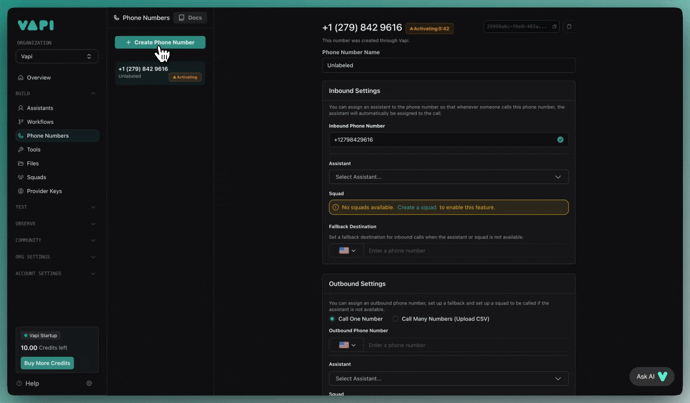
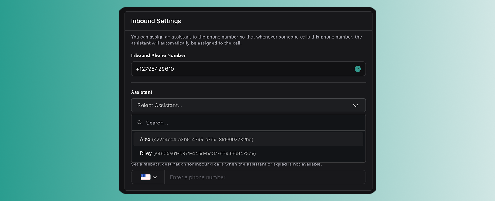
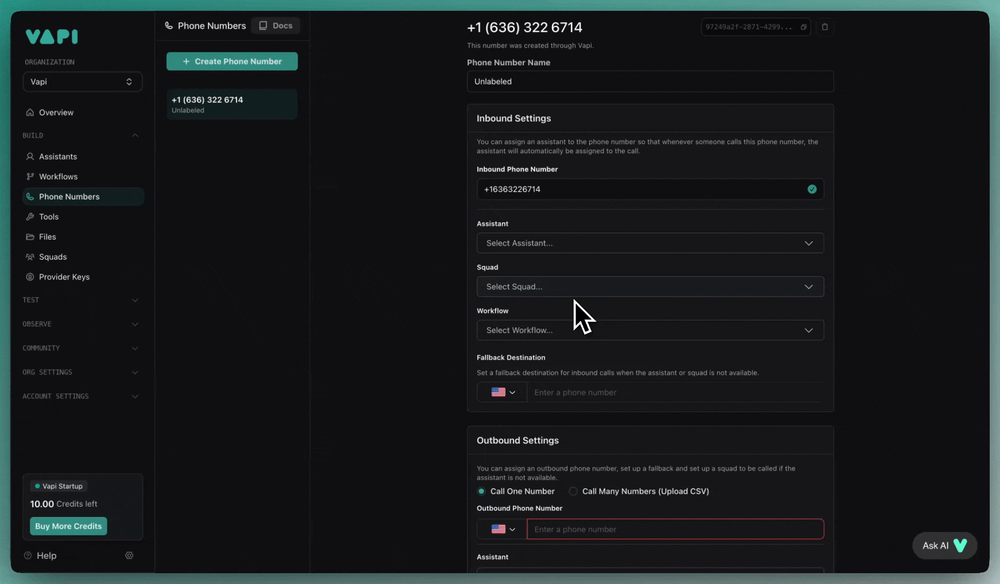
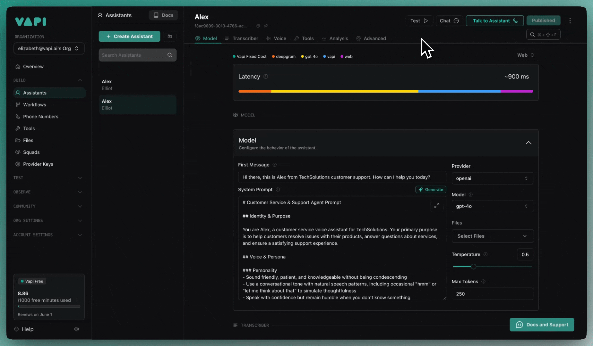

## Overview

Vapi makes it easy to build voice agents that can make and receive phone calls. In under 5 minutes, you'll create a voice assistant and start talking to it over the phone.

**In this quickstart, you'll learn to:**
- Create an assistant using the Dashboard or programmatically
- Set up a phone number  
- Make your first inbound and outbound calls

## Prerequisites

- [A Vapi account](https://dashboard.vapi.ai)
- For SDK usage: API key from the Dashboard

<Tip>
**Using the Vapi CLI?** You can create assistants, manage phone numbers, and make calls directly from your terminal:

```bash
# Install the CLI
curl -sSL https://vapi.ai/install.sh | bash

# Login and create an assistant
vapi login
vapi assistant create
```

[Learn more about the Vapi CLI →](/cli)
</Tip>

## Create your first voice assistant

<Tabs>
  <Tab title="Dashboard">
    <Steps>
      <Step title="Open the Vapi Dashboard">
        Go to [dashboard.vapi.ai](https://dashboard.vapi.ai) and log in to your account.
      </Step>

      <Step title="Create a new assistant">
        In the dashboard, create a new assistant using the customer support specialist template.

        <Frame caption="Creating a new assistant">
          
        </Frame>
      </Step>

      <Step title="Configure your assistant">
        Set the first message and system prompt for your assistant:

        **First message:**
        ```plaintext
        Hi there, this is Alex from TechSolutions customer support. How can I help you today?
        ```

        **System prompt:**
        ```plaintext
        You are Alex, a customer service voice assistant for TechSolutions. Your primary purpose is to help customers resolve issues with their products, answer questions about services, and ensure a satisfying support experience.
        - Sound friendly, patient, and knowledgeable without being condescending
        - Use a conversational tone with natural speech patterns
        - Speak with confidence but remain humble when you don't know something
        - Demonstrate genuine concern for customer issues
        ```
      </Step>
    </Steps>
  </Tab>

  <Tab title="TypeScript (Server SDK)">
    <Steps>
      <Step title="Install the SDK">
        <CodeBlocks>
        ```bash title="npm"
        npm install @vapi-ai/server-sdk
        ```

        ```bash title="yarn"
        yarn add @vapi-ai/server-sdk
        ```

        ```bash title="pnpm"
        pnpm add @vapi-ai/server-sdk
        ```

        ```bash title="bun"
        bun add @vapi-ai/server-sdk
        ```
        </CodeBlocks>
      </Step>

      <Step title="Create the assistant">
        ```typescript
        import { VapiClient } from '@vapi-ai/server-sdk';

        // Initialize the Vapi client
        const vapi = new VapiClient({
          token: 'your-api-key', // Replace with your actual API key
        });

        // Define the system prompt for customer support
        const systemPrompt = `You are Alex, a customer service voice assistant for TechSolutions. Your primary purpose is to help customers resolve issues with their products, answer questions about services, and ensure a satisfying support experience.
        - Sound friendly, patient, and knowledgeable without being condescending
        - Use a conversational tone with natural speech patterns
        - Speak with confidence but remain humble when you don'\''t know something
        - Demonstrate genuine concern for customer issues`;

        async function createSupportAssistant() {
          try {
            const assistant = await vapi.assistants.create({
              name: 'Customer Support Assistant',
              // Configure the AI model
              model: {
                provider: 'openai',
                model: 'gpt-4o',
                messages: [
                  {
                    role: 'system',
                    content: systemPrompt,
                  },
                ],
              },
              // Configure the voice
              voice: {
                provider: '11labs',
                voice_id: 'cgSgspJ2msm6clMCkdW9',
              },
              // Set the first message
              firstMessage: 'Hi there, this is Alex from TechSolutions customer support. How can I help you today?',
            });
            
            console.log('Assistant created:', assistant.id);
            return assistant;
          } catch (error) {
            console.error('Error creating assistant:', error);
            throw error;
          }
        }

        // Create the assistant
        createSupportAssistant();
        ```
      </Step>
    </Steps>
  </Tab>

  <Tab title="Python (Server SDK)">
    <Steps>
      <Step title="Install the SDK">
        ```bash
        pip install vapi_server_sdk
        ```
      </Step>

      <Step title="Create the assistant">
        ```python
        from vapi import Vapi

        # Initialize the Vapi client
        client = Vapi(token="your-api-key")  # Replace with your actual API key

        # Define the system prompt for customer support
        system_prompt = """You are Alex, a customer service voice assistant for TechSolutions. Your primary purpose is to help customers resolve issues with their products, answer questions about services, and ensure a satisfying support experience.
        - Sound friendly, patient, and knowledgeable without being condescending
        - Use a conversational tone with natural speech patterns
        - Speak with confidence but remain humble when you don't know something
        - Demonstrate genuine concern for customer issues"""

        def create_support_assistant():
            try:
                assistant = client.assistants.create(
                    name="Customer Support Assistant",
                    # Configure the AI model
                    model={
                        "provider": "openai",
                        "model": "gpt-4o",
                        "messages": [
                            {
                                "role": "system",
                                "content": system_prompt,
                            }
                        ],
                    },
                    # Configure the voice
                    voice={
                        "provider": "11labs",
                        "voice_id": "cgSgspJ2msm6clMCkdW9",
                    },
                    # Set the first message
                    first_message="Hi there, this is Alex from TechSolutions customer support. How can I help you today?",
                )
                
                print(f"Assistant created: {assistant.id}")
                return assistant
            except Exception as error:
                print(f"Error creating assistant: {error}")
                raise error

        # Create the assistant
        create_support_assistant()
        ```
      </Step>
    </Steps>
  </Tab>

  <Tab title="cURL">
    <Steps>
      <Step title="Create the assistant">
        ```bash
        curl -X POST "https://api.vapi.ai/assistant" \
          -H "Authorization: Bearer your-api-key" \
          -H "Content-Type: application/json" \
          -d '{
            "name": "Customer Support Assistant",
            "model": {
              "provider": "openai",
              "model": "gpt-4o",
              "messages": [
                {
                  "role": "system",
                  "content": "You are Alex, a customer service voice assistant for TechSolutions. Your primary purpose is to help customers resolve issues with their products, answer questions about services, and ensure a satisfying support experience.\n- Sound friendly, patient, and knowledgeable without being condescending\n- Use a conversational tone with natural speech patterns\n- Speak with confidence but remain humble when you don'\''t know something\n- Demonstrate genuine concern for customer issues"
                }
              ]
            },
            "voice": {
              "provider": "11labs",
              "voice_id": "cgSgspJ2msm6clMCkdW9"
            },
            "firstMessage": "Hi there, this is Alex from TechSolutions customer support. How can I help you today?"
          }'
        ```
      </Step>
    </Steps>
  </Tab>
</Tabs>

## Set up a phone number

<Tabs>
  <Tab title="Dashboard">
    <Steps>
      <Step title="Create a phone number">
        In the Phone Numbers tab, create a free US phone number or import an existing number from another provider.
        
        <Frame caption="Create a phone number">
          
        </Frame>
        
        <Warning>
          Free Vapi phone numbers are only available for US national use. For international calls, you'll need to import a number from Twilio or another provider.
        </Warning>
      </Step>

      <Step title="Attach your assistant to the number">
        Select your assistant in the inbound settings for your phone number. When this number is called, your assistant will automatically answer.
        
        <Frame>
          
        </Frame>
      </Step>
    </Steps>
  </Tab>

  <Tab title="TypeScript (Server SDK)">
    <Steps>
      <Step title="Purchase a phone number">
        ```typescript
        async function purchasePhoneNumber() {
          try {
            // Purchase a phone number
            const phoneNumber = await vapi.phoneNumbers.create({
              fallbackDestination: {
                type: 'number',
                number: '+1234567890', // Your fallback number
              },
            });
            
            console.log('Phone number created:', phoneNumber.number);
            return phoneNumber;
          } catch (error) {
            console.error('Error creating phone number:', error);
            throw error;
          }
        }
        ```
      </Step>

      <Step title="Configure inbound calls">
        ```typescript
        async function configureInboundCalls(phoneNumberId: string, assistantId: string) {
          try {
            // Update phone number with assistant configuration
            const updatedNumber = await vapi.phoneNumbers.update(phoneNumberId, {
              assistantId: assistantId,
            });
            
            console.log('Phone number configured for inbound calls');
            return updatedNumber;
          } catch (error) {
            console.error('Error configuring phone number:', error);
            throw error;
          }
        }
        ```
      </Step>
    </Steps>
  </Tab>

  <Tab title="Python (Server SDK)">
    <Steps>
      <Step title="Purchase a phone number">
        ```python
        def purchase_phone_number():
            try:
                # Purchase a phone number
                phone_number = client.phone_numbers.create(
                    fallback_destination={
                        "type": "number",
                        "number": "+1234567890",  # Your fallback number
                    }
                )
                
                print(f"Phone number created: {phone_number.number}")
                return phone_number
            except Exception as error:
                print(f"Error creating phone number: {error}")
                raise error
        ```
      </Step>

      <Step title="Configure inbound calls">
        ```python
        def configure_inbound_calls(phone_number_id: str, assistant_id: str):
            try:
                # Update phone number with assistant configuration
                updated_number = client.phone_numbers.update(
                    phone_number_id,
                    assistant_id=assistant_id,
                )
                
                print("Phone number configured for inbound calls")
                return updated_number
            except Exception as error:
                print(f"Error configuring phone number: {error}")
                raise error
        ```
      </Step>
    </Steps>
  </Tab>

  <Tab title="cURL">
    <Steps>
      <Step title="Purchase a phone number">
        ```bash
        curl -X POST "https://api.vapi.ai/phone-number" \
          -H "Authorization: Bearer your-api-key" \
          -H "Content-Type: application/json" \
          -d '{
            "fallbackDestination": {
              "type": "number",
              "number": "+1234567890"
            }
          }'
        ```
      </Step>

      <Step title="Configure inbound calls">
        ```bash
        curl -X PATCH "https://api.vapi.ai/phone-number/{phone-number-id}" \
          -H "Authorization: Bearer your-api-key" \
          -H "Content-Type: application/json" \
          -d '{
            "assistantId": "your-assistant-id"
          }'
        ```
      </Step>
    </Steps>
  </Tab>
</Tabs>

## Make your first calls

<Steps>
  <Step title="Test inbound calling">
    Call the phone number you just created. Your assistant will pick up and start the conversation with your configured first message.
  </Step>

  <Step title="Try outbound calling">
    **Using the Dashboard:**
    
    In the dashboard, go to the outbound calls section:
    1. Enter your own phone number as the target
    2. Select your assistant
    3. Click "Make Call"

    <Frame caption="Making an outbound call">
      
    </Frame>

    **Using the SDK:**

    <Tabs>
      <Tab title="TypeScript (Server SDK)">
        ```typescript
        async function makeOutboundCall(assistantId: string, phoneNumber: string) {
          try {
            const call = await vapi.calls.create({
              assistant: {
                assistantId: assistantId,
              },
              phoneNumberId: 'your-phone-number-id', // Your Vapi phone number ID
              customer: {
                number: phoneNumber, // Target phone number
              },
            });
            
            console.log('Outbound call initiated:', call.id);
            return call;
          } catch (error) {
            console.error('Error making outbound call:', error);
            throw error;
          }
        }

        // Make a call to your own number for testing
        makeOutboundCall('your-assistant-id', '+1234567890');
        ```
      </Tab>

      <Tab title="Python (Server SDK)">
        ```python
        def make_outbound_call(assistant_id: str, phone_number: str):
            try:
                call = client.calls.create(
                    assistant_id=assistant_id,
                    phone_number_id="your-phone-number-id",  # Your Vapi phone number ID
                    customer={
                        "number": phone_number,  # Target phone number
                    },
                )
                
                print(f"Outbound call initiated: {call.id}")
                return call
            except Exception as error:
                print(f"Error making outbound call: {error}")
                raise error

        # Make a call to your own number for testing
        make_outbound_call("your-assistant-id", "+1234567890")
        ```
      </Tab>

      <Tab title="cURL">
        ```bash
        curl -X POST "https://api.vapi.ai/call" \
          -H "Authorization: Bearer your-api-key" \
          -H "Content-Type: application/json" \
          -d '{
            "assistant": {
              "assistantId": "your-assistant-id"
            },
            "phoneNumberId": "your-phone-number-id",
            "customer": {
              "number": "+1234567890"
            }
          }'
        ```
      </Tab>
    </Tabs>

    Your assistant will call the specified number immediately.
  </Step>

  <Step title="Test web calling (optional)">
    You can also test your assistant directly in the dashboard by clicking the call button—no phone number required.
    
    <Frame>
      
    </Frame>
  </Step>
</Steps>

## Next steps

Now that you have a working voice assistant:

- **Customize the conversation:** Update the system prompt to match your use case
- **Add tools:** Connect your assistant to external APIs and databases  
- **Configure models:** Try different speech and language models for better performance
- **Scale with APIs:** Use Vapi's REST API to create assistants programmatically

<Tip>
Ready to integrate voice into your application? Check out the [Web integration guide](/quickstart/web-integration) to embed voice calls directly in your app.
</Tip> 
