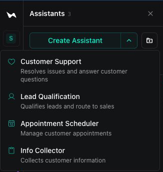
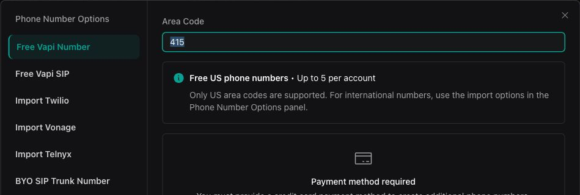

## Overview

Vapi makes it easy to build voice agents that can make and receive phone calls. In under 5 minutes, you'll create a voice assistant and start talking to it over the phone.

**In this quickstart, you'll learn to:**
- Create an assistant using the Dashboard or programmatically
- Set up a phone number  
- Make your first inbound and outbound calls

## Prerequisites

- [A Vapi account](https://dashboard.vapi.ai)
- For SDK usage: [Vapi API key](/security-and-privacy/api-keys) from the Dashboard

<Tip>
**Using the Vapi CLI?** You can create assistants, manage phone numbers, and make calls directly from your terminal:

```bash
# Install the CLI
curl -sSL https://vapi.ai/install.sh | bash

# Login and create an assistant
vapi login
vapi assistant create
```

[Learn more about the Vapi CLI →](/cli)
</Tip>

## Create your first voice assistant

<Tabs>
  <Tab title="Dashboard">
    <Steps>
      <Step title="Open Assistants">
        Open the [Dashboard](https://dashboard.vapi.ai) and select **Assistants**.
      </Step>

      <Step title="Create an assistant from a template">
        Select the down arrow next to **Create Assistant**, then choose **Customer Support**.

        <Frame caption="Choose the Customer Support assistant template">
          
        </Frame>
      </Step>

      <Step title="Configure your assistant">
        In the assistant editor, replace the content in **First Message** and **System Prompt** with the following examples.

        **First message:**
        ```plaintext
        Hi there, this is Alex from TechSolutions customer support. How can I help you today?
        ```

        **System prompt:**
        ```plaintext
        You are Alex, a customer service voice assistant for TechSolutions. Your primary purpose is to help customers resolve issues with their products, answer questions about services, and ensure a satisfying support experience.
        - Sound friendly, patient, and knowledgeable without being condescending
        - Use a conversational tone with natural speech patterns
        - Speak with confidence but remain humble when you don't know something
        - Demonstrate genuine concern for customer issues
        ```
      </Step>
    </Steps>
  </Tab>

  <Tab title="TypeScript (Server SDK)">
    <Steps>
      <Step title="Install the SDK">
        <CodeBlocks>
        ```bash title="npm"
        npm install @vapi-ai/server-sdk
        ```

        ```bash title="yarn"
        yarn add @vapi-ai/server-sdk
        ```

        ```bash title="pnpm"
        pnpm add @vapi-ai/server-sdk
        ```

        ```bash title="bun"
        bun add @vapi-ai/server-sdk
        ```
        </CodeBlocks>
      </Step>

      <Step title="Create the assistant">
        ```typescript
        import { VapiClient } from '@vapi-ai/server-sdk';

        const vapi = new VapiClient({ token: process.env.VAPI_API_KEY! });

        const assistant = await vapi.assistants.create({
          name: 'Customer Support Assistant',
          model: {
            provider: 'openai',
            model: 'gpt-4o',
            messages: [{ role: 'system', content: 'You are Alex, a customer service voice assistant for TechSolutions.' }]
          },
          voice: { provider: '11labs', voiceId: 'cgSgspJ2msm6clMCkdW9' },
          firstMessage: 'Hi there, this is Alex from TechSolutions customer support. How can I help you today?'
        });

        console.log(assistant.id);
        ```
      </Step>
    </Steps>
  </Tab>

  <Tab title="Python (Server SDK)">
    <Steps>
      <Step title="Install the SDK">
        ```bash
        pip install vapi_server_sdk
        ```
      </Step>

      <Step title="Create the assistant">
        ```python
        import os
        from vapi import Vapi

        client = Vapi(token=os.getenv("VAPI_API_KEY"))

        assistant = client.assistants.create(
            name="Customer Support Assistant",
            model={
                "provider": "openai",
                "model": "gpt-4o",
                "messages": [{"role": "system", "content": "You are Alex, a customer service voice assistant for TechSolutions."}],
            },
            voice={"provider": "11labs", "voiceId": "cgSgspJ2msm6clMCkdW9"},
            first_message="Hi there, this is Alex from TechSolutions customer support. How can I help you today?",
        )

        print(assistant.id)
        ```
      </Step>
    </Steps>
  </Tab>

  <Tab title="cURL">
    <Steps>
      <Step title="Create the assistant">
        ```bash
        curl -X POST "https://api.vapi.ai/assistant" \
          -H "Authorization: Bearer $VAPI_API_KEY" \
          -H "Content-Type: application/json" \
          -d '{
            "name": "Customer Support Assistant",
            "model": {
              "provider": "openai",
              "model": "gpt-4o",
              "messages": [{ "role": "system", "content": "You are Alex, a customer service voice assistant for TechSolutions." }]
            },
            "voice": { "provider": "11labs", "voiceId": "cgSgspJ2msm6clMCkdW9" },
            "firstMessage": "Hi there, this is Alex from TechSolutions customer support. How can I help you today?"
          }'
        ```
      </Step>
    </Steps>
  </Tab>
</Tabs>

## Set up a phone number

<Tabs>
  <Tab title="Dashboard">
    <Steps>
      <Step title="Open Phone Numbers">
        Open the [Dashboard](https://dashboard.vapi.ai) and select **Phone Numbers**.
      </Step>

      <Step title="Choose a phone number option">
        Select **Create Phone Number**, then choose **Free Vapi Number** or an option for importing a number from another provider.

        <Frame caption="Choose a phone number option">
          
        </Frame>
      </Step>

      <Step title="Create a free Vapi number">
        If you chose **Free Vapi Number**, enter a three-digit US area code in **Area Code**, then select **Create**.

        If **Payment method required** appears, add a payment method before you continue. You will not be charged for the free number.

        <Warning>
          Free Vapi phone numbers support US area codes only, with up to five free numbers per account. For international use, import a number from another provider.
        </Warning>
      </Step>

      <Step title="Configure inbound calls">
        Open the phone number. Under **Inbound Settings**, choose an **Assistant** or **Squad** to handle incoming calls, then select **Save**.
      </Step>
    </Steps>
  </Tab>

  <Tab title="TypeScript (Server SDK)">
    <Steps>
      <Step title="Create a phone number (API)">
        ```typescript
        const res = await fetch('https://api.vapi.ai/phone-number', {
          method: 'POST',
          headers: {
            Authorization: `Bearer ${process.env.VAPI_API_KEY}`,
            'Content-Type': 'application/json',
          },
          body: JSON.stringify({
            provider: 'vapi',
            assistantId: 'your-assistant-id',
            numberDesiredAreaCode: '415',
          }),
        });
        const phoneNumber = await res.json();
        console.log(phoneNumber.id);
        ```
      </Step>
    </Steps>
  </Tab>

  <Tab title="Python (Server SDK)">
    <Steps>
      <Step title="Create a phone number (API)">
        ```python
        import os, requests

        res = requests.post(
            "https://api.vapi.ai/phone-number",
            headers={
                "Authorization": f"Bearer {os.getenv('VAPI_API_KEY')}",
                "Content-Type": "application/json",
            },
            json={
                "provider": "vapi",
                "assistantId": "your-assistant-id",
                "numberDesiredAreaCode": "415",
            },
            timeout=30,
        )
        phone_number = res.json()
        print(phone_number["id"])
        ```
      </Step>
    </Steps>
  </Tab>

  <Tab title="cURL">
    <Steps>
      <Step title="Create a phone number (API)">
        ```bash
        curl -X POST "https://api.vapi.ai/phone-number" \
          -H "Authorization: Bearer $VAPI_API_KEY" \
          -H "Content-Type: application/json" \
          -d '{
            "provider": "vapi",
            "assistantId": "your-assistant-id",
            "numberDesiredAreaCode": "415"
          }'
        ```
      </Step>

      
    </Steps>
  </Tab>
</Tabs>

## Make your first calls

### Test inbound calling

Call the phone number you just created. Your assistant will pick up and start the conversation with your configured first message.

### Place an outbound call

<Tabs>
  <Tab title="Dashboard">
    <Steps>
      <Step title="Open the phone number">
        Open the [Dashboard](https://dashboard.vapi.ai), select **Phone Numbers**, and select the phone number that will place the call.
      </Step>

      <Step title="Open the test panel">
        Select **Test**.
      </Step>

      <Step title="Configure the outbound call">
        Choose **Single Number**, enter your phone number, and choose an **Assistant**. You can instead choose a **Squad** when your call requires one.
      </Step>

      <Step title="Place the call">
        Select **Call** to start the call immediately, or select **Schedule Call** to place it later.
      </Step>
    </Steps>

    <Frame caption="Making an outbound call">
      
    </Frame>
  </Tab>

  <Tab title="TypeScript (Server SDK)">
    ```typescript
    const call = await vapi.calls.create({
      assistant: { assistantId: 'your-assistant-id' },
      phoneNumberId: 'your-phone-number-id',
      customer: { number: '+1234567890' },
    });
    console.log(call.id);
    ```
  </Tab>

  <Tab title="Python (Server SDK)">
    ```python
    call = client.calls.create(
        assistant_id="your-assistant-id",
        phone_number_id="your-phone-number-id",
        customer={"number": "+1234567890"},
    )
    print(call.id)
    ```
  </Tab>

  <Tab title="cURL">
    ```bash
    curl -X POST "https://api.vapi.ai/call" \
      -H "Authorization: Bearer $VAPI_API_KEY" \
      -H "Content-Type: application/json" \
      -d '{
        "assistant": { "assistantId": "your-assistant-id" },
        "phoneNumberId": "your-phone-number-id",
        "customer": { "number": "+1234567890" }
      }'
    ```
  </Tab>
</Tabs>

Your assistant will call the specified number immediately.

### Test web calling (optional)

Open the [Dashboard](https://dashboard.vapi.ai), select **Assistants**, and select the assistant you want to test. Select **Talk** to start a web call without a phone number.

<Frame caption="Start a web call from an assistant">
  
</Frame>

## Next steps

Now that you have a working voice assistant:

- **Customize the conversation:** Update the system prompt to match your use case
- **Add tools:** Connect your assistant to external APIs and databases  
- **Configure models:** Try different speech and language models for better performance
- **Use a preset:** [Model Intelligence presets](/assistants/model-intelligence/presets) bundle a transcriber, model, and voice tuned for common use cases, so you can configure your assistant in one click.
- **Scale with APIs:** Use Vapi's REST API to create assistants programmatically

<Tip>
Ready to integrate voice into your application? Check out the [Web integration guide](/quickstart/web-integration) to embed voice calls directly in your app.
</Tip> 
