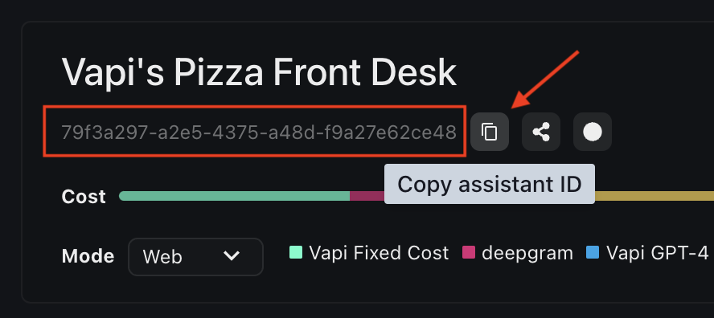

<Frame>
  <div class="video-embed-wrapper">
    <iframe
      src="https://www.youtube.com/embed/PUb-cseRNr4?si=NP-GO8tU46hibfuW"
      title='An embedded YouTube video titled "Quickstart: Web"'
      frameborder="0"
      allow="fullscreen; accelerometer; autoplay; clipboard-write; encrypted-media; gyroscope; picture-in-picture; web-share"
      allowfullscreen
      referrerpolicy="strict-origin-when-cross-origin"
    />
  </div>
</Frame>

Anywhere you can run client-side JavaScript, you can run Vapi. All the way from vanilla to complex component-based applications with React and Next.js.

<CardGroup cols={2}>
  <Card title="The Web SDK" icon="window" iconType="duotone" href="/sdk/web">
    Explore the full Vapi Web SDK.
  </Card>
  <Card
    title="Live React Demo"
    icon="arrow-up-right-from-square"
        color="#f25130"
    href="https://stackblitz.com/~/github.com/VapiAI/quickstart-react"
  >
    Follow along as you read.
  </Card>
</CardGroup>

## Installation

<Markdown src="../snippets/sdks/web/install-web-sdk.mdx" />

<Markdown src="../snippets/sdks/web/import-web-sdk.mdx" />

## Starting a Call

Assistants can either be created on the fly (temporary) or created & persisted to your account (persistent).

### Option 1: Temporary Assistant

If you want to customize properties from the frontend on the fly, you can create an assistant configuration object and pass it to the `.start()` method.

<AccordionGroup>
  <Accordion title="Assistant Configuration" icon="brackets-curly" iconType="solid">
    Here are the options we will pass to `.start()`:

    ```javascript
      const assistantOptions = {
        name: "Vapi’s Pizza Front Desk",
        firstMessage: "Vappy’s Pizzeria speaking, how can I help you?",
        transcriber: {
          provider: "deepgram",
          model: "nova-2",
          language: "en-US",
        },
        voice: {
          provider: "playht",
          voiceId: "jennifer",
        },
        model: {
          provider: "openai",
          model: "gpt-4",
          messages: [
            {
              role: "system",
              content: `You are a voice assistant for Vappy’s Pizzeria, a pizza shop located on the Internet.

      Your job is to take the order of customers calling in. The menu has only 3 types
      of items: pizza, sides, and drinks. There are no other types of items on the menu.

      1) There are 3 kinds of pizza: cheese pizza, pepperoni pizza, and vegetarian pizza
      (often called "veggie" pizza).
      2) There are 3 kinds of sides: french fries, garlic bread, and chicken wings.
      3) There are 2 kinds of drinks: soda, and water. (if a customer asks for a
      brand name like "coca cola", just let them know that we only offer "soda")

      Customers can only order 1 of each item. If a customer tries to order more
      than 1 item within each category, politely inform them that only 1 item per
      category may be ordered.

      Customers must order 1 item from at least 1 category to have a complete order.
      They can order just a pizza, or just a side, or just a drink.

      Be sure to introduce the menu items, don't assume that the caller knows what
      is on the menu (most appropriate at the start of the conversation).

      If the customer goes off-topic or off-track and talks about anything but the
      process of ordering, politely steer the conversation back to collecting their order.

      Once you have all the information you need pertaining to their order, you can
      end the conversation. You can say something like "Awesome, we'll have that ready
      for you in 10-20 minutes." to naturally let the customer know the order has been
      fully communicated.

      It is important that you collect the order in an efficient manner (succinct replies
      & direct questions). You only have 1 task here, and it is to collect the customers
      order, then end the conversation.

      - Be sure to be kind of funny and witty!
      - Keep all your responses short and simple. Use casual language, phrases like "Umm...", "Well...", and "I mean" are preferred.
      - This is a voice conversation, so keep your responses short, like in a real conversation. Don't ramble for too long.`,
            },
          ],
        },
      };
    ```
    Let's break down the configuration options we passed:

    - **name:** the display name for the assistant in our dashboard (for internal purposes only)
    - **firstMessage:** the first message that our assistant will say when it picks up the web call
    - **transcriber:** the transcriber is what turns user speech into processable text for our LLM. This is the first step in the end-to-end voice pipeline. We are using Deepgram for transcription, specifically, their `Nova 2` model. We also set the language to be transcribed as English.
    - **voice:** the final portion of the voice pipeline is turning LLM output-text into speech. This process is called "Text-to-speech" (or TTS for short). We use a voice provider called PlayHT, & a voice provided by them called `jennifer`.
    - **model:** for our LLM, we use `gpt-4` (from OpenAI) & set our system prompt for the assistant. The system prompt configures the context, role, personality, instructions and so on for the assistant. In our case, the system prompt above will give us the behaviour we want.

   </Accordion>
</AccordionGroup>

Now we can call `.start()`, passing the temporary assistant configuration:

```javascript
vapi.start(assistantOptions);
```

More configuration options can be found in the [Assistant](/api-reference/assistants/create-assistant) API reference.

### Option 2: Persistent Assistant

If you want to create an assistant that you can reuse across multiple calls, you can create a persistent assistant in the [Vapi Dashboard](https://dashboard.vapi.ai). Here's how you can do that:

<Markdown src="../snippets/quickstart/dashboard/assistant-setup-inbound.mdx" />

To customize additional fields, this can be done via the [Assistant](/api-reference/assistants/create-assistant) API instead.

Then, you can copy the assistant's ID at the top of the assistant detail page:

<Frame>
  
</Frame>

Now we can call `.start()`, passing the persistent assistant's ID:

```javascript
vapi.start("79f3XXXX-XXXX-XXXX-XXXX-XXXXXXXXce48");
```

If you need to override any assistant settings or set template variables, you can pass `assistantOverrides` as the second argument.

For example, if the first message is "Hello `{{name}}`", you can set `assistantOverrides` to replace `{{name}}` with `John`:

```javascript
const assistantOverrides = {
  transcriber: {
    provider: "deepgram",
    model: "nova-2",
    language: "en-US",
  },
  recordingEnabled: false,
  variableValues: {
    name: "John",
  },
};

vapi.start("79f3XXXX-XXXX-XXXX-XXXX-XXXXXXXXce48", assistantOverrides);
```
