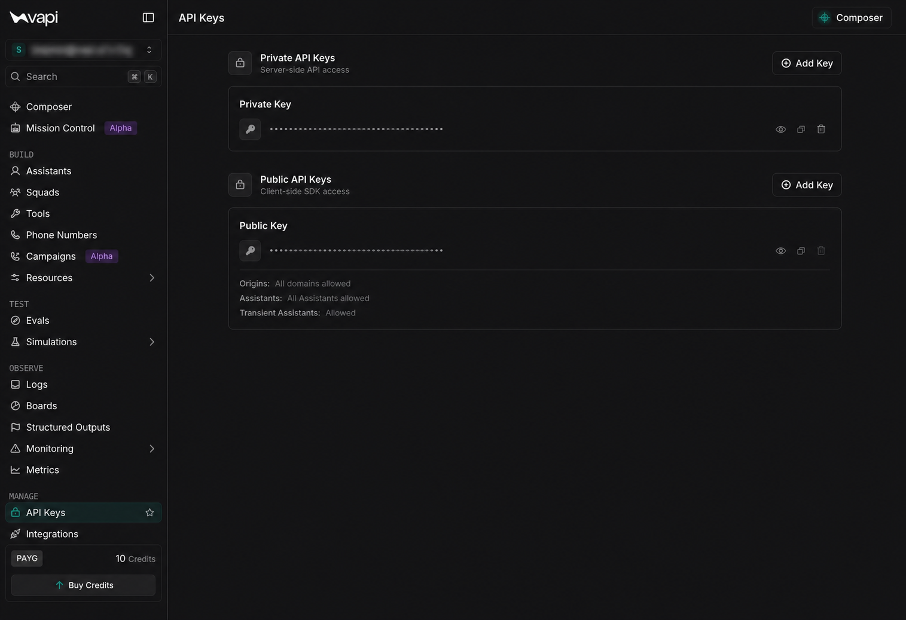
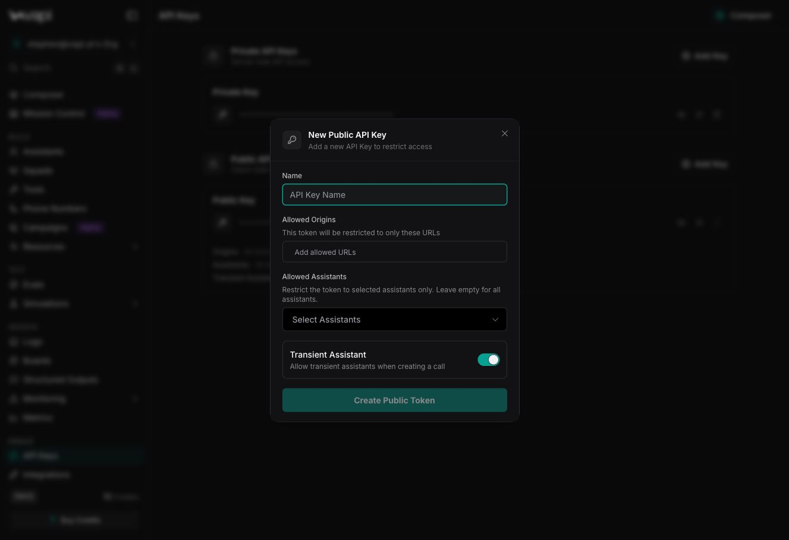
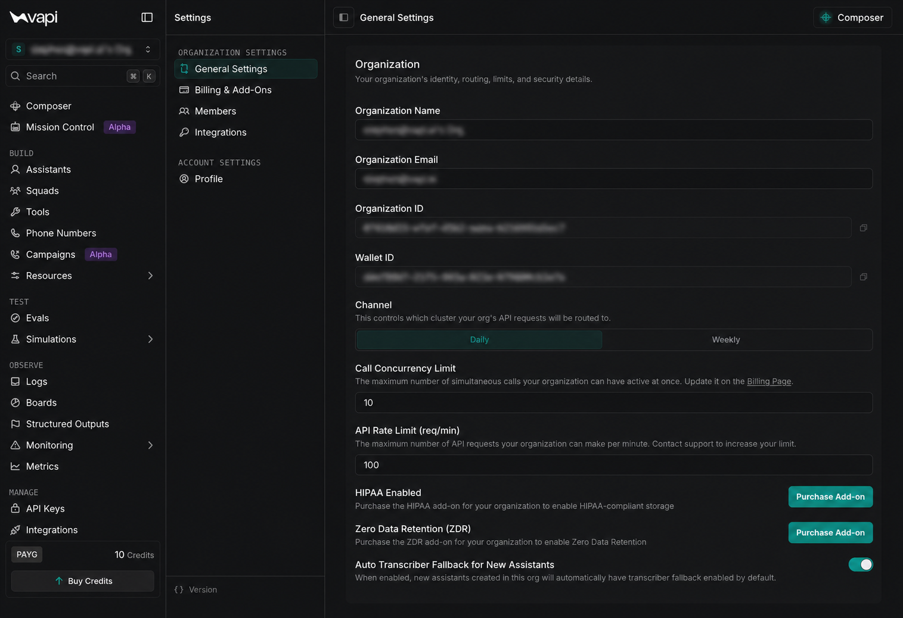

<Warning>
Never expose a private API key in browser or mobile app code, logs, screenshots, a source-code repository, or paste it in an agent chat. Store private keys in a server-side secret manager or environment variable.
</Warning>

A Vapi API key is a credential that authorizes an application to access your Vapi organization. Use a public API key for supported client-side integrations and a private API key for server-side requests.

This guide covers API keys issued by Vapi. To connect accounts from model, voice, transcriber, and telephony providers, see [Provider keys](/customization/provider-keys).

## How it works

Every API key belongs to one Vapi organization. Choose the key type based on where your application runs, then limit the key to the origins and assistants that need access.

| Key type | Use it for | Where to store it |
| --- | --- | --- |
| Public API key | Client-side Vapi SDKs and web integrations | Client-side application configuration |
| Private API key | Vapi REST API, server SDKs, and server-side integrations | Server-side secret manager or environment variable |

## Prerequisites

- A [Vapi account](https://dashboard.vapi.ai/)
- Access to **API Keys** for your Vapi organization

## Create an API key

<Steps>
  <Step title="Open API Keys">
    Open the [Dashboard](https://dashboard.vapi.ai/org/api-keys), then select **API Keys**.

    <Frame caption="Open API Keys to view and create private or public keys.">
      
    </Frame>
  </Step>

  <Step title="Choose a key type">
    Choose **Private API Keys** for server-side access or **Public API Keys** for client-side SDK access.
  </Step>

  <Step title="Start creating the key">
    In the section for your chosen key type, select **Add Key**.
  </Step>

  <Step title="Name the key">
    Enter a descriptive name in **Name**.
  </Step>

  <Step title="Restrict access">
    For a public key, enter the URLs that may use the key in **Allowed Origins**. In **Allowed Assistants**, select the assistants the key may access. Enable **Transient Assistant** only when the application needs to create calls with [transient assistants](/assistants/concepts/transient-vs-permanent-configurations).

    For example, add `https://app.example.com` for a production web application.

    <Frame caption="Configure the public key name and access restrictions.">
      
    </Frame>
  </Step>

  <Step title="Create and store the key">
    Select **Create Private Token** or **Create Public Token**. Select **Copy ID** next to the new key, then store the copied value in the appropriate location for that key type.
  </Step>
</Steps>

<Note>
Use separate keys for development, staging, and production. Give each key only the access its application needs.
</Note>

## View or copy a key

Open the [Dashboard](https://dashboard.vapi.ai/org/api-keys), then select **API Keys**. Find the key under **Private API Keys** or **Public API Keys**.

- Select the eye icon next to the masked key value to view the key.
- Select the copy icon next to the masked key value to copy the key.

## Use a public API key

Pass a public API key to the [Vapi Web SDK](/quickstart/web) to start a browser-based voice call with an assistant:

```typescript
import Vapi from "@vapi-ai/web";

const vapi = new Vapi("YOUR_PUBLIC_API_KEY");
vapi.start("YOUR_ASSISTANT_ID");
```

Replace `YOUR_PUBLIC_API_KEY` and `YOUR_ASSISTANT_ID` with values from your Vapi organization.

<Note>
Public API keys are visible in client-side code. Restrict them to the required origins and assistants. For short-lived or user-specific access, use [JWT authentication](/customization/jwt-authentication).
</Note>

## Test a private API key

Send a private API key in the `Authorization` header as a bearer token. This request only lists the assistants in your organization and does not modify them:

```bash
export VAPI_PRIVATE_API_KEY="YOUR_PRIVATE_API_KEY"

curl https://api.vapi.ai/assistant \
  -H "Authorization: Bearer $VAPI_PRIVATE_API_KEY"
```

Replace `YOUR_PRIVATE_API_KEY` with your private API key. Do not add the real value to a script or commit it to version control.

## Find your organization ID

Some integrations require your organization ID in addition to an API key.

<Steps>
  <Step title="Open General Settings">
    Open the [Dashboard](https://dashboard.vapi.ai/). Select your organization name in the upper-left corner, then select **Settings**.

    Under **Organization Settings**, select **General Settings**.

    <Frame caption="Select General Settings under Organization Settings.">
      
    </Frame>
  </Step>

  <Step title="Copy the organization ID">
    Locate **Organization ID**, then select **Copy to clipboard**.
  </Step>
</Steps>

## Verify it works

Run the list-assistants request with a private API key. A successful request returns a JSON list containing the assistant you created. A `401` response means the key is missing, invalid, or unavailable to the organization making the request.

Confirm that the new key also appears under **Private API Keys** or **Public API Keys** in the Dashboard.

## Related

<CardGroup cols={2}>
  <Card title="Web widget" icon="window" href="/chat/web-widget">
    Use a public API key in a client-side Vapi integration.
  </Card>
  <Card title="Server SDKs" icon="server" href="/server-sdks">
    Use a private API key with a Vapi server SDK.
  </Card>
  <Card title="Provider keys" icon="key" href="/customization/provider-keys">
    Connect credentials from supported third-party providers.
  </Card>
  <Card title="JWT authentication" icon="shield" href="/customization/jwt-authentication">
    Authenticate end users without exposing a private API key.
  </Card>
  <Card title="CLI authentication" icon="terminal" href="/cli/auth">
    Use OAuth to sign in when working interactively with the Vapi CLI.
  </Card>
  <Card title="Single Sign-On" icon="user-shield" href="/security-and-privacy/sso">
    Use SAML or OIDC to manage enterprise team access to the Dashboard.
  </Card>
</CardGroup>
