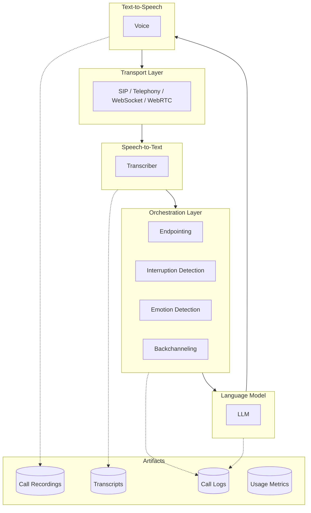
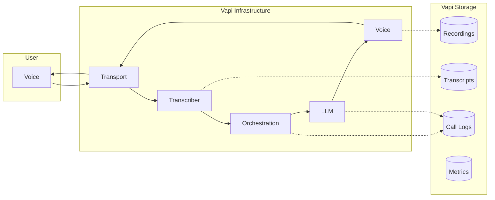
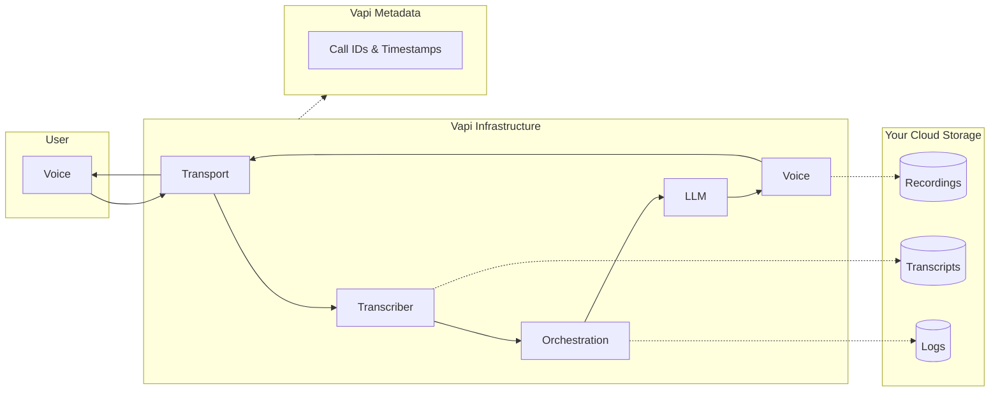
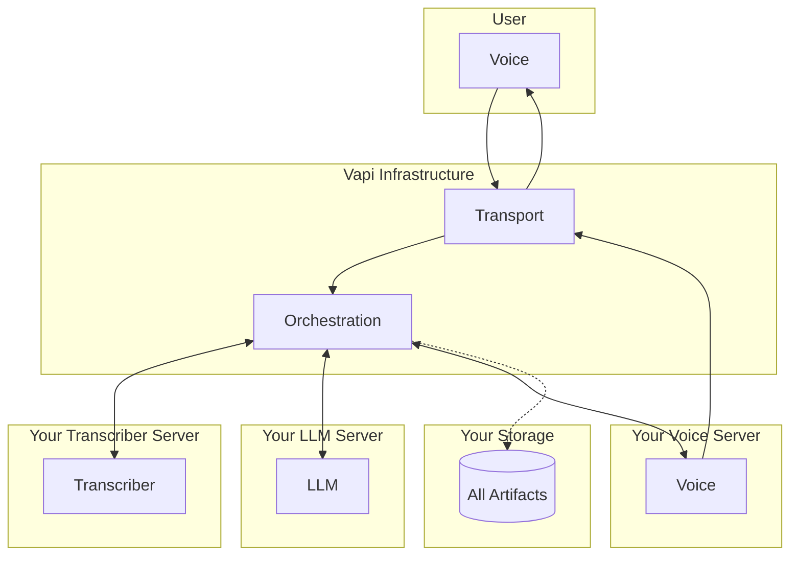

## Overview

When using Vapi, data flows through multiple components during a voice conversation. Understanding this flow is essential for security-conscious organizations, especially when integrating custom bucket storage or custom model providers.

**This guide explains:**
- The complete voice pipeline architecture
- What data passes through each component
- What data is stored on Vapi's infrastructure vs your own
- Which components support "bring your own" infrastructure

---

## Voice Pipeline Architecture

Vapi orchestrates a sophisticated voice pipeline with multiple modular components. Each component can be configured to use Vapi's default providers, your own API keys, or your own custom servers.

### Complete Pipeline Flow

---

## Pipeline Components

### 1. Transport Layer

The transport layer handles real-time audio streaming between users and Vapi.

| Transport Type | Description | Use Case |
|---------------|-------------|----------|
| **SIP** | Session Initiation Protocol | Traditional phone systems, PBX integration |
| **Telephony** | Twilio, Telnyx, Plivo integrations | PSTN calls, phone numbers |
| **WebSocket** | Direct bidirectional audio streaming | Web applications, custom integrations |
| **WebRTC** | Browser-based real-time communication | Web and mobile apps via LiveKit/Daily |

**Audio Formats:**
- PCM: 16-bit, 16kHz (highest quality)
- Mu-Law: 8-bit, 8kHz (telephony standard)

### 2. Speech-to-Text (Transcriber)

Converts user audio into text in real-time using streaming recognition.

<Note>
**Custom Transcriber:** Vapi supports custom transcriber integration via WebSocket. See [Custom Transcriber](/customization/custom-transcriber).
</Note>

**Bring Your Own API Key:**
- ✅ Supported: Deepgram, Gladia, AssemblyAI, Speechmatics, Google, Azure
- ❌ Not supported: Talkscriber

### 3. Orchestration Layer (Vapi Proprietary)

Vapi runs proprietary real-time models that make conversations feel natural. These models are **not customizable** and run on Vapi's infrastructure.

| Model | Purpose |
|-------|---------|
| **Endpointing** | Detects when user finishes speaking using audio-text fusion |
| **Interruption Detection** | Distinguishes barge-in from affirmations like "uh-huh" |
| **Background Noise Filtering** | Removes ambient sounds in real-time |
| **Background Voice Filtering** | Isolates primary speaker from TVs, echoes, others |
| **Backchanneling** | Adds natural affirmations ("uh-huh", "yeah", "got it") |
| **Emotion Detection** | Analyzes emotional tone and passes to LLM |
| **Filler Injection** | Adds natural speech patterns ("um", "like", "so") |

<Warning>
Orchestration models process data in real-time but do **not persist** the audio or intermediate results. All processing is **ephemeral**. Only final transcripts and logs are stored (unless HIPAA mode is enabled).
</Warning>

### 4. Language Model (LLM)

Generates conversational responses based on transcribed user input.

<Note>
**Custom LLM:** Vapi supports custom LLM integration via OpenAI-compatible endpoints. See [Custom LLM](/customization/custom-llm/using-your-server).
</Note>

**Bring Your Own API Key:**
- ✅ Supported: OpenAI, Anthropic, Azure OpenAI, Google Gemini, Groq, DeepSeek, OpenRouter, Together AI, Cerebras, DeepInfra, Perplexity, Anyscale, xAI

### 5. Text-to-Speech (Voice)

Converts LLM responses into spoken audio.

<Note>
**Custom Voice:** Vapi supports custom TTS integration via audio streaming endpoints. See [Custom TTS](/customization/custom-tts).
</Note>

**Bring Your Own API Key:**
- ✅ Supported: ElevenLabs, PlayHT, Cartesia, Deepgram, OpenAI TTS, Azure, LMNT, Rime AI, Smallest AI, Neuphonic, WellSaid, Hume

---

## Default Data Flow

In the default configuration, Vapi handles all pipeline components and stores artifacts on Vapi's infrastructure.

**Default storage on Vapi:**
- Call recordings (configurable retention)
- Full transcripts with timestamps
- Call logs with component-level detail
- Usage metrics and analytics
- Structured outputs from call analysis

---

## Custom Storage Data Flow

When you configure custom bucket storage, recordings and artifacts are uploaded to your infrastructure.

**Supported storage providers:**
- AWS S3
- GCP Cloud Storage
- Cloudflare R2
- Supabase Storage
- Azure Blob Storage

---

## Custom Models Data Flow

When using custom transcriber, LLM, or voice servers, data flows to your infrastructure for processing.

**With full custom configuration:**
- **Your servers process:** Audio transcription, LLM inference, speech synthesis
- **Vapi handles:** Orchestration (endpointing, interruptions, etc.), transport routing
- **Your storage receives:** Recordings, transcripts, logs

---

## Bring Your Own Infrastructure Summary

| Component | Bring Your Own API Key | Custom Server |
|-----------|----------------------|---------------|
| **Transport** | N/A | ✅ WebSocket/SIP |
| **Transcriber** | ✅ Most providers | ✅ [Custom Transcriber](/customization/custom-transcriber) |
| **Orchestration** | ❌ Vapi only | ❌ Vapi only |
| **LLM** | ✅ All providers | ✅ [Custom LLM](/customization/custom-llm/using-your-server) |
| **Voice** | ✅ All providers | ✅ [Custom TTS](/customization/custom-tts) |
| **Storage** | N/A | ✅ S3/GCP/R2/Azure |

<Note>
The **Orchestration Layer** (endpointing, interruption detection, emotion detection, backchanneling, filler injection) is Vapi's core value proposition and runs exclusively on Vapi infrastructure. Audio processed by these models is **ephemeral** and not stored.
</Note>

---

## Artifacts Storage Summary

| Artifact | Default Location | Custom Storage | HIPAA Mode |
|----------|-----------------|----------------|------------|
| **Call Recordings** | Vapi | Your bucket | Not stored |
| **Transcripts** | Vapi | Your bucket | Not stored |
| **Call Logs** | Vapi | Your bucket | Not stored |
| **Usage Metrics** | Vapi | Analytics API | Vapi only |
| **Structured Outputs** | Vapi | Webhook delivery | Configurable |

---

## What Data Passes Through Vapi

Even with maximum custom configuration, certain data passes through Vapi's orchestration:

| Data Type | Processing | Retention |
|-----------|-----------|-----------|
| Raw audio streams | Real-time routing to Transcriber/Voice | **Ephemeral** (not stored) |
| Transcribed text | Orchestration analysis, LLM routing | Logged (unless HIPAA) |
| LLM responses | Filler injection, Voice routing | Logged (unless HIPAA) |
| Emotion metadata | Passed to LLM context | **Ephemeral** |
| Call signaling | SIP/WebSocket management | Metadata only |

---

## Recommendations by Use Case

<AccordionGroup>
  <Accordion title="Maximum data control (enterprise/regulated)">
    Configure:
    - **Custom Transcriber** via WebSocket endpoint
    - **Custom LLM** via OpenAI-compatible server
    - **Custom Voice** via audio streaming endpoint
    - **Custom bucket storage** for all artifacts
    - **HIPAA mode** to prevent any Vapi storage
    
    Result: Only orchestration signals (ephemeral) pass through Vapi.
  </Accordion>
  
  <Accordion title="Data residency compliance">
    - Use **custom bucket storage** in your required region
    - Use **custom LLM** hosted in-region OR provider with regional endpoints
    - Use **custom Voice** hosted in-region if needed
    
    Note: Orchestration models run on Vapi's US/EU infrastructure (data is ephemeral).
  </Accordion>
  
  <Accordion title="Cost optimization with own API keys">
    - Enable **Provider Keys** for Transcriber, LLM, and Voice
    - Vapi uses your API keys, you're billed directly by providers
    - No custom server setup required
  </Accordion>
  
  <Accordion title="HIPAA compliance">
    - Enable `hipaaEnabled: true`
    - Use only HIPAA-compliant providers (Deepgram, Azure, OpenAI, Anthropic, ElevenLabs)
    - Optional: Custom storage for additional PHI control
    - See [HIPAA Compliance](/security-and-privacy/hipaa)
  </Accordion>
</AccordionGroup>

---

## Next Steps

### Custom Integration Guides
- [Custom Transcriber](/customization/custom-transcriber) - Bring your own speech-to-text
- [Custom LLM](/customization/custom-llm/using-your-server) - Bring your own language model
- [Custom TTS](/customization/custom-tts) - Bring your own voice synthesis

### Storage Configuration
- [AWS S3](/providers/cloud/s3) - S3 bucket setup
- [GCP Cloud Storage](/providers/cloud/gcp) - GCP bucket setup
- [Cloudflare R2](/providers/cloud/cloudflare) - R2 setup

### Compliance
- [HIPAA Compliance](/security-and-privacy/hipaa) - Healthcare data handling
- [PCI Compliance](/security-and-privacy/PCI) - Payment data handling
- [GDPR Compliance](/security-and-privacy/GDPR) - EU data protection
