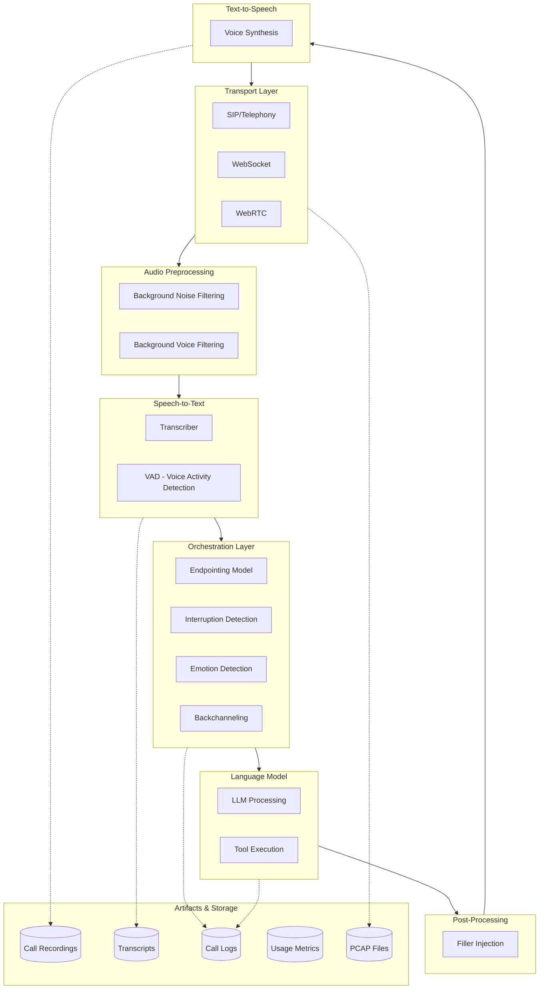
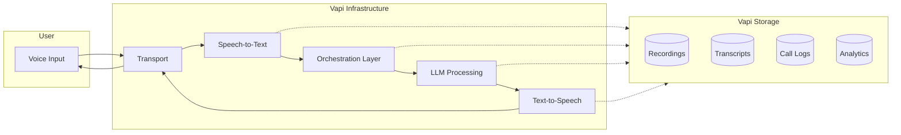
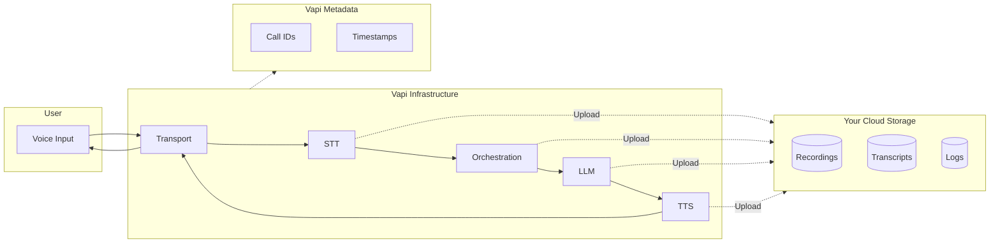
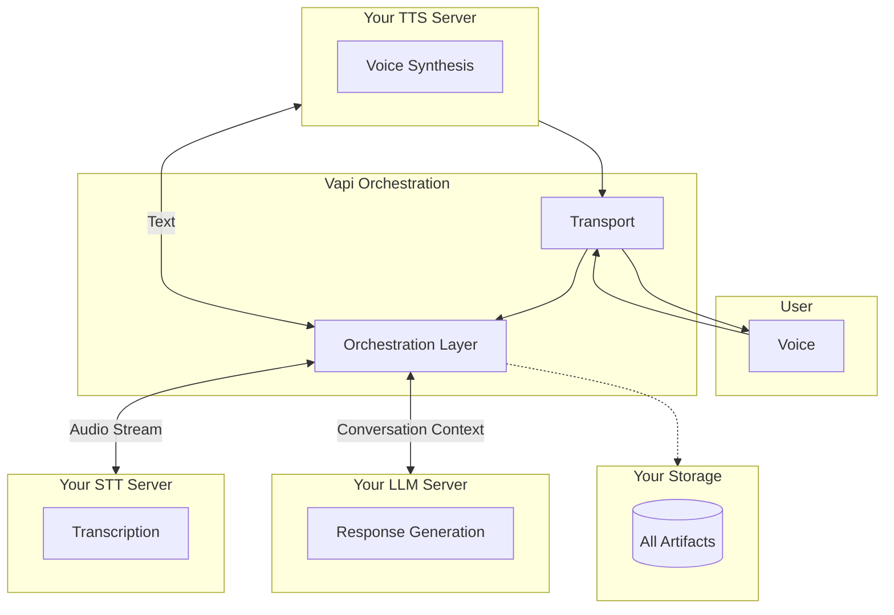

## Overview

When using Vapi, data flows through multiple components during a voice conversation. Understanding this flow is essential for security-conscious organizations, especially when integrating custom bucket storage or custom model providers.

**This guide explains:**
- The complete voice pipeline architecture
- What data passes through each component
- What data is stored on Vapi's infrastructure vs your own
- Which components support "bring your own" infrastructure

---

## Voice Pipeline Architecture

Vapi orchestrates a sophisticated voice pipeline with multiple modular components. Each component can be configured to use Vapi's default providers, your own API keys, or your own custom servers.

### Complete Pipeline Flow

---

## Pipeline Components Explained

### 1. Transport Layer

The transport layer handles real-time audio streaming between users and Vapi.

| Transport Type | Description | Use Case |
|---------------|-------------|----------|
| **SIP** | Session Initiation Protocol for telephony | Traditional phone systems, PBX integration |
| **Telephony** | Twilio, Telnyx, Plivo integrations | PSTN calls, phone numbers |
| **WebSocket** | Direct bidirectional audio streaming | Web applications, custom integrations |
| **WebRTC** | Browser-based real-time communication | Web and mobile apps via LiveKit/Daily |

**Audio Formats:**
- PCM: 16-bit, 16kHz (highest quality)
- Mu-Law: 8-bit, 8kHz (telephony standard)

### 2. Speech-to-Text (Transcriber)

Converts user audio into text in real-time using streaming recognition.

| Provider | Custom API Keys | Custom Server | HIPAA/PCI |
|----------|----------------|---------------|-----------|
| Deepgram | ✅ Yes | ✅ Yes | ✅ Yes |
| Google | ❌ No | ✅ Yes | ❌ Limited |
| Gladia | ❌ No | ✅ Yes | Verify |
| AssemblyAI | ❌ No | ✅ Yes | Verify |
| Azure | ❌ No | ✅ Yes | ✅ Yes |
| Speechmatics | ❌ No | ✅ Yes | Verify |
| Talkscriber | ❌ No | ✅ Yes | Verify |

<Note>
**Custom Transcriber:** You can bring your own STT server via WebSocket. Vapi streams audio to your endpoint and expects JSON transcription responses. See [Custom Transcriber](/customization/custom-transcriber).
</Note>

### 3. Orchestration Layer (Vapi Proprietary)

Vapi runs proprietary real-time models that make conversations feel natural. These models are **not customizable** and run on Vapi's infrastructure.

| Model | Purpose | Data Processed |
|-------|---------|---------------|
| **Endpointing** | Detects when user finishes speaking | Audio + transcript (ephemeral) |
| **Interruption Detection** | Distinguishes interruptions from affirmations | Audio patterns (ephemeral) |
| **Background Noise Filtering** | Removes ambient sounds | Raw audio (ephemeral) |
| **Background Voice Filtering** | Isolates primary speaker | Raw audio (ephemeral) |
| **Backchanneling** | Adds natural affirmations ("uh-huh", "yeah") | Audio + transcript (ephemeral) |
| **Emotion Detection** | Analyzes emotional tone | Audio features (ephemeral) |
| **Filler Injection** | Adds natural speech patterns | LLM output text (ephemeral) |

<Warning>
Orchestration models process data in real-time but do **not persist** the audio or intermediate results. Only final transcripts and logs are stored (unless HIPAA mode is enabled).
</Warning>

### 4. Language Model (LLM)

Generates conversational responses based on transcribed user input.

| Provider | Custom API Keys | Custom Server | HIPAA Compliant |
|----------|----------------|---------------|-----------------|
| OpenAI | ✅ Yes | ✅ Yes | ✅ Yes |
| Anthropic | ✅ Yes | ✅ Yes | ✅ Yes |
| Azure OpenAI | ✅ Yes | ✅ Yes | ✅ Yes |
| Google Gemini | ✅ Yes | ✅ Yes | Verify |
| Groq | ✅ Yes | ✅ Yes | Verify |
| OpenRouter | ✅ Yes | ✅ Yes | Varies |
| Together AI | ✅ Yes | ✅ Yes | Verify |

<Note>
**Custom LLM Server:** Implement an OpenAI-compatible `/chat/completions` endpoint. Vapi sends conversation history and expects SSE streaming responses. See [Bring Your Own Server](/customization/custom-llm/using-your-server).
</Note>

### 5. Text-to-Speech (Voice)

Converts LLM responses into spoken audio.

| Provider | Custom API Keys | Custom Server | Notes |
|----------|----------------|---------------|-------|
| ElevenLabs | ✅ Yes | ✅ Yes | 1000+ voices |
| PlayHT | ✅ Yes | ✅ Yes | 142+ languages |
| Cartesia | ✅ Yes | ✅ Yes | 40ms latency |
| Deepgram | ✅ Yes | ✅ Yes | Fast synthesis |
| OpenAI TTS | ✅ Yes | ✅ Yes | Built-in voices |
| Azure | ✅ Yes | ✅ Yes | Enterprise |
| LMNT | ✅ Yes | ✅ Yes | Low latency |
| Rime AI | ✅ Yes | ✅ Yes | High quality |

<Note>
**Custom TTS Server:** Implement an endpoint that accepts text and returns raw PCM audio (16-bit, mono, little-endian). See [Custom TTS Integration](/customization/custom-tts).
</Note>

---

## Default Data Flow

In the default configuration, Vapi handles all pipeline components and stores artifacts on Vapi's infrastructure.

**Default storage on Vapi:**
- Call recordings (14-30 day retention)
- Full transcripts with timing
- Call logs with component-level detail
- Usage metrics and analytics
- Structured outputs from call analysis

---

## Custom Storage Data Flow

When you configure custom bucket storage, recordings and logs are uploaded to your infrastructure.

**Supported storage providers:**
- AWS S3
- GCP Cloud Storage
- Cloudflare R2
- Supabase Storage

---

## Custom Models Data Flow

When using custom STT, LLM, or TTS servers, data flows to your infrastructure for processing.

**With full custom configuration:**
- **Your servers process:** Audio transcription, LLM inference, speech synthesis
- **Vapi handles:** Orchestration (endpointing, interruptions, etc.), transport
- **Your storage receives:** Recordings, transcripts, logs

---

## Bring Your Own Infrastructure Summary

| Component | Provider Keys | Custom Server | Vapi-Only |
|-----------|--------------|---------------|-----------|
| **Transport** | N/A | ✅ WebSocket/SIP | ❌ |
| **Speech-to-Text** | ✅ Deepgram only | ✅ Any via WebSocket | ❌ |
| **Orchestration Models** | ❌ | ❌ | ✅ Proprietary |
| **LLM** | ✅ All providers | ✅ OpenAI-compatible | ❌ |
| **Text-to-Speech** | ✅ All providers | ✅ PCM audio endpoint | ❌ |
| **Storage** | N/A | ✅ S3/GCP/R2 | ❌ |

<Note>
The **Orchestration Layer** (endpointing, interruption detection, emotion detection, backchanneling, filler injection) is Vapi's core value proposition and runs exclusively on Vapi infrastructure. Audio processed by these models is **ephemeral** and not stored.
</Note>

---

## Artifacts Storage Summary

| Artifact | Default Location | Custom Storage | HIPAA Mode |
|----------|-----------------|----------------|------------|
| **Call Recordings** | Vapi (14-30 days) | Your S3/GCP bucket | Not stored |
| **Transcripts** | Vapi | Your bucket | Not stored |
| **Call Logs** | Vapi (30 days) | S3 export available | Not stored |
| **PCAP Files** | Vapi | Your S3 bucket | Not stored |
| **Usage Metrics** | Vapi | Analytics API | Vapi only |
| **Structured Outputs** | Vapi | Webhook delivery | Configurable |

---

## What Data Passes Through Vapi

Even with maximum custom configuration, certain data passes through Vapi's orchestration:

| Data Type | Processing | Retention |
|-----------|-----------|-----------|
| Raw audio streams | Real-time STT/TTS routing | **Ephemeral** (not stored) |
| Transcribed text | Orchestration analysis, LLM routing | Logged (unless HIPAA) |
| LLM responses | Filler injection, TTS routing | Logged (unless HIPAA) |
| Emotion metadata | Passed to LLM context | **Ephemeral** |
| Call signaling | SIP/WebSocket management | Metadata only |

---

## Recommendations by Use Case

<AccordionGroup>
  <Accordion title="Maximum data control (enterprise/regulated)">
    Configure:
    - **Custom STT** via WebSocket endpoint
    - **Custom LLM** via OpenAI-compatible server
    - **Custom TTS** via PCM audio endpoint
    - **Custom bucket storage** for all artifacts
    - **HIPAA mode** to prevent any Vapi storage
    
    Result: Only orchestration signals (ephemeral) pass through Vapi.
  </Accordion>
  
  <Accordion title="Data residency compliance">
    - Use **custom bucket storage** in your required region
    - Use **custom LLM** hosted in-region OR provider with regional endpoints
    - Use **custom TTS** hosted in-region if needed
    
    Note: Orchestration models run on Vapi's US/EU infrastructure (data is ephemeral).
  </Accordion>
  
  <Accordion title="Cost optimization with own API keys">
    - Enable **Provider Keys** for STT (Deepgram), LLM, and TTS
    - Vapi uses your API keys, you're billed directly by providers
    - No custom server setup required
  </Accordion>
  
  <Accordion title="HIPAA compliance">
    - Enable `hipaaEnabled: true`
    - Use only HIPAA-compliant providers (Deepgram, Azure, OpenAI, Anthropic, ElevenLabs)
    - Optional: Custom storage for additional PHI control
    - See [HIPAA Compliance](/security-and-privacy/hipaa)
  </Accordion>
</AccordionGroup>

---

## Next Steps

### Custom Integration Guides
- [Custom Transcriber](/customization/custom-transcriber) - Bring your own STT
- [Custom LLM Server](/customization/custom-llm/using-your-server) - Bring your own LLM
- [Custom TTS Integration](/customization/custom-tts) - Bring your own voice

### Storage Configuration
- [AWS S3](/providers/cloud/s3) - S3 bucket setup
- [GCP Cloud Storage](/providers/cloud/gcp) - GCP bucket setup
- [Cloudflare R2](/providers/cloud/cloudflare) - R2 setup

### Compliance
- [HIPAA Compliance](/security-and-privacy/hipaa) - Healthcare data handling
- [PCI Compliance](/security-and-privacy/PCI) - Payment data handling
- [GDPR Compliance](/security-and-privacy/GDPR) - EU data protection
