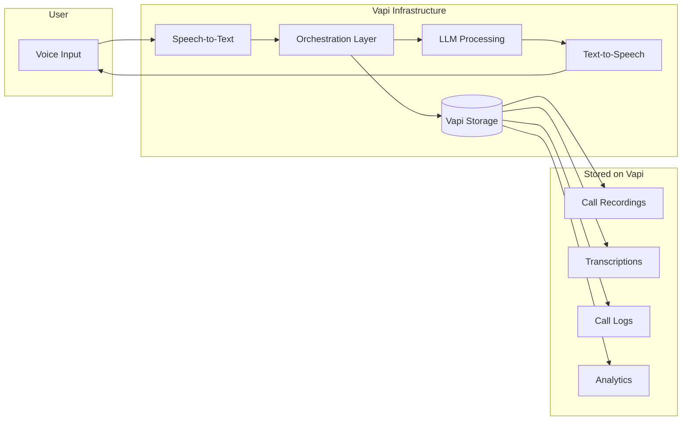
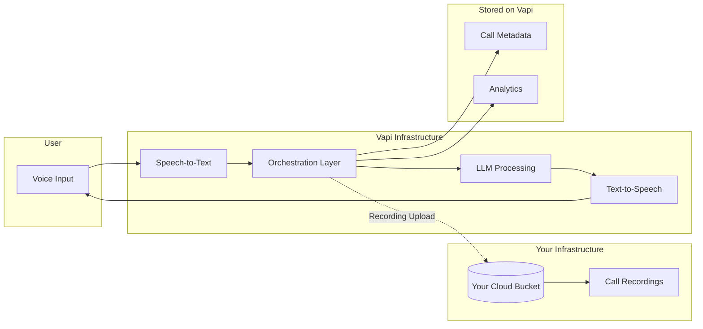
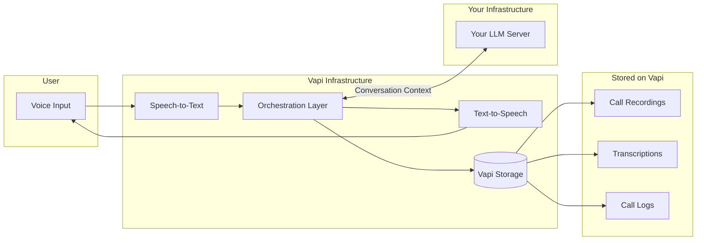
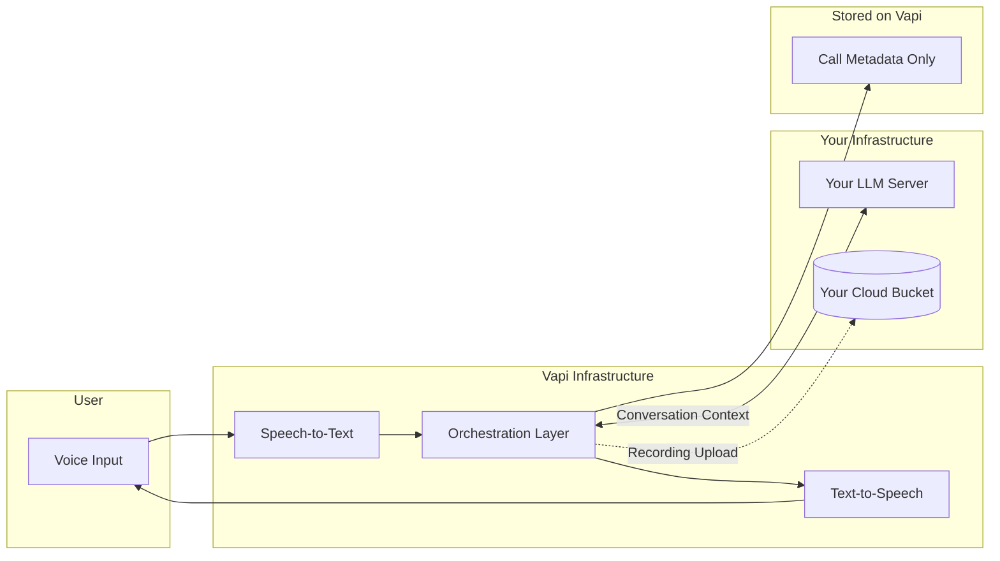

## Overview

When using Vapi, data flows through multiple components during a voice conversation. Understanding this flow is essential for security-conscious organizations, especially when integrating custom bucket storage or custom LLM providers.

**This guide explains:**
- What data passes through Vapi during calls
- What data is stored on Vapi's infrastructure vs your own
- How custom configurations change the data flow

## Default Data Flow

In the default configuration, Vapi handles all components of the voice pipeline and stores call artifacts on Vapi's infrastructure.

**In default mode, Vapi stores:**
- Call recordings (audio files)
- Transcriptions (full conversation text)
- Call logs and metadata
- Analytics and structured outputs

## Custom Bucket Storage Data Flow

When you configure custom bucket storage (AWS S3, GCP Cloud Storage, or Cloudflare R2), call recordings are uploaded directly to your storage instead of Vapi's infrastructure.

**With custom bucket storage:**
- **Your infrastructure stores:** Call recordings
- **Vapi stores:** Call metadata, analytics, transcriptions (unless HIPAA mode enabled)
- **Passes through Vapi:** Audio streams (not persisted after processing)

<Note>
Configure custom bucket storage in **Provider Credentials > Cloud Providers** in the Vapi Dashboard. See [AWS S3](/providers/cloud/s3), [GCP Cloud Storage](/providers/cloud/gcp), or [Cloudflare R2](/providers/cloud/cloudflare) for setup instructions.
</Note>

## Custom LLM Data Flow

When you bring your own LLM server, conversation context is sent to your infrastructure for processing instead of Vapi's default LLM providers.

**With custom LLM:**
- **Your infrastructure processes:** All LLM requests (prompts, conversation history, tool calls)
- **Vapi stores:** Call recordings, transcriptions, logs (unless HIPAA mode enabled)
- **Passes through Vapi:** Transcribed text sent to your LLM, LLM responses

<Note>
See [Bring Your Own Server](/customization/custom-llm/using-your-server) for custom LLM setup instructions.
</Note>

## Combined Configuration: Custom Storage + Custom LLM

For maximum data control, combine custom bucket storage with a custom LLM. This configuration minimizes data stored on Vapi's infrastructure.

**With both custom storage and custom LLM:**
- **Your infrastructure handles:** LLM processing, call recording storage
- **Vapi stores:** Minimal call metadata (call ID, timestamps, duration)
- **Passes through Vapi:** Audio streams, transcribed text (ephemeral)

## Data Storage Summary

The following table summarizes where data is stored based on your configuration:

| Data Type | Default | Custom Storage | Custom LLM | Custom Storage + LLM | HIPAA Mode |
|-----------|---------|----------------|------------|---------------------|------------|
| Call recordings | Vapi | **Your bucket** | Vapi | **Your bucket** | Not stored |
| Transcriptions | Vapi | Vapi | Vapi | Vapi | Not stored |
| LLM prompts/responses | Vapi's LLM provider | Vapi's LLM provider | **Your server** | **Your server** | Your server (compliant providers) |
| Call logs | Vapi | Vapi | Vapi | Vapi | Not stored |
| Call metadata | Vapi | Vapi | Vapi | Vapi | Vapi |
| Structured outputs | Vapi | Vapi | Vapi | Vapi | Not stored (unless explicitly enabled) |

<Note>
**HIPAA Mode** (`hipaaEnabled: true`) ensures no call logs, recordings, or transcriptions are stored on Vapi. See [HIPAA Compliance](/security-and-privacy/hipaa) for details.
</Note>

## What Data Passes Through Vapi

Even with custom configurations, certain data passes through Vapi's orchestration layer during calls:

| Data | Purpose | Retention |
|------|---------|-----------|
| Audio streams | Real-time processing by STT/TTS | Ephemeral (not stored) |
| Transcribed text | Sent to LLM for response generation | Stored in logs (unless HIPAA mode) |
| LLM responses | Converted to speech | Stored in logs (unless HIPAA mode) |
| Call signaling | SIP/WebRTC connection management | Metadata only |

## Recommendations by Use Case

<AccordionGroup>
  <Accordion title="I need to comply with data residency requirements">
    Use **custom bucket storage** with a bucket in your required region. This ensures call recordings stay within your geographic boundaries. For LLM processing, use a **custom LLM** hosted in the required region or use provider keys for an LLM with regional endpoints.
  </Accordion>
  
  <Accordion title="I want to minimize data stored on third-party infrastructure">
    Enable **custom bucket storage** + **custom LLM** + **HIPAA mode**. This configuration:
    - Routes recordings to your storage
    - Routes LLM processing to your server
    - Prevents Vapi from storing logs, transcriptions, or recordings
  </Accordion>
  
  <Accordion title="I need HIPAA compliance">
    Enable `hipaaEnabled: true` at the organization or assistant level. Use only [HIPAA-compliant providers](/security-and-privacy/hipaa#hipaa-compliant-providers) for STT, LLM, and TTS. Consider custom storage for additional control over PHI.
  </Accordion>
  
  <Accordion title="I want call recordings but with my own storage">
    Configure **custom bucket storage** only. Vapi will continue to handle transcription, LLM processing, and analytics while uploading recordings to your bucket.
  </Accordion>
</AccordionGroup>

## Next Steps

- **[AWS S3 Setup](/providers/cloud/s3)** - Configure S3 bucket storage
- **[GCP Cloud Storage Setup](/providers/cloud/gcp)** - Configure GCP bucket storage  
- **[Custom LLM Integration](/customization/custom-llm/using-your-server)** - Bring your own LLM server
- **[HIPAA Compliance](/security-and-privacy/hipaa)** - Enable HIPAA mode for healthcare use cases
- **[Provider Keys](/customization/provider-keys)** - Use your own API keys with Vapi's default providers
