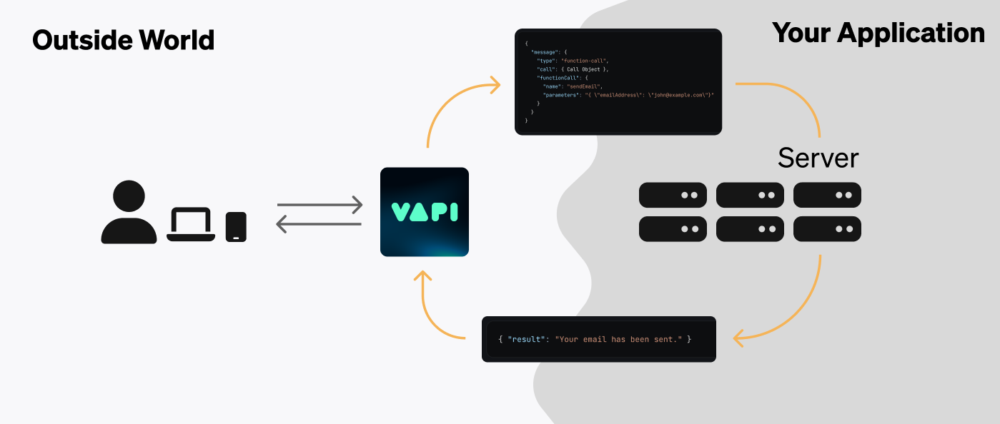

<Frame caption="Server URLs give Vapi a location to send real-time conversation data (as well as query for data Vapi needs).">
  
</Frame>

Server URLs allow your application to **receive data** & **communicate with Vapi** during conversations. Conversation events can include:

- **Status Updates:** updates on the status of a call
- **Transcript Updates**: call transcripts
- **Function Calls:** payloads delivered when your assistant wants certain actions executed
- **Assistant Requests:** in certain circumstances, Vapi may ping your server to get dynamic configuration for an assistant handling a specific call
- **End of Call Report:** call summary data at the end of a call
- **Hang Notifications:** get notified when your assistant fails to reply for a certain amount of time

In our [quickstart guides](/quickstart) we learned how to setup a basic back-and-forth conversation with a Vapi assistant.

To build more complex & custom applications, we're going to need to get real-time conversation data to our backend. **This is where server URLs come in.**

<Info>
  If you're familiar with functional programming, Server URLs are like callback functions. But
  instead of specifying a function to get data back on, we specify a URL to a server (to POST data
  back to).
</Info>

## Get Started

To get started using server URLs, read our guides:

<CardGroup cols={2}>
  <Card
    title="Setting Server URLs"
    icon="link"
    iconType="duotone"
    href="/server-url/setting-server-urls"
  >
    Server URLs can be set in multiple places. Learn where here.
  </Card>
  <Card title="Events" icon="bell-on" iconType="solid" href="/server-url/events">
    Read about the different types of events Vapi can send to your server.
  </Card>
  <Card
    title="Developing Locally"
    icon="laptop-arrow-down"
    iconType="solid"
    href="/server-url/developing-locally"
  >
    Learn about receiving server events in your local development environment.
  </Card>
  <Card
    title="CLI Webhook Testing"
    icon="terminal"
    iconType="solid"
    href="/cli/webhook"
  >
    Test webhooks instantly with the Vapi CLI - no ngrok required.
  </Card>
</CardGroup>

<Tip>
**Quick local testing with Vapi CLI:**
```bash
vapi listen --forward-to localhost:3000/webhook
```
This instantly forwards all webhook events to your local server for debugging.
</Tip>

## FAQ

<AccordionGroup>
  <Accordion title="Where can the server be located?">
    The server URL can be any publicly accessible URL pointing to an HTTP endpoint. This can be a:
    - **Cloud Server:** your application might be deployed on a cloud platform like [Railway](https://railway.app), [AWS](https://aws.com), [GCP](https://cloud.google.com/gcp), etc — as a persistent web server.
    - **Serverless Function:** services like [Vercel](https://vercel.com/docs/functions), [AWS Lambda](https://aws.amazon.com/lambda/), [Google Cloud Functions](https://cloud.google.com/functions), [Cloudflare](https://developers.cloudflare.com/workers/), etc — allow you to host on-demand cloud functions.
    - **Workflow Orchestrator:** platforms like [Pipedream](https://pipedream.com) & [Make](https://www.make.com) allow you to program workflows (often without code) that can receive events via HTTP triggers.

    The main idea is that Vapi needs a location on the Internet that it can drop data to & converse with your application.

  </Accordion>
  <Accordion title="Why not just call them webhooks?">
    [Webhooks](/glossary#webhook) are traditionally unidirectional & stateless, with the target endpoint usually only replying with a status code to acknowledge message reception. Certain server URL events (like assistant requests) may require a meaningful reply from your server.

    "Server URL" is a more general term that encompasses both webhooks & bidirectional communication.

  </Accordion>
</AccordionGroup>
